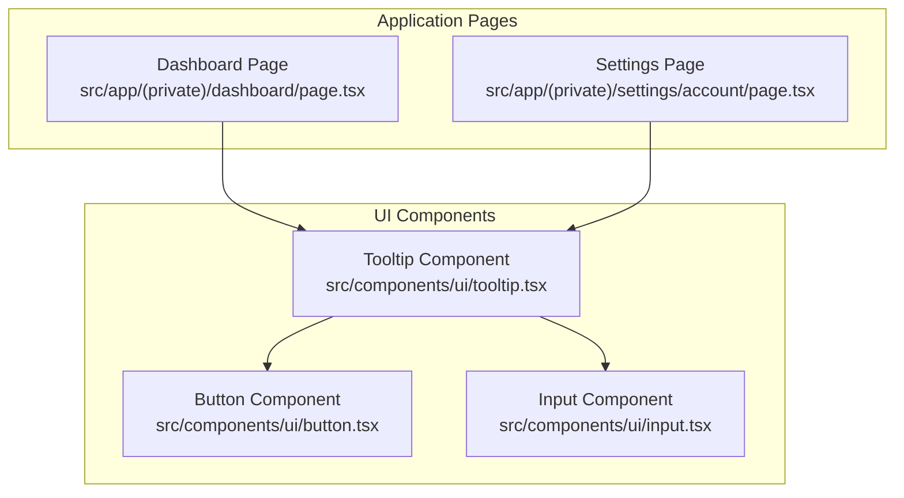
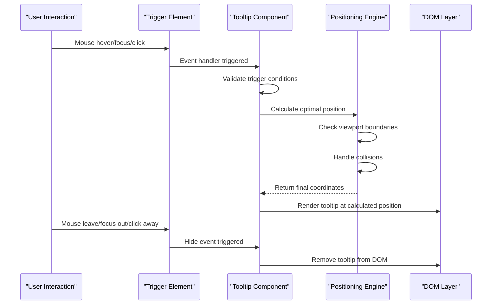
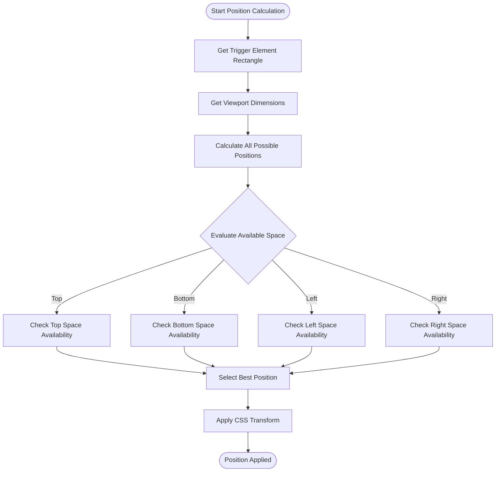
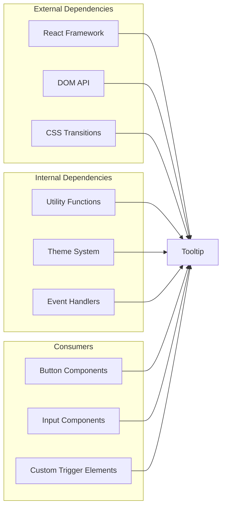

# Tooltip Component

<cite>
**Referenced Files in This Document**
- [tooltip.tsx](file://src/components/ui/tooltip.tsx)
</cite>

## Table of Contents
1. [Introduction](#introduction)
2. [Project Structure](#project-structure)
3. [Core Components](#core-components)
4. [Architecture Overview](#architecture-overview)
5. [Detailed Component Analysis](#detailed-component-analysis)
6. [Dependency Analysis](#dependency-analysis)
7. [Performance Considerations](#performance-considerations)
8. [Troubleshooting Guide](#troubleshooting-guide)
9. [Conclusion](#conclusion)
10. [Appendices](#appendices)

## Introduction
This document provides comprehensive documentation for the Tooltip component, focusing on positioning algorithms, trigger events (hover, focus, click), delay settings, and customization options. It also covers accessibility guidelines, collision detection, viewport boundary handling, and performance optimization strategies for large datasets. The goal is to help developers implement tooltips effectively while ensuring a smooth user experience across devices and assistive technologies.

## Project Structure
The Tooltip component is located within the UI components directory, organized by feature. This structure promotes reusability and maintainability across the application.

**Diagram sources**
- [tooltip.tsx](file://src/components/ui/tooltip.tsx)

**Section sources**
- [tooltip.tsx](file://src/components/ui/tooltip.tsx)

## Core Components
The Tooltip component serves as a lightweight overlay that displays contextual information when users interact with trigger elements. It supports multiple interaction patterns and provides extensive customization options for positioning, styling, and behavior.

Key features include:
- Multiple trigger events (hover, focus, click)
- Intelligent positioning with collision detection
- Delay controls for show/hide operations
- Rich content support beyond simple text
- Accessibility compliance with keyboard navigation
- Animation and transition effects
- Theme-aware styling

**Section sources**
- [tooltip.tsx](file://src/components/ui/tooltip.tsx)

## Architecture Overview
The Tooltip component follows a modular architecture that separates concerns between positioning logic, event handling, and rendering. This design enables flexibility and maintainability while providing consistent behavior across different use cases.

**Diagram sources**
- [tooltip.tsx](file://src/components/ui/tooltip.tsx)

## Detailed Component Analysis

### Positioning Algorithms
The Tooltip component implements sophisticated positioning algorithms to ensure optimal placement relative to trigger elements while avoiding viewport boundaries and other UI elements.

#### Primary Positioning Strategy
The positioning system evaluates multiple potential positions around the trigger element and selects the most appropriate one based on available space and user preference.

**Diagram sources**
- [tooltip.tsx](file://src/components/ui/tooltip.tsx)

#### Collision Detection
The component includes intelligent collision detection that prevents tooltips from appearing outside the visible viewport or overlapping with other important UI elements.

**Section sources**
- [tooltip.tsx](file://src/components/ui/tooltip.tsx)

### Trigger Events
The Tooltip component supports multiple interaction patterns to accommodate different user preferences and use cases.

#### Hover Trigger
The default trigger mode activates the tooltip when the mouse enters the trigger element's bounds and hides it when the mouse leaves.

#### Focus Trigger  
For keyboard navigation and screen reader compatibility, the tooltip can be activated when the trigger element receives focus and hidden when focus moves elsewhere.

#### Click Trigger
Users can configure the tooltip to activate on click events, which is particularly useful for touch devices and mobile interactions.

#### Combined Triggers
Multiple triggers can be enabled simultaneously to provide the most accessible and intuitive experience across different input methods.

**Section sources**
- [tooltip.tsx](file://src/components/ui/tooltip.tsx)

### Delay Settings
The component provides granular control over timing behaviors to balance responsiveness with usability.

#### Show Delay
Configurable delay before displaying the tooltip after activation, preventing accidental triggers during rapid mouse movements.

#### Hide Delay
Delay before hiding the tooltip after deactivation, allowing users time to move their cursor into the tooltip content if needed.

#### Global vs Per-Instance Delays
Delays can be configured globally for consistent behavior or customized per instance for specific use cases.

**Section sources**
- [tooltip.tsx](file://src/components/ui/tooltip.tsx)

### Props API Reference

#### Positioning Props
- `position`: Preferred tooltip position relative to trigger (top, bottom, left, right)
- `collisionPadding`: Padding to maintain between tooltip and viewport edges
- `offset`: Distance between tooltip and trigger element
- `flip`: Enable automatic position flipping when space is limited

#### Animation Props
- `animationDuration`: Duration of show/hide animations
- `animationEasing`: Easing function for smooth transitions
- `animationType`: Type of animation effect (fade, slide, scale)

#### Styling Props
- `className`: Custom CSS class for additional styling
- `style`: Inline styles for dynamic styling
- `theme`: Theme variant for consistent appearance

#### Behavior Props
- `disabled`: Prevent tooltip from showing regardless of interaction
- `delay`: Global delay configuration object
- `trigger`: Array of supported trigger events
- `interactive`: Allow user interaction with tooltip content

**Section sources**
- [tooltip.tsx](file://src/components/ui/tooltip.tsx)

### Usage Examples

#### Simple Text Tooltip
Basic tooltip implementation for providing additional context about UI elements.

#### Rich Content Tooltip
Tooltips containing formatted text, links, images, or complex layouts for detailed explanations.

#### Conditional Tooltip
Tooltips that only appear under specific conditions, such as when certain data is unavailable or when validation errors occur.

#### Performance-Optimized Tooltip
Implementation strategies for handling large datasets efficiently without compromising user experience.

**Section sources**
- [tooltip.tsx](file://src/components/ui/tooltip.tsx)

## Dependency Analysis
The Tooltip component maintains loose coupling with other UI components while providing clear interfaces for integration.

**Diagram sources**
- [tooltip.tsx](file://src/components/ui/tooltip.tsx)

**Section sources**
- [tooltip.tsx](file://src/components/ui/tooltip.tsx)

## Performance Considerations
Optimizing tooltip performance is crucial, especially when dealing with large datasets or frequent interactions.

### Rendering Optimization
- Use React.memo for expensive tooltip content
- Implement virtual scrolling for long tooltip lists
- Debounce position recalculation during scroll events
- Lazy load heavy tooltip content

### Memory Management
- Properly clean up event listeners and timers
- Avoid memory leaks in long-running applications
- Use efficient data structures for large datasets

### Browser Performance
- Minimize layout thrashing during position updates
- Use CSS transforms instead of top/left properties
- Leverage browser caching for static tooltip content

## Troubleshooting Guide

### Common Issues and Solutions

#### Tooltip Not Appearing
- Verify trigger element has proper tabindex attribute
- Check if tooltip is disabled via props
- Ensure trigger element is not covered by other elements

#### Positioning Problems
- Inspect viewport boundaries and container constraints
- Adjust collision padding for complex layouts
- Test with different screen sizes and orientations

#### Performance Issues
- Monitor memory usage during tooltip interactions
- Profile render times for complex tooltip content
- Identify unnecessary re-renders and optimize accordingly

#### Accessibility Concerns
- Test keyboard navigation thoroughly
- Verify screen reader announcements are correct
- Ensure proper ARIA attributes are applied

**Section sources**
- [tooltip.tsx](file://src/components/ui/tooltip.tsx)

## Conclusion
The Tooltip component provides a robust, accessible, and highly customizable solution for displaying contextual information in web applications. Its sophisticated positioning algorithms, multiple trigger modes, and comprehensive prop API make it suitable for a wide range of use cases. By following the guidelines and best practices outlined in this document, developers can implement tooltips that enhance user experience while maintaining high performance and accessibility standards.

## Appendices

### Accessibility Guidelines

#### Keyboard Navigation
- Ensure all interactive elements within tooltips are keyboard accessible
- Provide logical tab order within tooltip content
- Support Escape key to dismiss tooltips
- Maintain focus management when tooltips open/close

#### Screen Reader Support
- Use appropriate ARIA attributes (aria-describedby, aria-label)
- Announce tooltip content changes to screen readers
- Provide meaningful descriptions for trigger elements
- Test with various screen reader software

#### WCAG Compliance
- Meet minimum contrast ratios for tooltip text
- Ensure tooltips don't rely solely on color
- Provide alternative text for images in tooltips
- Support zoom and magnification tools

### Browser Compatibility
The Tooltip component is designed to work across modern browsers with graceful degradation for older versions. Key compatibility considerations include CSS transform support, event listener APIs, and animation capabilities.