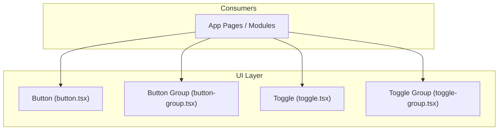
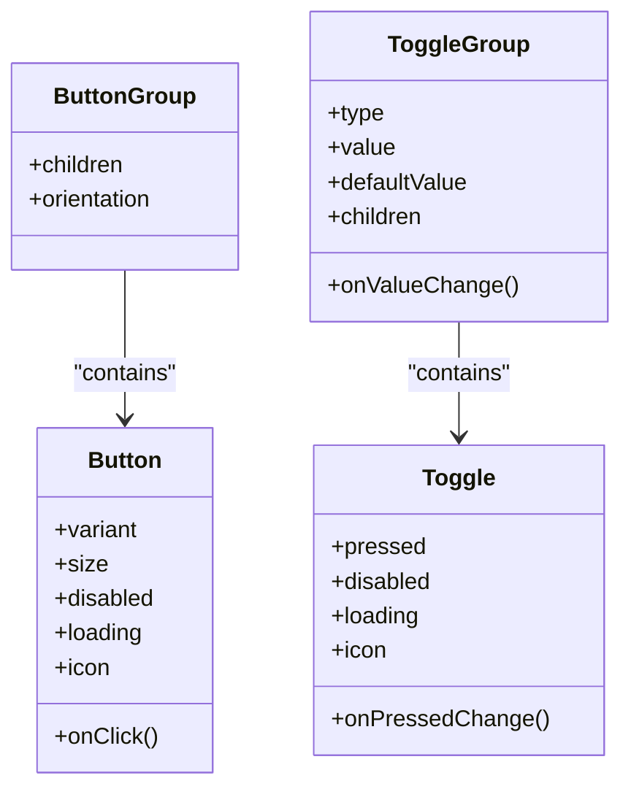
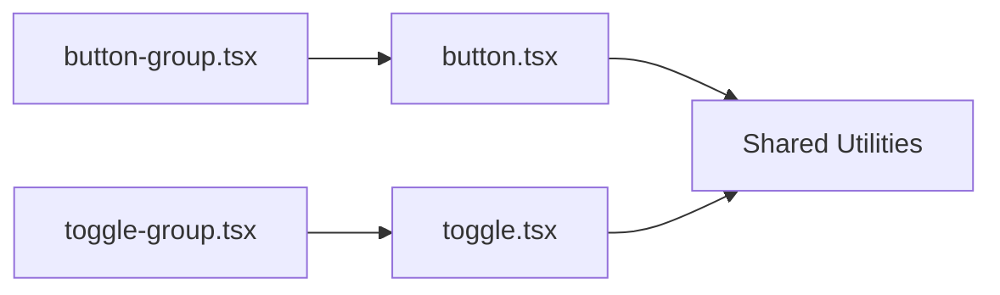

# Action Controls

<cite>
**Referenced Files in This Document**
- [button.tsx](file://src/components/ui/button.tsx)
- [button-group.tsx](file://src/components/ui/button-group.tsx)
- [toggle.tsx](file://src/components/ui/toggle.tsx)
- [toggle-group.tsx](file://src/components/ui/toggle-group.tsx)
</cite>

## Table of Contents
1. [Introduction](#introduction)
2. [Project Structure](#project-structure)
3. [Core Components](#core-components)
4. [Architecture Overview](#architecture-overview)
5. [Detailed Component Analysis](#detailed-component-analysis)
6. [Dependency Analysis](#dependency-analysis)
7. [Performance Considerations](#performance-considerations)
8. [Troubleshooting Guide](#troubleshooting-guide)
9. [Conclusion](#conclusion)
10. [Appendices](#appendices)

## Introduction
This document provides comprehensive documentation for action control components: Button, Button Group, Toggle, and Toggle Group. It covers component APIs, props/attributes, event handlers, loading states, styling variations, usage examples with TypeScript types, accessibility compliance, keyboard navigation, responsive behavior, button variants, icon integration, and group interactions.

## Project Structure
The action controls are implemented as reusable UI primitives under the shared UI layer. Each component is a self-contained module that can be imported and composed across the application.

[No sources needed since this diagram shows conceptual structure]

## Core Components
- Button: A versatile clickable element supporting multiple visual variants, sizes, disabled/loading states, icons, and full keyboard/accessibility support.
- Button Group: A layout container to visually group related buttons, managing spacing and alignment.
- Toggle: A two-state control (on/off) suitable for boolean settings or filters.
- Toggle Group: A collection of toggles that can enforce single-selection or multi-selection semantics.

Key capabilities across these components include:
- Variants and sizes for consistent design tokens
- Loading indicators without text
- Icon integration on leading/trailing positions
- Keyboard navigation and focus management
- Accessibility attributes (roles, aria-*), screen reader labels
- Responsive behavior via size and layout props

**Section sources**
- [button.tsx](file://src/components/ui/button.tsx)
- [button-group.tsx](file://src/components/ui/button-group.tsx)
- [toggle.tsx](file://src/components/ui/toggle.tsx)
- [toggle-group.tsx](file://src/components/ui/toggle-group.tsx)

## Architecture Overview
The components follow a simple composition model:
- Button is the atomic action primitive.
- Button Group composes one or more Buttons for grouped actions.
- Toggle is an independent binary control.
- Toggle Group composes multiple Toggles with selection semantics.

**Diagram sources**
- [button.tsx](file://src/components/ui/button.tsx)
- [button-group.tsx](file://src/components/ui/button-group.tsx)
- [toggle.tsx](file://src/components/ui/toggle.tsx)
- [toggle-group.tsx](file://src/components/ui/toggle-group.tsx)

## Detailed Component Analysis

### Button
Purpose:
- Primary interactive element for user actions.

API overview:
- Props
  - variant: Visual style preset (e.g., default, outline, ghost, destructive).
  - size: Size preset (e.g., default, sm, lg, icon).
  - disabled: Disables interaction and applies disabled styles.
  - loading: Shows a spinner; typically hides text content.
  - icon: Leading or trailing icon node.
  - className: Additional CSS classes for customization.
  - children: Label or content inside the button.
- Events
  - onClick: Standard click handler.
  - onKeyDown/onKeyPress: Keyboard events if needed by consumers.
- Accessibility
  - Semantic button role and focusable by default.
  - Disabled state sets aria-disabled appropriately.
  - When used as a link-like action, ensure proper href and target handling at the consumer level.

Usage patterns:
- Basic usage with label and onClick.
- Icon-only button using size="icon".
- Loading state with spinner and no text.
- Destructive variant for dangerous actions.
- Outline or ghost variants for secondary actions.

Keyboard navigation:
- Enter and Space trigger click when focused.
- Focus visible styles for keyboard users.

Responsive behavior:
- Use size="icon" for compact toolbars.
- Combine with flex layouts to wrap on small screens.

TypeScript tips:
- Ensure event handlers accept standard React button event types.
- Type icon prop as a ReactNode or specific icon component type.

Common pitfalls:
- Avoid nesting interactive elements inside Button.
- Do not use Button for navigation; prefer anchor/link components.

**Section sources**
- [button.tsx](file://src/components/ui/button.tsx)

### Button Group
Purpose:
- Visually groups related buttons with consistent spacing and alignment.

API overview:
- Props
  - children: One or more Button instances.
  - orientation: Horizontal or vertical arrangement.
  - className: Additional CSS classes.
- Behavior
  - Applies gap and border-radius adjustments so adjacent buttons share edges.
  - Maintains focus order within the group.

Accessibility:
- No special role required; acts as a presentational wrapper.
- Ensure each child Button remains accessible individually.

Layout considerations:
- For horizontal groups, first and last items adjust rounded corners.
- For vertical groups, apply similar edge logic along the column axis.

TypeScript tips:
- Constrain children to Button elements for type safety.

**Section sources**
- [button-group.tsx](file://src/components/ui/button-group.tsx)

### Toggle
Purpose:
- Binary control representing an on/off state.

API overview:
- Props
  - pressed: Controlled state.
  - onPressedChange: Handler for state changes.
  - disabled: Disables interaction.
  - loading: Optional loading indicator.
  - icon: Optional icon to render alongside label.
  - className: Additional CSS classes.
  - children: Label or content.
- Events
  - onPressedChange(pressed: boolean): Emitted on toggle.

Accessibility:
- Uses appropriate role and aria-pressed attribute.
- Supports keyboard activation (Enter/Space).
- Provides clear focus styles.

Usage patterns:
- Controlled mode with local state.
- Uncontrolled mode with defaultValue.
- Icon-only toggles for compact interfaces.

TypeScript tips:
- typed pressed and onPressedChange for strict typing.

**Section sources**
- [toggle.tsx](file://src/components/ui/toggle.tsx)

### Toggle Group
Purpose:
- Manages a set of Toggles with selection semantics.

API overview:
- Props
  - type: "single" or "multiple".
  - value: Controlled value(s).
  - defaultValue: Initial value(s) for uncontrolled usage.
  - onValueChange: Handler for value updates.
  - children: One or more Toggle instances.
  - className: Additional CSS classes.
- Behavior
  - Single selection: Only one Toggle can be active at a time.
  - Multiple selection: Any number of Toggles can be active.

Accessibility:
- Ensures correct keyboard navigation between toggles.
- Announces current selection state to assistive technologies.

Interaction details:
- Arrow keys navigate between toggles.
- Enter/Space activates the focused toggle.
- Selection state is reflected via aria-pressed on each Toggle.

TypeScript tips:
- Type value based on type prop: string | string[] accordingly.

**Section sources**
- [toggle-group.tsx](file://src/components/ui/toggle-group.tsx)

## Dependency Analysis
The action controls are designed to be low-coupling primitives. They may depend on shared utilities for styling and accessibility helpers, but they do not import higher-level domain logic. Consumers compose them directly.

[No sources needed since this diagram shows conceptual dependencies]

## Performance Considerations
- Prefer controlled state only when necessary; uncontrolled with defaultValue reduces re-renders.
- Memoize expensive icon components passed into Button/Toggle to avoid unnecessary renders.
- Keep Button Group and Toggle Group children minimal; large lists should be virtualized at the consumer level.
- Avoid heavy side effects in onClick/onPressedChange; offload to async flows and show loading states.

[No sources needed since this section provides general guidance]

## Troubleshooting Guide
- Click not firing: Ensure the element is not disabled and there are no overlapping overlays capturing pointer events.
- Keyboard not working: Verify focus is visible and that the component receives focus; avoid tabindex conflicts.
- Screen reader issues: Confirm aria-pressed is set on Toggles and that labels are provided for icon-only controls.
- Loading state confusion: When loading is true, consider hiding text to prevent redundant announcements.

**Section sources**
- [button.tsx](file://src/components/ui/button.tsx)
- [toggle.tsx](file://src/components/ui/toggle.tsx)
- [toggle-group.tsx](file://src/components/ui/toggle-group.tsx)

## Conclusion
Button, Button Group, Toggle, and Toggle Group provide a cohesive set of action controls with consistent APIs, strong accessibility, and flexible styling. By composing these primitives, you can build robust, accessible, and responsive user interfaces with predictable behavior and clear TypeScript contracts.

[No sources needed since this section summarizes without analyzing specific files]

## Appendices

### API Reference Summary

- Button
  - Props: variant, size, disabled, loading, icon, className, children
  - Events: onClick
  - Notes: Supports icon-only mode and loading spinner

- Button Group
  - Props: children, orientation, className
  - Notes: Adjusts spacing and border radius for adjacent buttons

- Toggle
  - Props: pressed, onPressedChange, disabled, loading, icon, className, children
  - Events: onPressedChange(boolean)
  - Notes: Uses aria-pressed for accessibility

- Toggle Group
  - Props: type, value, defaultValue, onValueChange, children, className
  - Events: onValueChange(value | value[])
  - Notes: Enforces single or multiple selection semantics

[No sources needed since this section aggregates previously analyzed information]