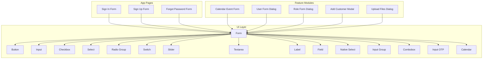
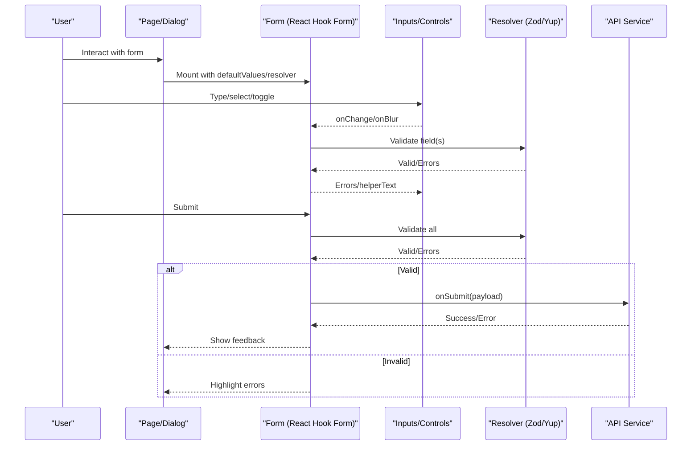
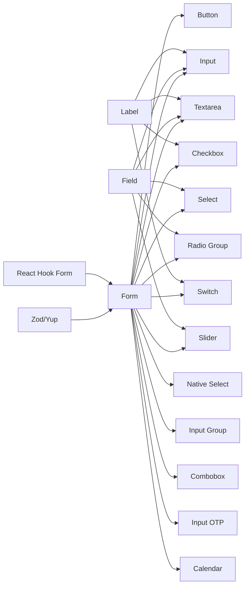

# Form Components

<cite>
**Referenced Files in This Document**
- [button.tsx](file://src/components/ui/button.tsx)
- [input.tsx](file://src/components/ui/input.tsx)
- [form.tsx](file://src/components/ui/form.tsx)
- [checkbox.tsx](file://src/components/ui/checkbox.tsx)
- [select.tsx](file://src/components/ui/select.tsx)
- [radio-group.tsx](file://src/components/ui/radio-group.tsx)
- [switch.tsx](file://src/components/ui/switch.tsx)
- [slider.tsx](file://src/components/ui/slider.tsx)
- [textarea.tsx](file://src/components/ui/textarea.tsx)
- [field.tsx](file://src/components/ui/field.tsx)
- [label.tsx](file://src/components/ui/label.tsx)
- [native-select.tsx](file://src/components/ui/native-select.tsx)
- [input-group.tsx](file://src/components/ui/input-group.tsx)
- [combobox.tsx](file://src/components/ui/combobox.tsx)
- [input-otp.tsx](file://src/components/ui/input-otp.tsx)
- [calendar.tsx](file://src/components/ui/calendar.tsx)
- [login-form.tsx](file://src/app/(auth)/sign-in/components/login-form.tsx)
- [signup-form.tsx](file://src/app/(auth)/sign-up/components/signup-form.tsx)
- [forgot-password-form.tsx](file://src/app/(auth)/forgot-password/components/forgot-password-form.tsx)
- [event-form.tsx](file://src/modules/calendar/components/event-form.tsx)
- [user-form-dialog.tsx](file://src/modules/users/components/user-form-dialog.tsx)
- [role-form-dialog.tsx](file://src/modules/users/components/role-form-dialog.tsx)
- [add-customer-modal.tsx](file://src/modules/customers/components/add-customer-modal.tsx)
- [upload-files-dialog.tsx](file://src/modules/documents/components/upload-files-dialog.tsx)
</cite>

## Table of Contents
1. [Introduction](#introduction)
2. [Project Structure](#project-structure)
3. [Core Components](#core-components)
4. [Architecture Overview](#architecture-overview)
5. [Detailed Component Analysis](#detailed-component-analysis)
6. [Dependency Analysis](#dependency-analysis)
7. [Performance Considerations](#performance-considerations)
8. [Troubleshooting Guide](#troubleshooting-guide)
9. [Conclusion](#conclusion)
10. [Appendices](#appendices)

## Introduction
This document provides comprehensive documentation for the form components used across the application, including Button, Input, Form, Checkbox, Select, Radio Group, Switch, Slider, and Textarea. It covers component APIs (props/attributes), events, validation patterns, styling options, accessibility considerations, responsive design implementation, and integration with form state management. Usage examples reference real-world implementations within the codebase to demonstrate common form patterns.

## Project Structure
The form-related UI components are organized under a shared UI layer and consumed by feature modules and pages. The structure follows a feature-based organization at the app level and a component-based organization for reusable UI primitives.

**Diagram sources**
- [button.tsx:1-200](file://src/components/ui/button.tsx#L1-L200)
- [input.tsx:1-200](file://src/components/ui/input.tsx#L1-L200)
- [form.tsx:1-200](file://src/components/ui/form.tsx#L1-L200)
- [checkbox.tsx:1-200](file://src/components/ui/checkbox.tsx#L1-L200)
- [select.tsx:1-200](file://src/components/ui/select.tsx#L1-L200)
- [radio-group.tsx:1-200](file://src/components/ui/radio-group.tsx#L1-L200)
- [switch.tsx:1-200](file://src/components/ui/switch.tsx#L1-L200)
- [slider.tsx:1-200](file://src/components/ui/slider.tsx#L1-L200)
- [textarea.tsx:1-200](file://src/components/ui/textarea.tsx#L1-L200)
- [field.tsx:1-200](file://src/components/ui/field.tsx#L1-L200)
- [label.tsx:1-200](file://src/components/ui/label.tsx#L1-L200)
- [native-select.tsx:1-200](file://src/components/ui/native-select.tsx#L1-L200)
- [input-group.tsx:1-200](file://src/components/ui/input-group.tsx#L1-L200)
- [combobox.tsx:1-200](file://src/components/ui/combobox.tsx#L1-L200)
- [input-otp.tsx:1-200](file://src/components/ui/input-otp.tsx#L1-L200)
- [calendar.tsx:1-200](file://src/components/ui/calendar.tsx#L1-L200)
- [login-form.tsx:1-200](file://src/app/(auth)/sign-in/components/login-form.tsx#L1-L200)
- [signup-form.tsx:1-200](file://src/app/(auth)/sign-up/components/signup-form.tsx#L1-L200)
- [forgot-password-form.tsx:1-200](file://src/app/(auth)/forgot-password/components/forgot-password-form.tsx#L1-L200)
- [event-form.tsx:1-200](file://src/modules/calendar/components/event-form.tsx#L1-L200)
- [user-form-dialog.tsx:1-200](file://src/modules/users/components/user-form-dialog.tsx#L1-L200)
- [role-form-dialog.tsx:1-200](file://src/modules/users/components/role-form-dialog.tsx#L1-L200)
- [add-customer-modal.tsx:1-200](file://src/modules/customers/components/add-customer-modal.tsx#L1-L200)
- [upload-files-dialog.tsx:1-200](file://src/modules/documents/components/upload-files-dialog.tsx#L1-L200)

**Section sources**
- [button.tsx:1-200](file://src/components/ui/button.tsx#L1-L200)
- [input.tsx:1-200](file://src/components/ui/input.tsx#L1-L200)
- [form.tsx:1-200](file://src/components/ui/form.tsx#L1-L200)
- [checkbox.tsx:1-200](file://src/components/ui/checkbox.tsx#L1-L200)
- [select.tsx:1-200](file://src/components/ui/select.tsx#L1-L200)
- [radio-group.tsx:1-200](file://src/components/ui/radio-group.tsx#L1-L200)
- [switch.tsx:1-200](file://src/components/ui/switch.tsx#L1-L200)
- [slider.tsx:1-200](file://src/components/ui/slider.tsx#L1-L200)
- [textarea.tsx:1-200](file://src/components/ui/textarea.tsx#L1-L200)
- [field.tsx:1-200](file://src/components/ui/field.tsx#L1-L200)
- [label.tsx:1-200](file://src/components/ui/label.tsx#L1-L200)
- [native-select.tsx:1-200](file://src/components/ui/native-select.tsx#L1-L200)
- [input-group.tsx:1-200](file://src/components/ui/input-group.tsx#L1-L200)
- [combobox.tsx:1-200](file://src/components/ui/combobox.tsx#L1-L200)
- [input-otp.tsx:1-200](file://src/components/ui/input-otp.tsx#L1-L200)
- [calendar.tsx:1-200](file://src/components/ui/calendar.tsx#L1-L200)
- [login-form.tsx:1-200](file://src/app/(auth)/sign-in/components/login-form.tsx#L1-L200)
- [signup-form.tsx:1-200](file://src/app/(auth)/sign-up/components/signup-form.tsx#L1-L200)
- [forgot-password-form.tsx:1-200](file://src/app/(auth)/forgot-password/components/forgot-password-form.tsx#L1-L200)
- [event-form.tsx:1-200](file://src/modules/calendar/components/event-form.tsx#L1-L200)
- [user-form-dialog.tsx:1-200](file://src/modules/users/components/user-form-dialog.tsx#L1-L200)
- [role-form-dialog.tsx:1-200](file://src/modules/users/components/role-form-dialog.tsx#L1-L200)
- [add-customer-modal.tsx:1-200](file://src/modules/customers/components/add-customer-modal.tsx#L1-L200)
- [upload-files-dialog.tsx:1-200](file://src/modules/documents/components/upload-files-dialog.tsx#L1-L200)

## Core Components
This section summarizes the core form components, their primary props, events, validation hooks, and styling approaches. For each component, we provide references to the source files where the API is defined and examples of usage in the application.

- Button
  - Purpose: Triggers actions such as submitting forms or performing operations.
  - Key props: variant, size, disabled, loading, type (submit/reset/button).
  - Events: onClick.
  - Styling: Variant and size classes; theme-aware colors.
  - Accessibility: Semantic button element, keyboard support, aria-disabled when disabled.
  - Example usage: See sign-in and sign-up forms.

- Input
  - Purpose: Single-line text input.
  - Key props: id, name, type, placeholder, value, onChange, onBlur, disabled, readOnly, required, autoFocus, pattern, minLength, maxLength, step, multiple (for file), accept (for file).
  - Events: onChange, onBlur, onFocus, onKeyDown.
  - Validation: HTML5 constraints + React Hook Form integration via register.
  - Styling: Size variants, focus ring, error states.
  - Accessibility: Associated label via htmlFor/id, aria-invalid on errors.
  - Example usage: Sign-in email/password fields.

- Form
  - Purpose: Container that integrates with React Hook Form for state and validation.
  - Key props: form (from useForm), onSubmit, defaultValues, resolver, mode, reValidateMode, shouldUnregister, values, errors.
  - Events: onSubmit.
  - Validation: Zod/Yup resolvers, field-level rules, async validation.
  - Styling: Error messages, helper text, layout wrappers.
  - Accessibility: Fieldset/legend for groups, proper labeling.
  - Example usage: All auth forms and module dialogs.

- Checkbox
  - Purpose: Binary selection control.
  - Key props: checked, onCheckedChange, disabled, required, id, name.
  - Events: onCheckedChange.
  - Validation: Required rule.
  - Styling: Checked/unchecked states, indeterminate if supported.
  - Accessibility: Label association, keyboard toggle.
  - Example usage: Terms acceptance, filters.

- Select
  - Purpose: Dropdown list for single or multiple selections.
  - Key props: options, value, onValueChange, disabled, placeholder, required.
  - Events: onValueChange.
  - Validation: Required rule.
  - Styling: Popover/listbox behavior, search/filter if provided.
  - Accessibility: Listbox role, arrow key navigation, aria-selected.
  - Example usage: Calendar event category, user roles.

- Radio Group
  - Purpose: Mutually exclusive selection among options.
  - Key props: value, onValueChange, orientation, disabled, required.
  - Events: onValueChange.
  - Validation: Required rule.
  - Styling: Horizontal/vertical layouts.
  - Accessibility: Radiogroup role, radio items, aria-checked.
  - Example usage: Notification preferences.

- Switch
  - Purpose: Toggle boolean setting.
  - Key props: checked, onCheckedChange, disabled, required, id, name.
  - Events: onCheckedChange.
  - Validation: Optional required checks.
  - Styling: On/off visuals, focus ring.
  - Accessibility: Role switch, aria-checked, keyboard toggle.
  - Example usage: Feature toggles, settings.

- Slider
  - Purpose: Continuous range selection.
  - Key props: min, max, step, value, defaultValue, onValueChange, disabled, orientation.
  - Events: onValueChange.
  - Validation: Range constraints.
  - Styling: Track/thumb visuals, orientation.
  - Accessibility: Slider role, aria-valuenow/min/max, keyboard increment/decrement.
  - Example usage: Price ranges, thresholds.

- Textarea
  - Purpose: Multi-line text input.
  - Key props: rows, placeholder, value, onChange, onBlur, disabled, readOnly, required, autoFocus, maxLength.
  - Events: onChange, onBlur, onFocus.
  - Validation: Length constraints, custom validators.
  - Styling: Resizable, error states.
  - Accessibility: Label association, aria-invalid on errors.
  - Example usage: Notes, descriptions.

Additional supporting components:
- Label: Associates text with controls via htmlFor/id.
- Field: Wraps inputs with consistent spacing and error display.
- Native Select: Lightweight select using native <select>.
- Input Group: Groups inputs with addons (prefix/suffix).
- Combobox: Searchable select with free-text entry.
- Input OTP: One-time password input with segmented boxes.
- Calendar: Date picker for date selection.

**Section sources**
- [button.tsx:1-200](file://src/components/ui/button.tsx#L1-L200)
- [input.tsx:1-200](file://src/components/ui/input.tsx#L1-L200)
- [form.tsx:1-200](file://src/components/ui/form.tsx#L1-L200)
- [checkbox.tsx:1-200](file://src/components/ui/checkbox.tsx#L1-L200)
- [select.tsx:1-200](file://src/components/ui/select.tsx#L1-L200)
- [radio-group.tsx:1-200](file://src/components/ui/radio-group.tsx#L1-L200)
- [switch.tsx:1-200](file://src/components/ui/switch.tsx#L1-L200)
- [slider.tsx:1-200](file://src/components/ui/slider.tsx#L1-L200)
- [textarea.tsx:1-200](file://src/components/ui/textarea.tsx#L1-L200)
- [field.tsx:1-200](file://src/components/ui/field.tsx#L1-L200)
- [label.tsx:1-200](file://src/components/ui/label.tsx#L1-L200)
- [native-select.tsx:1-200](file://src/components/ui/native-select.tsx#L1-L200)
- [input-group.tsx:1-200](file://src/components/ui/input-group.tsx#L1-L200)
- [combobox.tsx:1-200](file://src/components/ui/combobox.tsx#L1-L200)
- [input-otp.tsx:1-200](file://src/components/ui/input-otp.tsx#L1-L200)
- [calendar.tsx:1-200](file://src/components/ui/calendar.tsx#L1-L200)

## Architecture Overview
The form architecture centers around React Hook Form for state and validation, with UI components providing accessible, themed primitives. Forms compose these primitives and integrate validation resolvers (e.g., Zod) to enforce business rules.

**Diagram sources**
- [form.tsx:1-200](file://src/components/ui/form.tsx#L1-L200)
- [input.tsx:1-200](file://src/components/ui/input.tsx#L1-L200)
- [select.tsx:1-200](file://src/components/ui/select.tsx#L1-L200)
- [checkbox.tsx:1-200](file://src/components/ui/checkbox.tsx#L1-L200)
- [radio-group.tsx:1-200](file://src/components/ui/radio-group.tsx#L1-L200)
- [switch.tsx:1-200](file://src/components/ui/switch.tsx#L1-L200)
- [slider.tsx:1-200](file://src/components/ui/slider.tsx#L1-L200)
- [textarea.tsx:1-200](file://src/components/ui/textarea.tsx#L1-L200)
- [login-form.tsx:1-200](file://src/app/(auth)/sign-in/components/login-form.tsx#L1-L200)
- [signup-form.tsx:1-200](file://src/app/(auth)/sign-up/components/signup-form.tsx#L1-L200)
- [forgot-password-form.tsx:1-200](file://src/app/(auth)/forgot-password/components/forgot-password-form.tsx#L1-L200)
- [event-form.tsx:1-200](file://src/modules/calendar/components/event-form.tsx#L1-L200)
- [user-form-dialog.tsx:1-200](file://src/modules/users/components/user-form-dialog.tsx#L1-L200)
- [role-form-dialog.tsx:1-200](file://src/modules/users/components/role-form-dialog.tsx#L1-L200)
- [add-customer-modal.tsx:1-200](file://src/modules/customers/components/add-customer-modal.tsx#L1-L200)
- [upload-files-dialog.tsx:1-200](file://src/modules/documents/components/upload-files-dialog.tsx#L1-L200)

## Detailed Component Analysis

### Button
- Props overview: variant, size, disabled, loading, type, className.
- Events: onClick.
- Styling: Theme-aware color schemes and sizes; hover/focus/disabled states.
- Accessibility: Keyboard activation, aria-disabled when disabled, semantic button.
- Usage examples:
  - Sign-in submit button.
  - Sign-up create account button.
  - Module dialogs confirm buttons.

**Section sources**
- [button.tsx:1-200](file://src/components/ui/button.tsx#L1-L200)
- [login-form.tsx:1-200](file://src/app/(auth)/sign-in/components/login-form.tsx#L1-L200)
- [signup-form.tsx:1-200](file://src/app/(auth)/sign-up/components/signup-form.tsx#L1-L200)
- [user-form-dialog.tsx:1-200](file://src/modules/users/components/user-form-dialog.tsx#L1-L200)
- [role-form-dialog.tsx:1-200](file://src/modules/users/components/role-form-dialog.tsx#L1-L200)
- [add-customer-modal.tsx:1-200](file://src/modules/customers/components/add-customer-modal.tsx#L1-L200)
- [upload-files-dialog.tsx:1-200](file://src/modules/documents/components/upload-files-dialog.tsx#L1-L200)

### Input
- Props overview: id, name, type, placeholder, value, onChange, onBlur, disabled, readOnly, required, autoFocus, pattern, minLength, maxLength, step, multiple, accept.
- Events: onChange, onBlur, onFocus, onKeyDown.
- Validation: HTML5 attributes + React Hook Form register rules.
- Styling: Focus ring, error border, size variants.
- Accessibility: htmlFor/id pairing with Label, aria-invalid on errors.
- Usage examples:
  - Email and password fields in authentication flows.
  - Search and filter inputs in data tables.

**Section sources**
- [input.tsx:1-200](file://src/components/ui/input.tsx#L1-L200)
- [label.tsx:1-200](file://src/components/ui/label.tsx#L1-L200)
- [login-form.tsx:1-200](file://src/app/(auth)/sign-in/components/login-form.tsx#L1-L200)
- [signup-form.tsx:1-200](file://src/app/(auth)/sign-up/components/signup-form.tsx#L1-L200)
- [forgot-password-form.tsx:1-200](file://src/app/(auth)/forgot-password/components/forgot-password-form.tsx#L1-L200)

### Form
- Props overview: form instance from useForm, onSubmit, defaultValues, resolver, mode, reValidateMode, shouldUnregister, values, errors.
- Events: onSubmit.
- Validation: Schema-driven validation with Zod/Yup; per-field rules; async validation.
- Styling: Error message rendering, helper text, layout wrappers.
- Accessibility: Proper labeling, grouping with fieldset/legend when needed.
- Usage examples:
  - Authentication forms.
  - Calendar event creation/editing.
  - User and role management dialogs.
  - Customer and document upload flows.

**Section sources**
- [form.tsx:1-200](file://src/components/ui/form.tsx#L1-L200)
- [field.tsx:1-200](file://src/components/ui/field.tsx#L1-L200)
- [login-form.tsx:1-200](file://src/app/(auth)/sign-in/components/login-form.tsx#L1-L200)
- [signup-form.tsx:1-200](file://src/app/(auth)/sign-up/components/signup-form.tsx#L1-L200)
- [forgot-password-form.tsx:1-200](file://src/app/(auth)/forgot-password/components/forgot-password-form.tsx#L1-L200)
- [event-form.tsx:1-200](file://src/modules/calendar/components/event-form.tsx#L1-L200)
- [user-form-dialog.tsx:1-200](file://src/modules/users/components/user-form-dialog.tsx#L1-L200)
- [role-form-dialog.tsx:1-200](file://src/modules/users/components/role-form-dialog.tsx#L1-L200)
- [add-customer-modal.tsx:1-200](file://src/modules/customers/components/add-customer-modal.tsx#L1-L200)
- [upload-files-dialog.tsx:1-200](file://src/modules/documents/components/upload-files-dialog.tsx#L1-L200)

### Checkbox
- Props overview: checked, onCheckedChange, disabled, required, id, name.
- Events: onCheckedChange.
- Validation: Required rule.
- Styling: Checked/unchecked states, focus ring.
- Accessibility: Label association, keyboard toggle.
- Usage examples:
  - Accept terms checkbox.
  - Filter checkboxes.

**Section sources**
- [checkbox.tsx:1-200](file://src/components/ui/checkbox.tsx#L1-L200)
- [label.tsx:1-200](file://src/components/ui/label.tsx#L1-L200)

### Select
- Props overview: options, value, onValueChange, disabled, placeholder, required.
- Events: onValueChange.
- Validation: Required rule.
- Styling: Popover/listbox behavior, search/filter if provided.
- Accessibility: Listbox role, arrow key navigation, aria-selected.
- Usage examples:
  - Category selection in calendar events.
  - Role assignment in user management.

**Section sources**
- [select.tsx:1-200](file://src/components/ui/select.tsx#L1-L200)
- [native-select.tsx:1-200](file://src/components/ui/native-select.tsx#L1-L200)
- [event-form.tsx:1-200](file://src/modules/calendar/components/event-form.tsx#L1-L200)
- [user-form-dialog.tsx:1-200](file://src/modules/users/components/user-form-dialog.tsx#L1-L200)

### Radio Group
- Props overview: value, onValueChange, orientation, disabled, required.
- Events: onValueChange.
- Validation: Required rule.
- Styling: Horizontal/vertical layouts.
- Accessibility: Radiogroup role, radio items, aria-checked.
- Usage examples:
  - Notification preferences.
  - Sorting options.

**Section sources**
- [radio-group.tsx:1-200](file://src/components/ui/radio-group.tsx#L1-L200)
- [label.tsx:1-200](file://src/components/ui/label.tsx#L1-L200)

### Switch
- Props overview: checked, onCheckedChange, disabled, required, id, name.
- Events: onCheckedChange.
- Validation: Optional required checks.
- Styling: On/off visuals, focus ring.
- Accessibility: Role switch, aria-checked, keyboard toggle.
- Usage examples:
  - Feature toggles in settings.

**Section sources**
- [switch.tsx:1-200](file://src/components/ui/switch.tsx#L1-L200)
- [label.tsx:1-200](file://src/components/ui/label.tsx#L1-L200)

### Slider
- Props overview: min, max, step, value, defaultValue, onValueChange, disabled, orientation.
- Events: onValueChange.
- Validation: Range constraints.
- Styling: Track/thumb visuals, orientation.
- Accessibility: Slider role, aria-valuenow/min/max, keyboard increment/decrement.
- Usage examples:
  - Price range filters.
  - Threshold sliders.

**Section sources**
- [slider.tsx:1-200](file://src/components/ui/slider.tsx#L1-L200)
- [label.tsx:1-200](file://src/components/ui/label.tsx#L1-L200)

### Textarea
- Props overview: rows, placeholder, value, onChange, onBlur, disabled, readOnly, required, autoFocus, maxLength.
- Events: onChange, onBlur, onFocus.
- Validation: Length constraints, custom validators.
- Styling: Resizable, error states.
- Accessibility: Label association, aria-invalid on errors.
- Usage examples:
  - Notes and descriptions in forms.

**Section sources**
- [textarea.tsx:1-200](file://src/components/ui/textarea.tsx#L1-L200)
- [label.tsx:1-200](file://src/components/ui/label.tsx#L1-L200)

### Supporting Components
- Label: Associates text with controls via htmlFor/id.
- Field: Wraps inputs with consistent spacing and error display.
- Native Select: Lightweight select using native <select>.
- Input Group: Groups inputs with addons (prefix/suffix).
- Combobox: Searchable select with free-text entry.
- Input OTP: One-time password input with segmented boxes.
- Calendar: Date picker for date selection.

**Section sources**
- [label.tsx:1-200](file://src/components/ui/label.tsx#L1-L200)
- [field.tsx:1-200](file://src/components/ui/field.tsx#L1-L200)
- [native-select.tsx:1-200](file://src/components/ui/native-select.tsx#L1-L200)
- [input-group.tsx:1-200](file://src/components/ui/input-group.tsx#L1-L200)
- [combobox.tsx:1-200](file://src/components/ui/combobox.tsx#L1-L200)
- [input-otp.tsx:1-200](file://src/components/ui/input-otp.tsx#L1-L200)
- [calendar.tsx:1-200](file://src/components/ui/calendar.tsx#L1-L200)

## Dependency Analysis
The form system composes UI primitives with React Hook Form and optional schema validators. The following diagram shows how components depend on each other and on shared utilities.

**Diagram sources**
- [form.tsx:1-200](file://src/components/ui/form.tsx#L1-L200)
- [input.tsx:1-200](file://src/components/ui/input.tsx#L1-L200)
- [textarea.tsx:1-200](file://src/components/ui/textarea.tsx#L1-L200)
- [checkbox.tsx:1-200](file://src/components/ui/checkbox.tsx#L1-L200)
- [select.tsx:1-200](file://src/components/ui/select.tsx#L1-L200)
- [radio-group.tsx:1-200](file://src/components/ui/radio-group.tsx#L1-L200)
- [switch.tsx:1-200](file://src/components/ui/switch.tsx#L1-L200)
- [slider.tsx:1-200](file://src/components/ui/slider.tsx#L1-L200)
- [native-select.tsx:1-200](file://src/components/ui/native-select.tsx#L1-L200)
- [input-group.tsx:1-200](file://src/components/ui/input-group.tsx#L1-L200)
- [combobox.tsx:1-200](file://src/components/ui/combobox.tsx#L1-L200)
- [input-otp.tsx:1-200](file://src/components/ui/input-otp.tsx#L1-L200)
- [calendar.tsx:1-200](file://src/components/ui/calendar.tsx#L1-L200)
- [label.tsx:1-200](file://src/components/ui/label.tsx#L1-L200)
- [field.tsx:1-200](file://src/components/ui/field.tsx#L1-L200)
- [button.tsx:1-200](file://src/components/ui/button.tsx#L1-L200)

**Section sources**
- [form.tsx:1-200](file://src/components/ui/form.tsx#L1-L200)
- [input.tsx:1-200](file://src/components/ui/input.tsx#L1-L200)
- [textarea.tsx:1-200](file://src/components/ui/textarea.tsx#L1-L200)
- [checkbox.tsx:1-200](file://src/components/ui/checkbox.tsx#L1-L200)
- [select.tsx:1-200](file://src/components/ui/select.tsx#L1-L200)
- [radio-group.tsx:1-200](file://src/components/ui/radio-group.tsx#L1-L200)
- [switch.tsx:1-200](file://src/components/ui/switch.tsx#L1-L200)
- [slider.tsx:1-200](file://src/components/ui/slider.tsx#L1-L200)
- [native-select.tsx:1-200](file://src/components/ui/native-select.tsx#L1-L200)
- [input-group.tsx:1-200](file://src/components/ui/input-group.tsx#L1-L200)
- [combobox.tsx:1-200](file://src/components/ui/combobox.tsx#L1-L200)
- [input-otp.tsx:1-200](file://src/components/ui/input-otp.tsx#L1-L200)
- [calendar.tsx:1-200](file://src/components/ui/calendar.tsx#L1-L200)
- [label.tsx:1-200](file://src/components/ui/label.tsx#L1-L200)
- [field.tsx:1-200](file://src/components/ui/field.tsx#L1-L200)
- [button.tsx:1-200](file://src/components/ui/button.tsx#L1-L200)

## Performance Considerations
- Use controlled inputs via React Hook Form to avoid unnecessary re-renders.
- Debounce expensive validations or network calls triggered by onChange.
- Prefer memoization for large option lists in Select/Combobox.
- Avoid heavy computations in render paths; offload to useMemo/useCallback where appropriate.
- Keep form schemas concise and incremental; validate only changed fields when possible.

[No sources needed since this section provides general guidance]

## Troubleshooting Guide
Common issues and resolutions:
- Inputs not updating: Ensure onChange handlers are wired through React Hook Form’s register or controller.
- Validation not triggering: Confirm resolver configuration and field rules; check mode/reValidateMode.
- Labels not associated: Verify htmlFor/id pairing between Label and input elements.
- Accessibility warnings: Ensure ARIA attributes (aria-invalid, aria-checked, aria-valuenow) are set correctly in error states.
- Styling conflicts: Check variant/size props and ensure no overriding CSS classes.

**Section sources**
- [form.tsx:1-200](file://src/components/ui/form.tsx#L1-L200)
- [input.tsx:1-200](file://src/components/ui/input.tsx#L1-L200)
- [label.tsx:1-200](file://src/components/ui/label.tsx#L1-L200)
- [field.tsx:1-200](file://src/components/ui/field.tsx#L1-L200)

## Conclusion
The form system combines accessible, themed UI primitives with robust state and validation management via React Hook Form and schema validators. By adhering to the documented APIs, validation patterns, and accessibility guidelines, developers can build consistent, maintainable forms across the application.

[No sources needed since this section summarizes without analyzing specific files]

## Appendices

### Usage Examples and Patterns
- Authentication forms:
  - Sign-in: Uses Input, Button, and Form with validation.
  - Sign-up: Adds additional fields and confirmation logic.
  - Forgot password: Simplified flow with email validation.
- Calendar event form:
  - Integrates Select, Input, Textarea, and Calendar with complex validation.
- User and role management dialogs:
  - Combine multiple controls (Input, Select, Checkbox, Radio Group, Switch) with conditional logic.
- Customer and document flows:
  - Include file uploads and multi-step interactions.

**Section sources**
- [login-form.tsx:1-200](file://src/app/(auth)/sign-in/components/login-form.tsx#L1-L200)
- [signup-form.tsx:1-200](file://src/app/(auth)/sign-up/components/signup-form.tsx#L1-L200)
- [forgot-password-form.tsx:1-200](file://src/app/(auth)/forgot-password/components/forgot-password-form.tsx#L1-L200)
- [event-form.tsx:1-200](file://src/modules/calendar/components/event-form.tsx#L1-L200)
- [user-form-dialog.tsx:1-200](file://src/modules/users/components/user-form-dialog.tsx#L1-L200)
- [role-form-dialog.tsx:1-200](file://src/modules/users/components/role-form-dialog.tsx#L1-L200)
- [add-customer-modal.tsx:1-200](file://src/modules/customers/components/add-customer-modal.tsx#L1-L200)
- [upload-files-dialog.tsx:1-200](file://src/modules/documents/components/upload-files-dialog.tsx#L1-L200)

### Accessibility Checklist
- Associate labels with inputs using htmlFor/id.
- Provide meaningful aria attributes for interactive controls (aria-invalid, aria-checked, aria-valuenow).
- Ensure keyboard navigability and visible focus indicators.
- Announce errors and success states to assistive technologies.

**Section sources**
- [label.tsx:1-200](file://src/components/ui/label.tsx#L1-L200)
- [input.tsx:1-200](file://src/components/ui/input.tsx#L1-L200)
- [checkbox.tsx:1-200](file://src/components/ui/checkbox.tsx#L1-L200)
- [switch.tsx:1-200](file://src/components/ui/switch.tsx#L1-L200)
- [slider.tsx:1-200](file://src/components/ui/slider.tsx#L1-L200)
- [select.tsx:1-200](file://src/components/ui/select.tsx#L1-L200)
- [radio-group.tsx:1-200](file://src/components/ui/radio-group.tsx#L1-L200)

### Responsive Design Implementation
- Use flexible layouts and spacing utilities to adapt forms to different screen sizes.
- Stack fields vertically on small screens and use grid layouts on larger screens.
- Ensure touch targets meet minimum size requirements for mobile devices.
- Test form usability across breakpoints and orientations.

[No sources needed since this section provides general guidance]