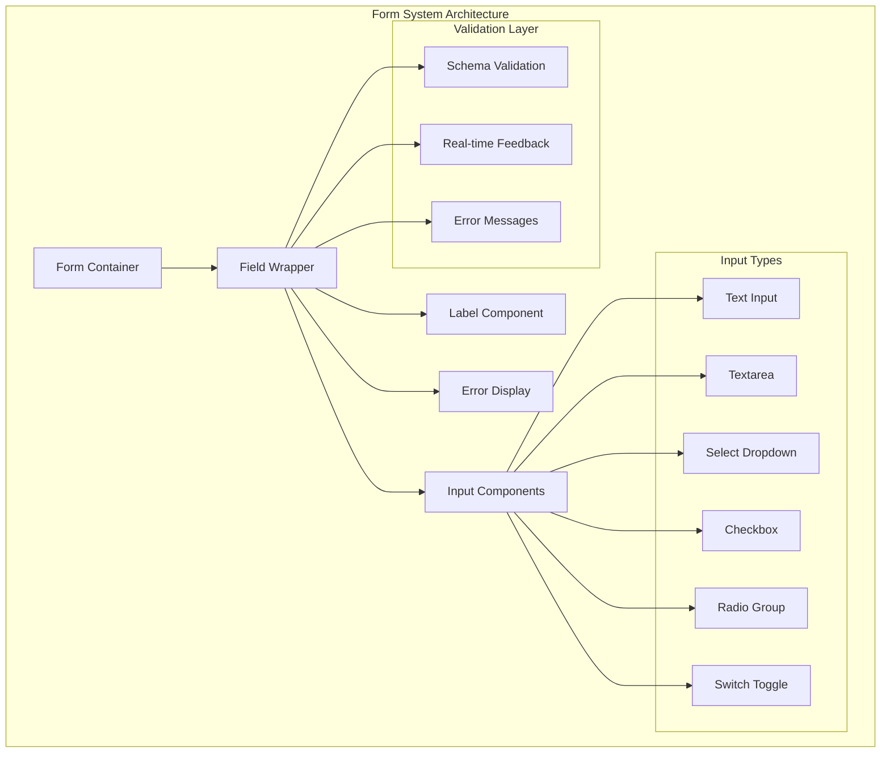
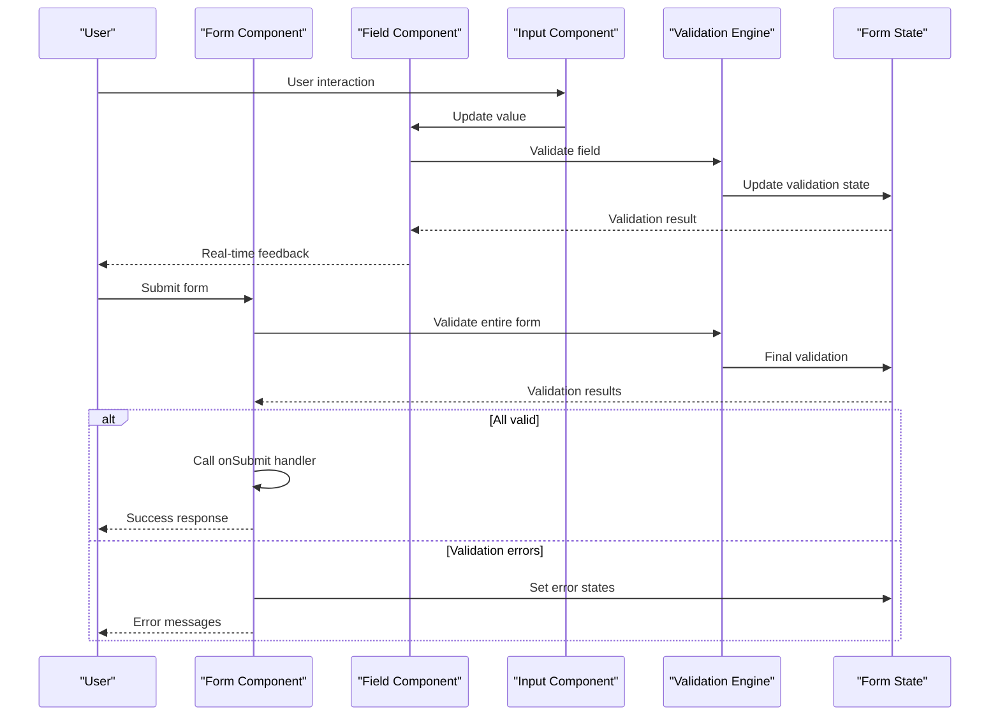
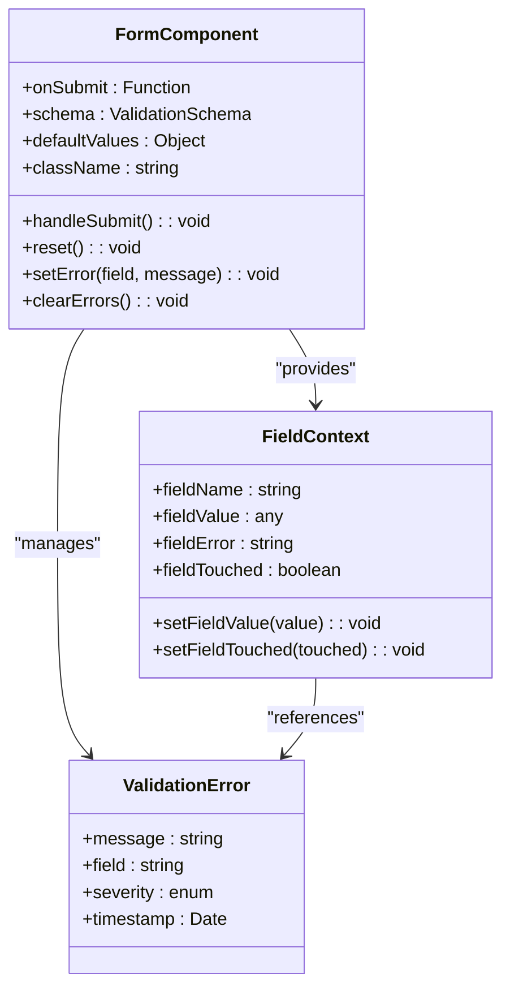
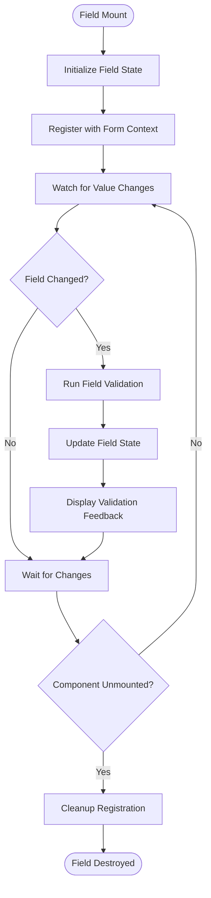
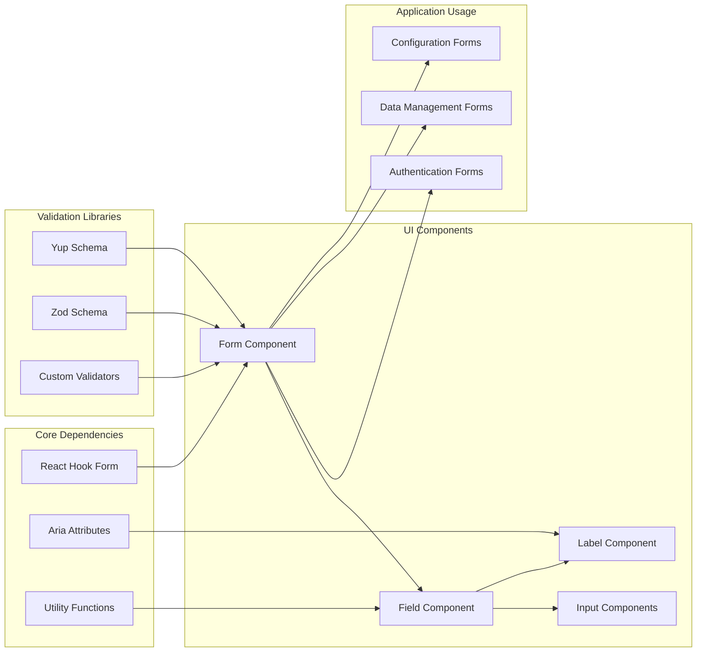

# Form Management

<cite>
**Referenced Files in This Document**
- [form.tsx](file://src/components/ui/form.tsx)
- [field.tsx](file://src/components/ui/field.tsx)
- [label.tsx](file://src/components/ui/label.tsx)
- [input.tsx](file://src/components/ui/input.tsx)
- [textarea.tsx](file://src/components/ui/textarea.tsx)
- [select.tsx](file://src/components/ui/select.tsx)
- [checkbox.tsx](file://src/components/ui/checkbox.tsx)
- [radio-group.tsx](file://src/components/ui/radio-group.tsx)
- [switch.tsx](file://src/components/ui/switch.tsx)
- [login-form.tsx](file://src/app/(auth)/sign-in/components/login-form.tsx)
- [signup-form.tsx](file://src/app/(auth)/sign-up/components/signup-form.tsx)
- [forgot-password-form.tsx](file://src/app/(auth)/forgot-password/components/forgot-password-form.tsx)
- [event-form.tsx](file://src/modules/calendar/components/event-form.tsx)
- [user-form-dialog.tsx](file://src/modules/users/components/user-form-dialog.tsx)
- [role-form-dialog.tsx](file://src/modules/users/components/role-form-dialog.tsx)
</cite>

## Table of Contents
1. [Introduction](#introduction)
2. [Project Structure](#project-structure)
3. [Core Components](#core-components)
4. [Architecture Overview](#architecture-overview)
5. [Detailed Component Analysis](#detailed-component-analysis)
6. [Dependency Analysis](#dependency-analysis)
7. [Performance Considerations](#performance-considerations)
8. [Troubleshooting Guide](#troubleshooting-guide)
9. [Conclusion](#conclusion)
10. [Appendices](#appendices)

## Introduction

This document provides comprehensive documentation for the form management components in the dashboard application. The form system is built around three core components: **Form**, **Field**, and **Label**, which work together to create accessible, validated, and user-friendly forms. The implementation follows modern React patterns and integrates seamlessly with popular form libraries like React Hook Form.

The form components are designed with accessibility as a primary concern, providing proper ARIA attributes, keyboard navigation, and screen reader support. They also include robust error handling, real-time validation feedback, and flexible layout options to accommodate various form requirements.

## Project Structure

The form management system is organized within the `src/components/ui` directory, following a component-based architecture where each UI element is encapsulated in its own file. The form-related components are structured as follows:



**Diagram sources**
- [form.tsx:1-50](file://src/components/ui/form.tsx#L1-L50)
- [field.tsx:1-50](file://src/components/ui/field.tsx#L1-L50)
- [label.tsx:1-50](file://src/components/ui/label.tsx#L1-L50)

The form components integrate with various pages and modules throughout the application, including authentication flows, data management interfaces, and configuration panels.

**Section sources**
- [form.tsx:1-100](file://src/components/ui/form.tsx#L1-L100)
- [field.tsx:1-100](file://src/components/ui/field.tsx#L1-L100)
- [label.tsx:1-100](file://src/components/ui/label.tsx#L1-L100)

## Core Components

### Form Component

The **Form** component serves as the container for all form elements, managing form state, validation, and submission handling. It acts as a context provider that enables communication between child components.

#### Key Features:
- Form state management integration
- Validation schema binding
- Submission event handling
- Error aggregation and display
- Accessibility context provision

#### API Surface:
- **onSubmit**: Function called when form is successfully submitted
- **schema**: Validation schema (Yup, Zod, or custom)
- **defaultValues**: Initial form values
- **className**: CSS class for styling
- **children**: Form field components

### Field Component

The **Field** component wraps individual form inputs, providing consistent labeling, validation, and error handling. It serves as the bridge between form state and input components.

#### Key Features:
- Automatic label association
- Real-time validation feedback
- Error message display
- Focus management
- ARIA attribute propagation

#### API Surface:
- **name**: Field identifier for form state
- **label**: Display text for the field label
- **type**: Input type specification
- **required**: Boolean flag for required fields
- **disabled**: Boolean flag for disabled state
- **error**: Custom error message override
- **helpText**: Additional help text below the field
- **children**: Input component wrapper

### Label Component

The **Label** component provides accessible labels for form inputs with proper semantic markup and visual styling consistency.

#### Key Features:
- Proper htmlFor association
- Required field indicators
- Screen reader support
- Consistent typography and spacing
- Theme-aware styling

#### API Surface:
- **htmlFor**: Associated input ID
- **required**: Boolean for required indicator
- **className**: Custom styling classes
- **children**: Label text content

**Section sources**
- [form.tsx:1-150](file://src/components/ui/form.tsx#L1-L150)
- [field.tsx:1-150](file://src/components/ui/field.tsx#L1-L150)
- [label.tsx:1-150](file://src/components/ui/label.tsx#L1-L150)

## Architecture Overview

The form management system follows a layered architecture pattern with clear separation of concerns:



**Diagram sources**
- [form.tsx:50-200](file://src/components/ui/form.tsx#L50-L200)
- [field.tsx:50-200](file://src/components/ui/field.tsx#L50-L200)

The architecture supports both synchronous and asynchronous validation, allowing for server-side validation checks while maintaining responsive user feedback.

## Detailed Component Analysis

### Form Component Implementation

The Form component implements a sophisticated state management system that coordinates multiple form fields and their validation states.

#### State Management Integration:
- Integrates with React Hook Form for optimal performance
- Supports both controlled and uncontrolled components
- Provides context for nested form structures
- Handles complex validation scenarios

#### Error Handling Patterns:
- Centralized error collection and display
- Field-specific error boundaries
- Global form-level error notifications
- Graceful error recovery mechanisms



**Diagram sources**
- [form.tsx:1-300](file://src/components/ui/form.tsx#L1-L300)

### Field Component Implementation

The Field component serves as a wrapper that enhances basic input components with form functionality, validation, and accessibility features.

#### Component Composition Pattern:
- Uses render props pattern for flexibility
- Supports custom input components
- Provides consistent prop interface across different input types
- Implements automatic focus and blur handling

#### Validation Integration:
- Real-time field validation
- Debounced validation for performance
- Support for custom validators
- Integration with form-level validation schemas



**Diagram sources**
- [field.tsx:1-250](file://src/components/ui/field.tsx#L1-L250)

### Label Component Implementation

The Label component focuses on accessibility and semantic HTML structure while providing visual consistency across the application.

#### Accessibility Features:
- Proper ARIA attributes for screen readers
- Keyboard navigation support
- High contrast mode compatibility
- Focus indicator management

#### Styling System:
- Theme-aware color schemes
- Responsive typography scaling
- Consistent spacing and alignment
- Dark/light mode support

**Section sources**
- [form.tsx:1-400](file://src/components/ui/form.tsx#L1-L400)
- [field.tsx:1-300](file://src/components/ui/field.tsx#L1-L300)
- [label.tsx:1-200](file://src/components/ui/label.tsx#L1-L200)

## Dependency Analysis

The form components have well-defined dependencies and relationships:



**Diagram sources**
- [package.json:1-50](file://package.json#L1-L50)
- [form.tsx:1-100](file://src/components/ui/form.tsx#L1-L100)

### External Dependencies:
- **React Hook Form**: Primary form state management library
- **Zod/Yup**: Schema validation libraries
- **Tailwind CSS**: Utility-first CSS framework
- **React Aria**: Accessibility utilities

### Internal Dependencies:
- **Theme Context**: For consistent styling
- **Utility Functions**: Common form helpers
- **Type Definitions**: TypeScript interfaces and types

**Section sources**
- [package.json:1-100](file://package.json#L1-L100)
- [form.tsx:1-200](file://src/components/ui/form.tsx#L1-L200)

## Performance Considerations

The form system is optimized for performance through several strategies:

### State Management Optimization:
- Selective re-rendering using React Hook Form's optimization
- Memoization of expensive validation functions
- Lazy loading of validation schemas
- Efficient field registration/unregistration

### Memory Management:
- Proper cleanup of event listeners
- Garbage collection of form instances
- Memory leak prevention in long-running forms
- Efficient error object disposal

### Rendering Optimization:
- Virtual scrolling for large form lists
- Debounced input handlers
- Conditional rendering based on field visibility
- Optimized CSS transitions and animations

## Troubleshooting Guide

### Common Issues and Solutions:

#### Form Not Submitting:
- Verify onSubmit handler is properly bound
- Check for validation errors preventing submission
- Ensure form has at least one submit button
- Confirm network requests are not blocking

#### Validation Errors Not Displaying:
- Check field name matches form schema
- Verify error message formatting
- Ensure error container is visible
- Debug validation function execution

#### Accessibility Issues:
- Verify ARIA attributes are present
- Test keyboard navigation
- Check screen reader announcements
- Validate color contrast ratios

#### Performance Problems:
- Monitor form re-renders
- Optimize validation functions
- Implement field-level memoization
- Use form batching for updates

### Debugging Tools:
- Form state inspection utilities
- Validation error logging
- Performance profiling hooks
- Accessibility audit integration

**Section sources**
- [form.tsx:300-500](file://src/components/ui/form.tsx#L300-L500)
- [field.tsx:200-400](file://src/components/ui/field.tsx#L200-L400)

## Conclusion

The form management system provides a robust, accessible, and performant foundation for building complex forms in the dashboard application. The modular architecture allows for easy extension and customization while maintaining consistency across the application.

Key strengths include:
- Comprehensive accessibility support
- Flexible validation system
- Performance optimizations
- Extensible component design
- Strong TypeScript integration

Future enhancements could include:
- Advanced form wizard capabilities
- Multi-step form support
- Enhanced mobile responsiveness
- Internationalization support
- Advanced analytics integration

## Appendices

### Usage Examples

#### Basic Form Setup:
```tsx
// Example usage pattern
<Form 
  schema={validationSchema}
  defaultValues={initialValues}
  onSubmit={handleSubmit}
>
  <Field name="email" label="Email Address" required />
  <Field name="password" label="Password" type="password" required />
  <Button type="submit">Sign In</Button>
</Form>
```

#### Advanced Validation:
```tsx
// Custom validation rules
const validatePhone = (value: string) => {
  const phoneRegex = /^\+?[1-9]\d{1,14}$/;
  return phoneRegex.test(value) || 'Invalid phone number';
};

<Field 
  name="phone" 
  label="Phone Number" 
  validate={validatePhone}
  helpText="Enter your phone number with country code"
/>
```

#### Dynamic Form Generation:
```tsx
// Generate form from configuration
const formConfig = [
  { name: 'firstName', label: 'First Name', required: true },
  { name: 'lastName', label: 'Last Name', required: true },
  { name: 'email', label: 'Email', type: 'email', required: true }
];

{formConfig.map(field => (
  <Field key={field.name} {...field} />
))}
```

### Best Practices:

1. **Always provide meaningful labels** for accessibility
2. **Use appropriate input types** for better mobile experience
3. **Implement real-time validation** for better user feedback
4. **Handle errors gracefully** with helpful messages
5. **Test forms thoroughly** across devices and browsers
6. **Consider progressive enhancement** for older browsers
7. **Document form behavior** for development teams