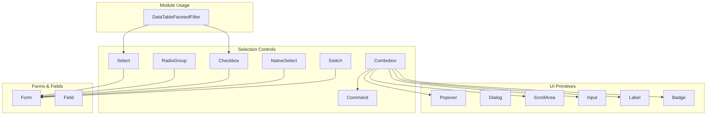
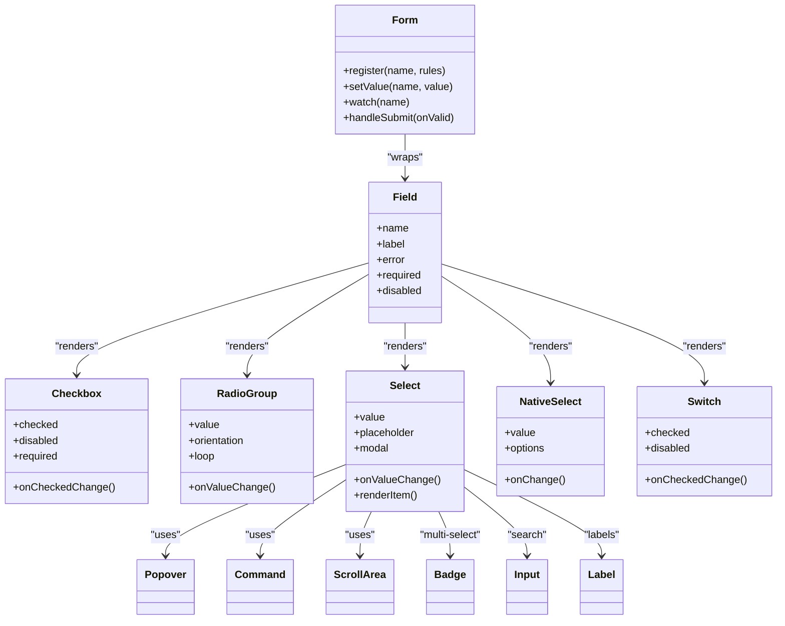
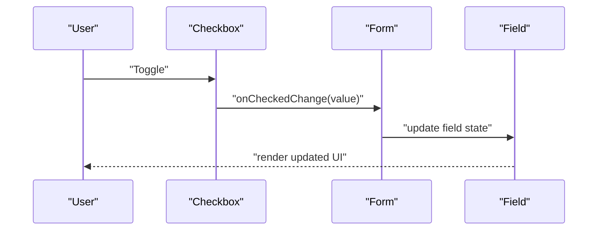
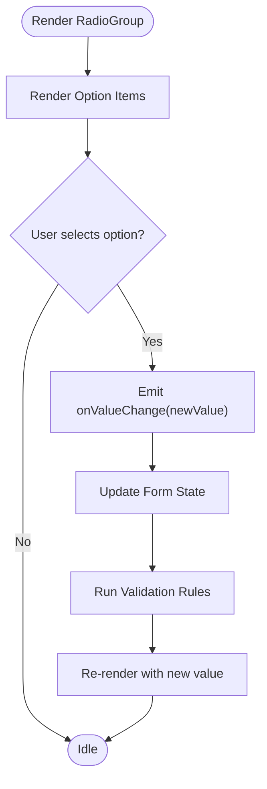
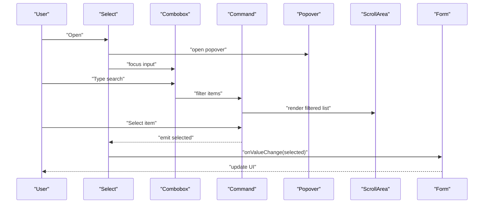
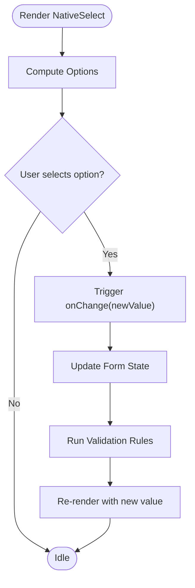
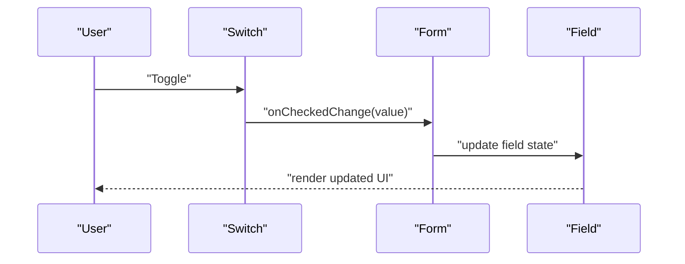
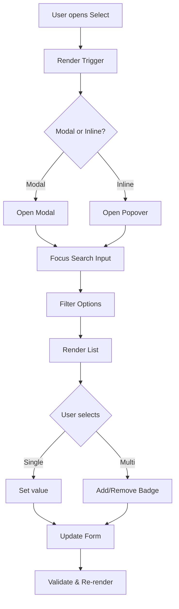
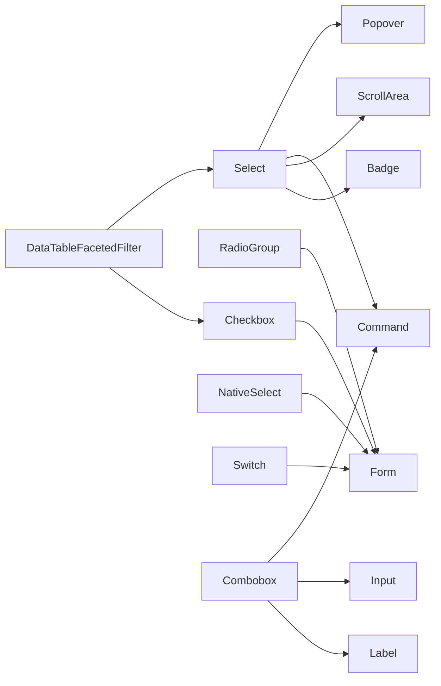

# Selection Controls

<cite>
**Referenced Files in This Document**
- [checkbox.tsx](file://src/components/ui/checkbox.tsx)
- [radio-group.tsx](file://src/components/ui/radio-group.tsx)
- [select.tsx](file://src/components/ui/select.tsx)
- [native-select.tsx](file://src/components/ui/native-select.tsx)
- [switch.tsx](file://src/components/ui/switch.tsx)
- [form.tsx](file://src/components/ui/form.tsx)
- [field.tsx](file://src/components/ui/field.tsx)
- [combobox.tsx](file://src/components/ui/combobox.tsx)
- [command.tsx](file://src/components/ui/command.tsx)
- [popover.tsx](file://src/components/ui/popover.tsx)
- [dialog.tsx](file://src/components/ui/dialog.tsx)
- [input.tsx](file://src/components/ui/input.tsx)
- [label.tsx](file://src/components/ui/label.tsx)
- [badge.tsx](file://src/components/ui/badge.tsx)
- [scroll-area.tsx](file://src/components/ui/scroll-area.tsx)
- [data-table-faceted-filter.tsx](file://src/modules/tasks/components/data-table-faceted-filter.tsx)
</cite>

## Table of Contents
1. [Introduction](#introduction)
2. [Project Structure](#project-structure)
3. [Core Components](#core-components)
4. [Architecture Overview](#architecture-overview)
5. [Detailed Component Analysis](#detailed-component-analysis)
6. [Dependency Analysis](#dependency-analysis)
7. [Performance Considerations](#performance-considerations)
8. [Troubleshooting Guide](#troubleshooting-guide)
9. [Conclusion](#conclusion)
10. [Appendices](#appendices)

## Introduction
This document provides comprehensive documentation for selection control components: Checkbox, Radio Group, Select, Native Select, and Switch. It covers component APIs, props/attributes, event handlers, validation patterns, styling customization, accessibility considerations, responsive design patterns, and integration with form state management. It also addresses complex scenarios such as multi-select, searchable dropdowns, and conditional logic using the project’s UI primitives and module-level examples.

## Project Structure
The selection controls are implemented as reusable UI components under src/components/ui and are used across modules (e.g., tasks, users, settings). The architecture follows a layered approach:
- Low-level UI primitives (e.g., Popover, Dialog, ScrollArea, Badge, Input, Label)
- Selection components built on top of primitives
- Module-level usage demonstrating advanced patterns (e.g., faceted filtering)

**Diagram sources**
- [checkbox.tsx](file://src/components/ui/checkbox.tsx)
- [radio-group.tsx](file://src/components/ui/radio-group.tsx)
- [select.tsx](file://src/components/ui/select.tsx)
- [native-select.tsx](file://src/components/ui/native-select.tsx)
- [switch.tsx](file://src/components/ui/switch.tsx)
- [combobox.tsx](file://src/components/ui/combobox.tsx)
- [command.tsx](file://src/components/ui/command.tsx)
- [popover.tsx](file://src/components/ui/popover.tsx)
- [dialog.tsx](file://src/components/ui/dialog.tsx)
- [input.tsx](file://src/components/ui/input.tsx)
- [label.tsx](file://src/components/ui/label.tsx)
- [badge.tsx](file://src/components/ui/badge.tsx)
- [scroll-area.tsx](file://src/components/ui/scroll-area.tsx)
- [data-table-faceted-filter.tsx](file://src/modules/tasks/components/data-table-faceted-filter.tsx)

**Section sources**
- [checkbox.tsx](file://src/components/ui/checkbox.tsx)
- [radio-group.tsx](file://src/components/ui/radio-group.tsx)
- [select.tsx](file://src/components/ui/select.tsx)
- [native-select.tsx](file://src/components/ui/native-select.tsx)
- [switch.tsx](file://src/components/ui/switch.tsx)
- [combobox.tsx](file://src/components/ui/combobox.tsx)
- [command.tsx](file://src/components/ui/command.tsx)
- [popover.tsx](file://src/components/ui/popover.tsx)
- [dialog.tsx](file://src/components/ui/dialog.tsx)
- [input.tsx](file://src/components/ui/input.tsx)
- [label.tsx](file://src/components/ui/label.tsx)
- [badge.tsx](file://src/components/ui/badge.tsx)
- [scroll-area.tsx](file://src/components/ui/scroll-area.tsx)
- [form.tsx](file://src/components/ui/form.tsx)
- [field.tsx](file://src/components/ui/field.tsx)
- [data-table-faceted-filter.tsx](file://src/modules/tasks/components/data-table-faceted-filter.tsx)

## Core Components
This section summarizes each selection control’s purpose, typical props, events, and common usage patterns. For precise prop names and types, refer to the linked files.

- Checkbox
  - Purpose: Toggle a boolean value; supports indeterminate states.
  - Typical props: checked, defaultChecked, disabled, required, id, name, value, onChange/onCheckedChange, onPointerDownOutside, aria-label, aria-describedby.
  - Events: change/checked updates, pointer interactions.
  - Accessibility: associates label via htmlFor/id, supports aria-invalid when invalid.
  - Styling: controlled by theme classes and variant props where applicable.
  - Section sources
    - [checkbox.tsx](file://src/components/ui/checkbox.tsx)
    - [form.tsx](file://src/components/ui/form.tsx)
    - [field.tsx](file://src/components/ui/field.tsx)

- Radio Group
  - Purpose: Single-choice selection from multiple options.
  - Typical props: value, defaultValue, onValueChange, orientation, loop, disabled, required, name, id.
  - Events: value change, keyboard navigation.
  - Accessibility: role="radiogroup", radio items have role="radio", proper labels and aria-checked.
  - Styling: variant and size props may be available; consistent with theme tokens.
  - Section sources
    - [radio-group.tsx](file://src/components/ui/radio-group.tsx)
    - [form.tsx](file://src/components/ui/form.tsx)
    - [field.tsx](file://src/components/ui/field.tsx)

- Select (Custom)
  - Purpose: Dropdown-style single or multi-value selection with rich features.
  - Typical props: value, onValueChange, placeholder, disabled, required, modal, align, side, collisionPadding, triggerContent, contentProps, itemComponent, renderItem.
  - Events: open/close, selection changes, search/filter if integrated with Combobox.
  - Accessibility: combobox semantics, aria-expanded, aria-activedescendant, keyboard navigation.
  - Styling: customizable via content and item components; supports badges for multi-select.
  - Section sources
    - [select.tsx](file://src/components/ui/select.tsx)
    - [combobox.tsx](file://src/components/ui/combobox.tsx)
    - [command.tsx](file://src/components/ui/command.tsx)
    - [popover.tsx](file://src/components/ui/popover.tsx)
    - [scroll-area.tsx](file://src/components/ui/scroll-area.tsx)
    - [badge.tsx](file://src/components/ui/badge.tsx)

- Native Select
  - Purpose: Lightweight select backed by native <select>.
  - Typical props: value, onChange, disabled, required, placeholder, options, className, id, name.
  - Events: native change event.
  - Accessibility: leverages native semantics; pair with Label for best practices.
  - Styling: minimal overrides; use className and theme utilities.
  - Section sources
    - [native-select.tsx](file://src/components/ui/native-select.tsx)
    - [label.tsx](file://src/components/ui/label.tsx)
    - [form.tsx](file://src/components/ui/form.tsx)

- Switch
  - Purpose: Binary toggle similar to checkbox but with distinct UX.
  - Typical props: checked, defaultChecked, disabled, required, id, name, value, onCheckedChange, aria-label, aria-describedby.
  - Events: checked change, pointer interactions.
  - Accessibility: role="switch", aria-checked, focus management.
  - Styling: variant and size props; theme-driven colors.
  - Section sources
    - [switch.tsx](file://src/components/ui/switch.tsx)
    - [form.tsx](file://src/components/ui/form.tsx)
    - [field.tsx](file://src/components/ui/field.tsx)

## Architecture Overview
The selection components integrate tightly with form field abstractions and primitive UI layers. The following diagram shows how higher-level selection components compose lower-level primitives and how forms manage state and validation.

**Diagram sources**
- [form.tsx](file://src/components/ui/form.tsx)
- [field.tsx](file://src/components/ui/field.tsx)
- [checkbox.tsx](file://src/components/ui/checkbox.tsx)
- [radio-group.tsx](file://src/components/ui/radio-group.tsx)
- [select.tsx](file://src/components/ui/select.tsx)
- [native-select.tsx](file://src/components/ui/native-select.tsx)
- [switch.tsx](file://src/components/ui/switch.tsx)
- [combobox.tsx](file://src/components/ui/combobox.tsx)
- [command.tsx](file://src/components/ui/command.tsx)
- [popover.tsx](file://src/components/ui/popover.tsx)
- [scroll-area.tsx](file://src/components/ui/scroll-area.tsx)
- [badge.tsx](file://src/components/ui/badge.tsx)
- [input.tsx](file://src/components/ui/input.tsx)
- [label.tsx](file://src/components/ui/label.tsx)

## Detailed Component Analysis

### Checkbox
- API overview
  - Props: checked/defaultChecked, disabled, required, id/name/value, onCheckedChange/onPointerDownOutside, aria-* attributes.
  - Events: toggles checked state; integrates with form registration for validation.
  - Validation: required, custom validators via form schema; error display through Field wrapper.
  - Styling: theme-based variants; can be combined with Label for accessible labeling.
  - Accessibility: htmlFor/id pairing, aria-invalid when invalid, keyboard support.
- Usage example references
  - Basic usage and form integration: [checkbox.tsx](file://src/components/ui/checkbox.tsx), [form.tsx](file://src/components/ui/form.tsx), [field.tsx](file://src/components/ui/field.tsx)
- Complex scenarios
  - Multi-select: combine multiple checkboxes within a form array or list; see module-level patterns in data tables.
  - Conditional logic: derive visibility/enabled state from other fields.

**Diagram sources**
- [checkbox.tsx](file://src/components/ui/checkbox.tsx)
- [form.tsx](file://src/components/ui/form.tsx)
- [field.tsx](file://src/components/ui/field.tsx)

**Section sources**
- [checkbox.tsx](file://src/components/ui/checkbox.tsx)
- [form.tsx](file://src/components/ui/form.tsx)
- [field.tsx](file://src/components/ui/field.tsx)

### Radio Group
- API overview
  - Props: value/defaultValue, onValueChange, orientation, loop, disabled, required, name/id.
  - Events: emits selected value; keyboard navigation between options.
  - Validation: required constraints; error messaging via Field.
  - Styling: variant/size options; consistent spacing and alignment.
  - Accessibility: radiogroup role, radio roles, aria-checked, labels.
- Usage example references
  - Single choice selection: [radio-group.tsx](file://src/components/ui/radio-group.tsx), [form.tsx](file://src/components/ui/form.tsx), [field.tsx](file://src/components/ui/field.tsx)
- Complex scenarios
  - Conditional rendering: show/hide dependent fields based on selected option.
  - Grouped sections: nest multiple radio groups with distinct names.

**Diagram sources**
- [radio-group.tsx](file://src/components/ui/radio-group.tsx)
- [form.tsx](file://src/components/ui/form.tsx)
- [field.tsx](file://src/components/ui/field.tsx)

**Section sources**
- [radio-group.tsx](file://src/components/ui/radio-group.tsx)
- [form.tsx](file://src/components/ui/form.tsx)
- [field.tsx](file://src/components/ui/field.tsx)

### Select (Custom)
- API overview
  - Props: value/onValueChange, placeholder, disabled, required, modal, align/side/collisionPadding, triggerContent, contentProps, itemComponent/renderItem.
  - Events: open/close, selection change, search/filter when paired with Combobox.
  - Validation: required, custom rules via form schema; error display via Field.
  - Styling: fully customizable via itemComponent and contentProps; supports multi-select with Badges.
  - Accessibility: combobox semantics, aria-expanded, aria-activedescendant, keyboard navigation.
- Usage example references
  - Single/multi-select, searchable dropdown: [select.tsx](file://src/components/ui/select.tsx), [combobox.tsx](file://src/components/ui/combobox.tsx), [command.tsx](file://src/components/ui/command.tsx), [popover.tsx](file://src/components/ui/popover.tsx), [scroll-area.tsx](file://src/components/ui/scroll-area.tsx), [badge.tsx](file://src/components/ui/badge.tsx)
- Complex scenarios
  - Multi-select: render selected values as removable Badges; handle add/remove operations.
  - Searchable dropdown: integrate input search with command filtering; virtualize long lists with ScrollArea.
  - Conditional logic: filter options based on other form fields.

**Diagram sources**
- [select.tsx](file://src/components/ui/select.tsx)
- [combobox.tsx](file://src/components/ui/combobox.tsx)
- [command.tsx](file://src/components/ui/command.tsx)
- [popover.tsx](file://src/components/ui/popover.tsx)
- [scroll-area.tsx](file://src/components/ui/scroll-area.tsx)

**Section sources**
- [select.tsx](file://src/components/ui/select.tsx)
- [combobox.tsx](file://src/components/ui/combobox.tsx)
- [command.tsx](file://src/components/ui/command.tsx)
- [popover.tsx](file://src/components/ui/popover.tsx)
- [scroll-area.tsx](file://src/components/ui/scroll-area.tsx)
- [badge.tsx](file://src/components/ui/badge.tsx)

### Native Select
- API overview
  - Props: value/onChange, disabled, required, placeholder, options, className, id/name.
  - Events: native change event; integrates with form onChange handlers.
  - Validation: standard HTML5 validation plus form schema rules.
  - Styling: minimal overrides; use className and theme utilities.
  - Accessibility: leverages native semantics; pair with Label for best practices.
- Usage example references
  - Simple selection: [native-select.tsx](file://src/components/ui/native-select.tsx), [label.tsx](file://src/components/ui/label.tsx), [form.tsx](file://src/components/ui/form.tsx)
- Complex scenarios
  - Dynamic options: compute options based on other fields; re-render on dependency changes.
  - Responsive behavior: native select adapts well across devices; consider larger touch targets.

**Diagram sources**
- [native-select.tsx](file://src/components/ui/native-select.tsx)
- [form.tsx](file://src/components/ui/form.tsx)

**Section sources**
- [native-select.tsx](file://src/components/ui/native-select.tsx)
- [label.tsx](file://src/components/ui/label.tsx)
- [form.tsx](file://src/components/ui/form.tsx)

### Switch
- API overview
  - Props: checked/defaultChecked, disabled, required, id/name/value, onCheckedChange, aria-label/aria-describedby.
  - Events: toggles checked state; integrates with form registration for validation.
  - Validation: required, custom validators via form schema; error display via Field.
  - Styling: theme-driven variants; suitable for binary preferences.
  - Accessibility: role="switch", aria-checked, focus management.
- Usage example references
  - Toggle preference: [switch.tsx](file://src/components/ui/switch.tsx), [form.tsx](file://src/components/ui/form.tsx), [field.tsx](file://src/components/ui/field.tsx)
- Complex scenarios
  - Conditional logic: enable/disable other controls based on switch state.
  - Grouped toggles: multiple switches controlling different feature flags.

**Diagram sources**
- [switch.tsx](file://src/components/ui/switch.tsx)
- [form.tsx](file://src/components/ui/form.tsx)
- [field.tsx](file://src/components/ui/field.tsx)

**Section sources**
- [switch.tsx](file://src/components/ui/switch.tsx)
- [form.tsx](file://src/components/ui/form.tsx)
- [field.tsx](file://src/components/ui/field.tsx)

### Conceptual Overview
- Multi-select patterns
  - Use Select with renderItem to render selected values as Badges; provide remove actions per badge.
  - Maintain an array state; update on add/remove; ensure unique keys and stable identities.
- Searchable dropdowns
  - Combine Select with Combobox and Command for efficient filtering; debounce input if needed.
  - Use ScrollArea for large lists; implement virtualization if necessary.
- Conditional logic
  - Derive options or enabled states from other fields; leverage form watch/dependencies.
  - Show/hide sections based on selections; maintain focus management for better UX.

[No sources needed since this diagram shows conceptual workflow, not actual code structure]

## Dependency Analysis
Selection components depend on UI primitives and form abstractions. The following diagram highlights key dependencies and their relationships.

**Diagram sources**
- [checkbox.tsx](file://src/components/ui/checkbox.tsx)
- [radio-group.tsx](file://src/components/ui/radio-group.tsx)
- [select.tsx](file://src/components/ui/select.tsx)
- [native-select.tsx](file://src/components/ui/native-select.tsx)
- [switch.tsx](file://src/components/ui/switch.tsx)
- [combobox.tsx](file://src/components/ui/combobox.tsx)
- [command.tsx](file://src/components/ui/command.tsx)
- [popover.tsx](file://src/components/ui/popover.tsx)
- [scroll-area.tsx](file://src/components/ui/scroll-area.tsx)
- [badge.tsx](file://src/components/ui/badge.tsx)
- [input.tsx](file://src/components/ui/input.tsx)
- [label.tsx](file://src/components/ui/label.tsx)
- [data-table-faceted-filter.tsx](file://src/modules/tasks/components/data-table-faceted-filter.tsx)

**Section sources**
- [checkbox.tsx](file://src/components/ui/checkbox.tsx)
- [radio-group.tsx](file://src/components/ui/radio-group.tsx)
- [select.tsx](file://src/components/ui/select.tsx)
- [native-select.tsx](file://src/components/ui/native-select.tsx)
- [switch.tsx](file://src/components/ui/switch.tsx)
- [combobox.tsx](file://src/components/ui/combobox.tsx)
- [command.tsx](file://src/components/ui/command.tsx)
- [popover.tsx](file://src/components/ui/popover.tsx)
- [scroll-area.tsx](file://src/components/ui/scroll-area.tsx)
- [badge.tsx](file://src/components/ui/badge.tsx)
- [input.tsx](file://src/components/ui/input.tsx)
- [label.tsx](file://src/components/ui/label.tsx)
- [data-table-faceted-filter.tsx](file://src/modules/tasks/components/data-table-faceted-filter.tsx)

## Performance Considerations
- Large option lists
  - Prefer ScrollArea for smooth scrolling; consider virtualization for very long lists.
  - Debounce search input to reduce re-renders during typing.
- Rendering optimization
  - Memoize expensive computations for options and filters.
  - Avoid unnecessary re-renders by stabilizing keys and derived values.
- Event handling
  - Coalesce rapid user interactions (e.g., quick toggles) to prevent excessive state updates.
- Memory usage
  - Clean up listeners and timers when components unmount.
  - Avoid storing large datasets in local state unless necessary.

[No sources needed since this section provides general guidance]

## Troubleshooting Guide
Common issues and resolutions:
- Focus management
  - Ensure the first selectable item receives focus when opening Select; verify aria-activedescendant is set correctly.
- Keyboard navigation
  - Confirm arrow keys navigate options; Enter/Space selects; Escape closes the dropdown.
- Validation feedback
  - Display errors via Field wrapper; ensure aria-invalid and aria-describedby link to error messages.
- Multi-select performance
  - Limit rendered badges; implement remove actions that update arrays immutably.
- Accessibility pitfalls
  - Always associate labels with inputs via htmlFor/id; avoid empty labels; test with screen readers.

**Section sources**
- [select.tsx](file://src/components/ui/select.tsx)
- [combobox.tsx](file://src/components/ui/combobox.tsx)
- [field.tsx](file://src/components/ui/field.tsx)
- [form.tsx](file://src/components/ui/form.tsx)

## Conclusion
The selection controls in this repository provide robust, accessible, and customizable building blocks for forms and interfaces. By composing primitives like Popover, Command, and ScrollArea, they support advanced scenarios including multi-select, searchable dropdowns, and conditional logic. Integrating with the form abstraction ensures consistent validation and state management. Follow the guidelines here to achieve high-quality UX across devices and assistive technologies.

[No sources needed since this section summarizes without analyzing specific files]

## Appendices

### TypeScript Types and Interfaces
- Refer to component files for exported types and interfaces:
  - Checkbox: [checkbox.tsx](file://src/components/ui/checkbox.tsx)
  - Radio Group: [radio-group.tsx](file://src/components/ui/radio-group.tsx)
  - Select: [select.tsx](file://src/components/ui/select.tsx)
  - Native Select: [native-select.tsx](file://src/components/ui/native-select.tsx)
  - Switch: [switch.tsx](file://src/components/ui/switch.tsx)
- Form integration types:
  - Form: [form.tsx](file://src/components/ui/form.tsx)
  - Field: [field.tsx](file://src/components/ui/field.tsx)

### Accessibility Checklist
- Provide descriptive labels (Label + htmlFor/id).
- Ensure keyboard operability (Tab, Arrow keys, Enter/Space, Escape).
- Announce state changes (aria-expanded, aria-checked, aria-invalid).
- Test with screen readers and color contrast tools.

### Responsive Design Patterns
- Use mobile-friendly triggers and larger hit areas.
- Prefer modal mode for Select on small screens; inline mode on desktop.
- Adjust padding and typography via theme utilities.

### Advanced Usage References
- Faceted filtering example (multi-select + checkboxes): [data-table-faceted-filter.tsx](file://src/modules/tasks/components/data-table-faceted-filter.tsx)