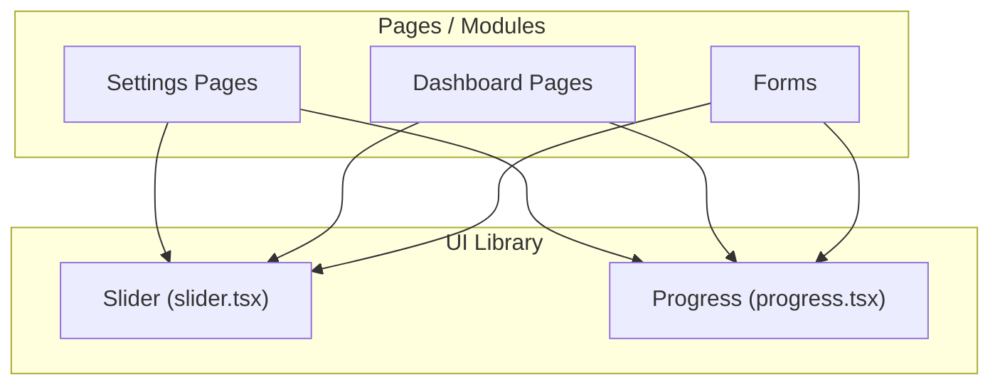
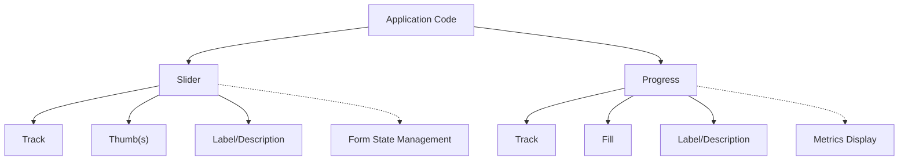
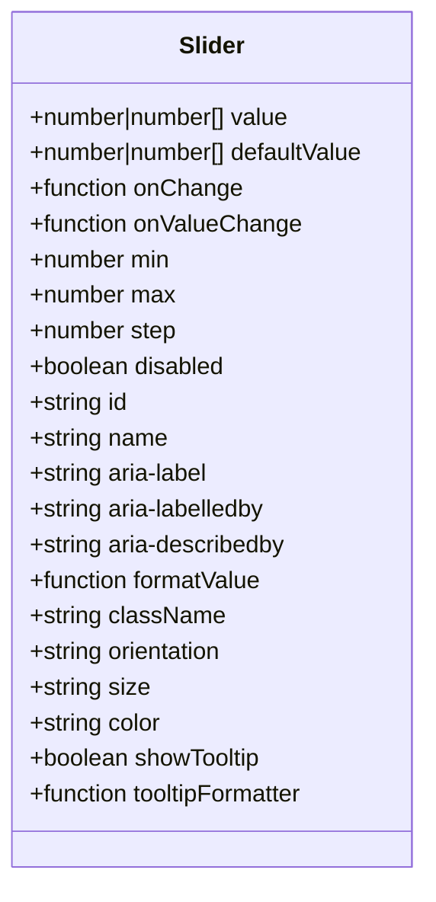
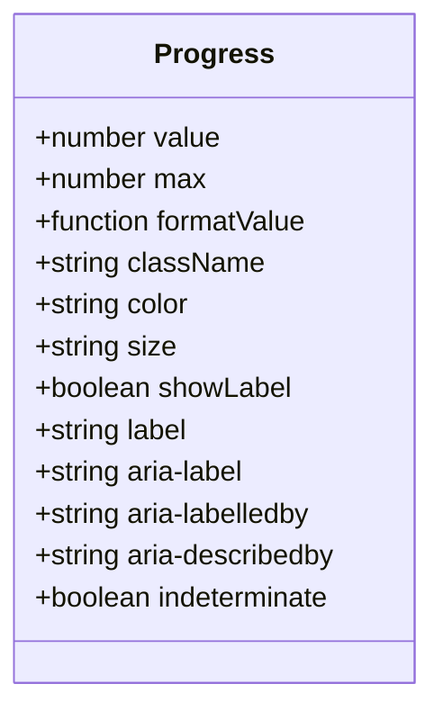
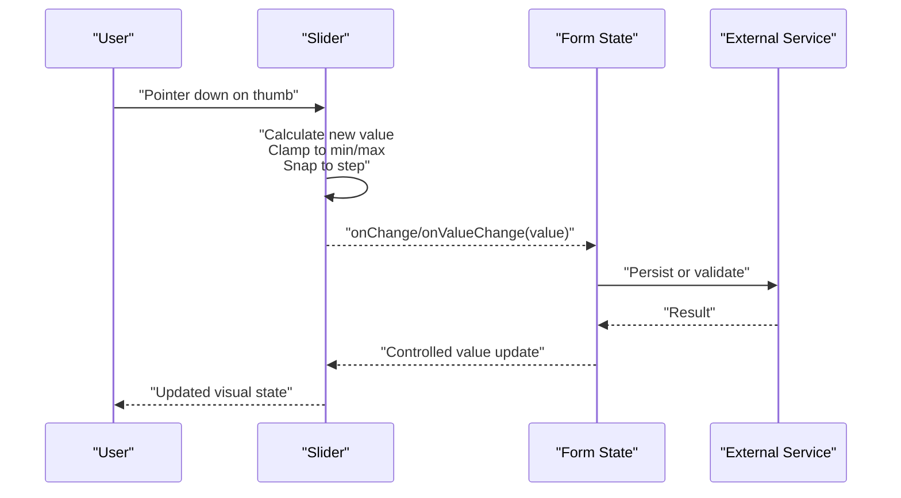
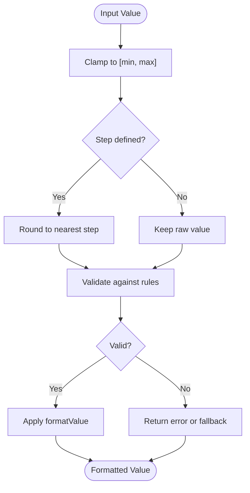
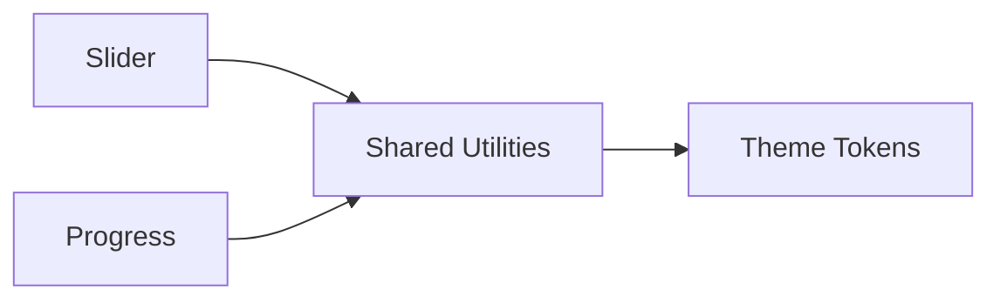

# Slider & Range Controls

<cite>
**Referenced Files in This Document**
- [slider.tsx](file://src/components/ui/slider.tsx)
- [progress.tsx](file://src/components/ui/progress.tsx)
</cite>

## Table of Contents
1. [Introduction](#introduction)
2. [Project Structure](#project-structure)
3. [Core Components](#core-components)
4. [Architecture Overview](#architecture-overview)
5. [Detailed Component Analysis](#detailed-component-analysis)
6. [Dependency Analysis](#dependency-analysis)
7. [Performance Considerations](#performance-considerations)
8. [Troubleshooting Guide](#troubleshooting-guide)
9. [Conclusion](#conclusion)
10. [Appendices](#appendices)

## Introduction
This document provides comprehensive documentation for the slider and range control components: Slider and Progress. It covers component APIs, props/attributes, value formatting, step controls, visual customization, usage examples with TypeScript types, accessibility considerations, keyboard navigation, responsive design, range validation, formatted display values, and integration with form state management. The goal is to help developers implement accessible, robust, and customizable sliders and progress indicators across applications.

## Project Structure
The slider and progress components are implemented as UI primitives under the shared UI library. They can be imported and used throughout the application’s pages and modules.

[No sources needed since this diagram shows conceptual workflow, not actual code structure]

## Core Components
- Slider: An interactive range input that supports single or multiple thumbs, steps, min/max bounds, controlled/uncontrolled usage, and custom formatting.
- Progress: A non-interactive indicator showing a percentage value within a bounded track.

Key capabilities include:
- Value binding and change callbacks
- Step increments and clamping
- Keyboard navigation and focus management
- Accessibility attributes and labels
- Visual customization via CSS classes and theme tokens
- Integration with form libraries and React state

**Section sources**
- [slider.tsx](file://src/components/ui/slider.tsx)
- [progress.tsx](file://src/components/ui/progress.tsx)

## Architecture Overview
At a high level, both components follow a consistent pattern:
- Controlled or uncontrolled value management
- Event handling for user interactions (pointer, keyboard)
- Rendering of track, fill, thumb(s), and optional label/description
- Accessibility attributes for screen readers and assistive technologies

[No sources needed since this diagram shows conceptual workflow, not actual code structure]

## Detailed Component Analysis

### Slider Component
Responsibilities:
- Represent a numeric range selection with one or more thumbs
- Enforce min/max and step constraints
- Provide keyboard navigation and ARIA semantics
- Support controlled and uncontrolled modes
- Allow custom formatting and visual styling

Typical props/attributes:
- value or defaultValue: number | number[]
- onChange: (value: number | number[]) => void
- onValueChange: (value: number | number[], raw?: number | number[]) => void
- min: number
- max: number
- step: number
- disabled: boolean
- id: string
- name: string
- aria-label, aria-labelledby, aria-describedby: string
- formatValue: (value: number | number[]) => string
- className: string
- orientation: "horizontal" | "vertical"
- size: "sm" | "md" | "lg"
- color: string | undefined
- showTooltip: boolean
- tooltipFormatter: (value: number | number[]) => string

Accessibility:
- role="slider"
- aria-valuemin, aria-valuemax, aria-valuenow
- aria-orientation
- aria-disabled when disabled
- Focusable thumb(s) with arrow key support

Keyboard navigation:
- Arrow keys increment/decrement by step
- Home/End jump to min/max
- Page Up/Page Down for larger jumps if supported

Responsive behavior:
- Horizontal default; vertical variant available
- Touch-friendly thumb sizing
- Adapts to container width

Integration patterns:
- Controlled: bind value and onChange
- Uncontrolled: provide defaultValue and onValueChange
- With form libraries: use ref or controller wrapper to integrate with validation

Usage example references:
- Single-thumb slider with step and formatting
- Dual-thumb range with min/max and validation
- Vertical slider for compact layouts
- Disabled and read-only states

**Section sources**
- [slider.tsx](file://src/components/ui/slider.tsx)

#### Class Diagram (Conceptual Mapping)

[No sources needed since this diagram shows conceptual mapping, not actual code structure]

### Progress Component
Responsibilities:
- Display a non-interactive percentage value
- Indicate completion or load status
- Provide accessible labeling and current value

Typical props/attributes:
- value: number (percentage from 0 to 100)
- max: number (default 100)
- formatValue: (value: number) => string
- className: string
- color: string | undefined
- size: "sm" | "md" | "lg"
- showLabel: boolean
- label: string
- aria-label, aria-labelledby, aria-describedby: string
- indeterminate: boolean (optional)

Accessibility:
- role="progressbar"
- aria-valuemin, aria-valuemax, aria-valuenow
- aria-label or aria-labelledby

Visual customization:
- Track background and fill color
- Height and radius via size variants
- Optional label text and formatting

Usage example references:
- Simple progress bar with value and label
- Indeterminate loading state
- Custom colors and sizes
- Integration with async operations

**Section sources**
- [progress.tsx](file://src/components/ui/progress.tsx)

#### Class Diagram (Conceptual Mapping)

[No sources needed since this diagram shows conceptual mapping, not actual code structure]

### Sequence Diagram: Slider Interaction Flow

[No sources needed since this diagram shows conceptual workflow, not actual code structure]

### Flowchart: Value Formatting and Validation

[No sources needed since this diagram shows conceptual workflow, not actual code structure]

## Dependency Analysis
- Both components are self-contained UI primitives with minimal external dependencies.
- They may rely on shared utilities for class merging and theme tokens.
- No circular dependencies between Slider and Progress.

[No sources needed since this diagram shows conceptual relationships, not actual code structure]

## Performance Considerations
- Prefer controlled updates only when necessary; use uncontrolled mode with onValueChange for performance-critical scenarios.
- Debounce expensive side effects triggered by frequent changes (e.g., network requests).
- Avoid heavy computations inside render; precompute formatted strings where possible.
- Use memoization for derived values and form integrations.

[No sources needed since this section provides general guidance]

## Troubleshooting Guide
Common issues and resolutions:
- Value out of bounds: Ensure min/max are set and onChange clamps values.
- Step misalignment: Verify step divides the range evenly or handle rounding explicitly.
- Accessibility warnings: Confirm aria-* attributes and labels are provided.
- Keyboard not working: Ensure the thumb has focus and role/aria attributes are correct.
- Form integration errors: Bind value and onChange correctly; avoid conflicting controlled/uncontrolled states.

**Section sources**
- [slider.tsx](file://src/components/ui/slider.tsx)
- [progress.tsx](file://src/components/ui/progress.tsx)

## Conclusion
Slider and Progress components provide flexible, accessible, and customizable range inputs and progress indicators. By following the documented APIs, accessibility guidelines, and integration patterns, developers can build robust forms and dashboards with consistent UX across devices.

[No sources needed since this section summarizes without analyzing specific files]

## Appendices

### TypeScript Types Reference
- Slider props: see [slider.tsx](file://src/components/ui/slider.tsx)
- Progress props: see [progress.tsx](file://src/components/ui/progress.tsx)

### Accessibility Checklist
- Provide aria-label or aria-labelledby
- Set aria-valuemin, aria-valuemax, aria-valuenow
- Ensure focus management and keyboard support
- Announce changes to screen readers

### Responsive Design Tips
- Use horizontal layout by default; switch to vertical for narrow spaces
- Adjust thumb size for touch targets
- Test at common breakpoints for readability and usability

[No sources needed since this section provides general guidance]