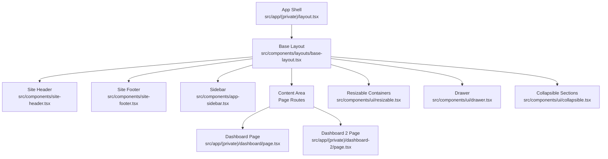
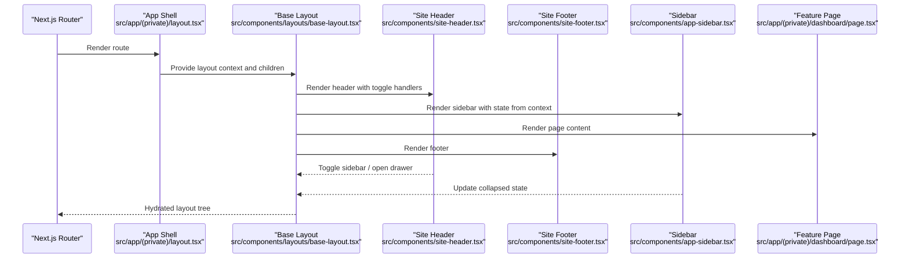
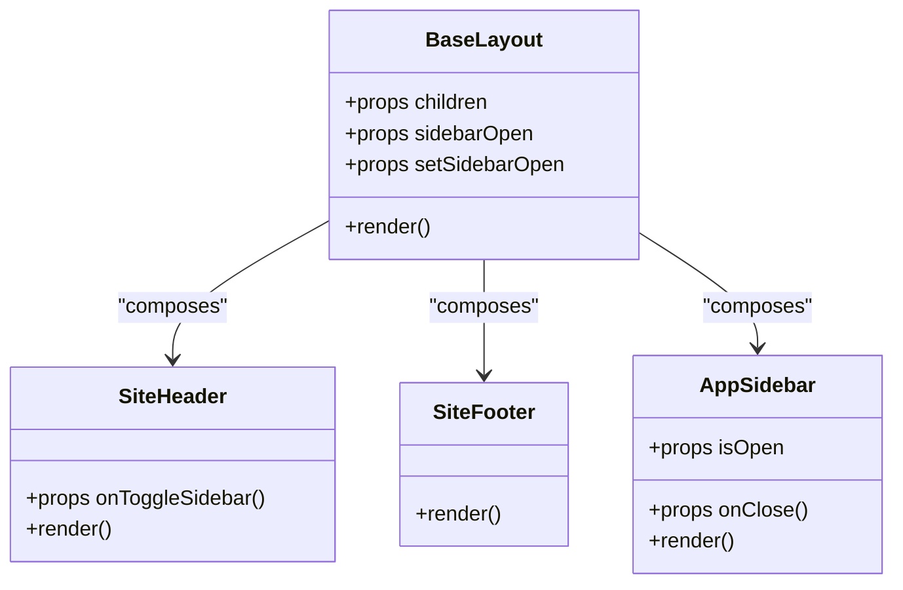
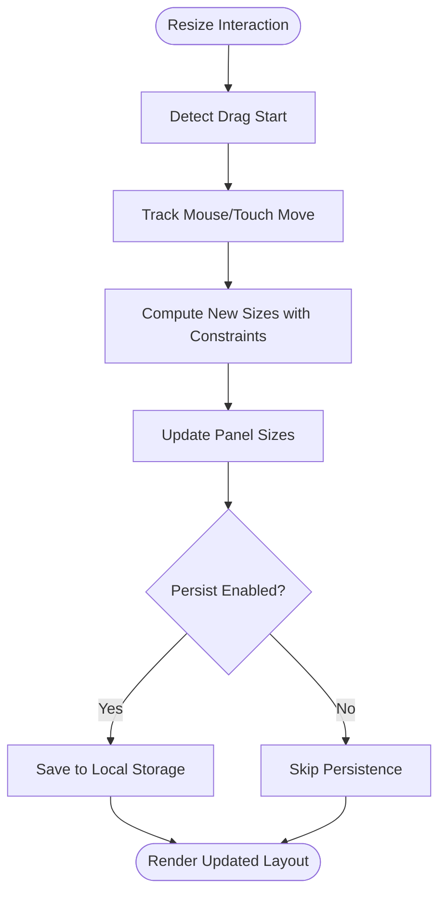
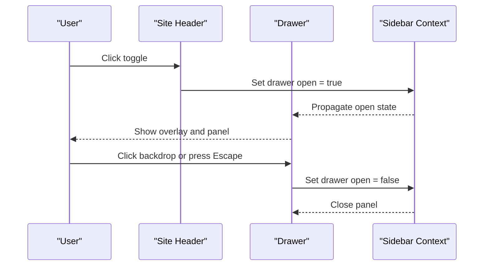
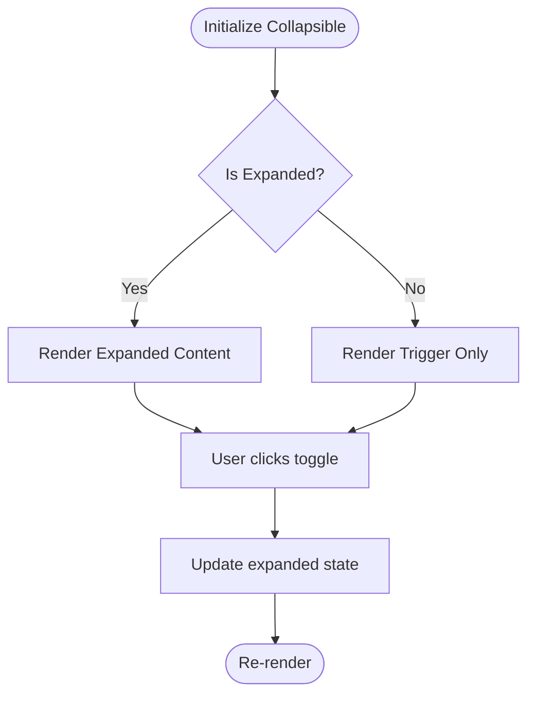
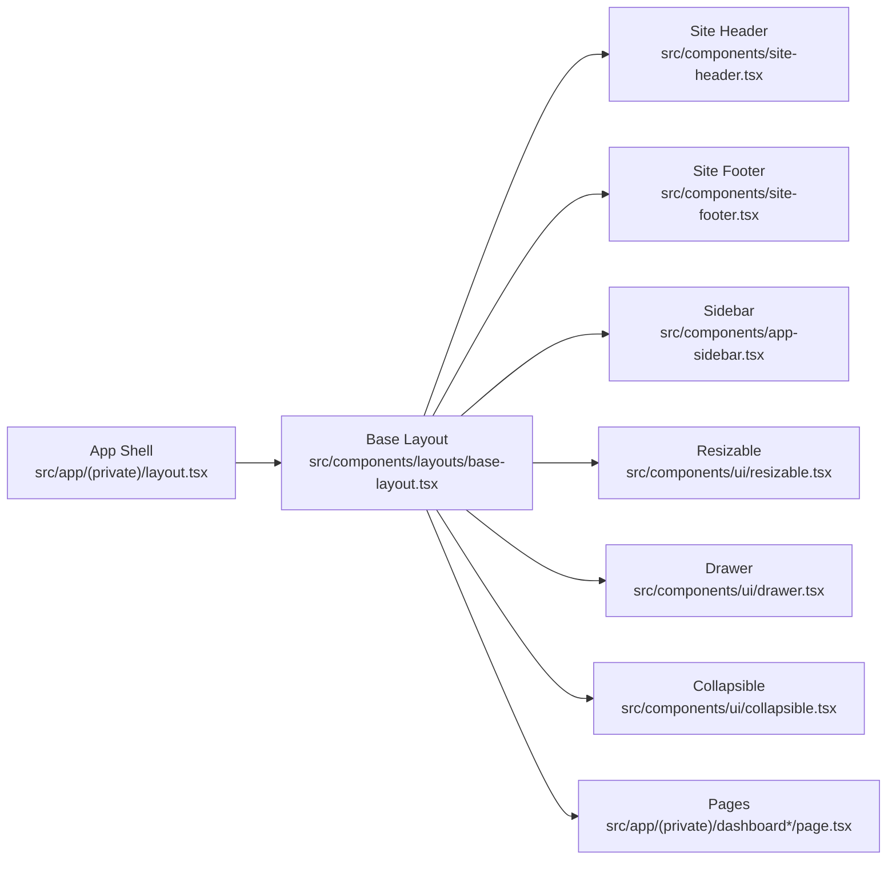

# Layout Components

<cite>
**Referenced Files in This Document**
- [base-layout.tsx](file://src/components/layouts/base-layout.tsx)
- [site-header.tsx](file://src/components/site-header.tsx)
- [site-footer.tsx](file://src/components/site-footer.tsx)
- [resizable.tsx](file://src/components/ui/resizable.tsx)
- [drawer.tsx](file://src/components/ui/drawer.tsx)
- [collapsible.tsx](file://src/components/ui/collapsible.tsx)
- [app-sidebar.tsx](file://src/components/app-sidebar.tsx)
- [layout.tsx](file://src/app/(private)/layout.tsx)
- [page.tsx](file://src/app/(private)/dashboard/page.tsx)
- [page.tsx](file://src/app/(private)/dashboard-2/page.tsx)
- [use-mobile.ts](file://src/hooks/use-mobile.ts)
- [sidebar-context.tsx](file://src/contexts/sidebar-context.tsx)
- [globals.css](file://src/app/globals.css)
</cite>

## Table of Contents
1. [Introduction](#introduction)
2. [Project Structure](#project-structure)
3. [Core Components](#core-components)
4. [Architecture Overview](#architecture-overview)
5. [Detailed Component Analysis](#detailed-component-analysis)
6. [Dependency Analysis](#dependency-analysis)
7. [Performance Considerations](#performance-considerations)
8. [Troubleshooting Guide](#troubleshooting-guide)
9. [Conclusion](#conclusion)

## Introduction
This document explains the layout system used across the application, focusing on Base Layout, Site Header, Site Footer, Resizable containers, Drawer, and Collapsible sections. It covers layout patterns, responsive design implementation, and composition strategies for building dashboards and flexible interfaces. It also includes guidance for optimizing performance when rendering large layouts.

## Project Structure
The layout system is composed of reusable components under src/components and page-level layouts under src/app. The private app shell composes a sidebar, header, content area, and footer to create consistent dashboard experiences.

**Diagram sources**
- [layout.tsx](file://src/app/(private)/layout.tsx)
- [base-layout.tsx](file://src/components/layouts/base-layout.tsx)
- [site-header.tsx](file://src/components/site-header.tsx)
- [site-footer.tsx](file://src/components/site-footer.tsx)
- [app-sidebar.tsx](file://src/components/app-sidebar.tsx)
- [page.tsx](file://src/app/(private)/dashboard/page.tsx)
- [page.tsx](file://src/app/(private)/dashboard-2/page.tsx)
- [resizable.tsx](file://src/components/ui/resizable.tsx)
- [drawer.tsx](file://src/components/ui/drawer.tsx)
- [collapsible.tsx](file://src/components/ui/collapsible.tsx)

**Section sources**
- [layout.tsx](file://src/app/(private)/layout.tsx)
- [base-layout.tsx](file://src/components/layouts/base-layout.tsx)

## Core Components
- Base Layout: Provides the overall grid or flex structure, integrates header/footer/sidebar, and exposes slots for dynamic content. It coordinates responsive behavior and theme context.
- Site Header: Contains branding, navigation triggers, user controls, and optional search. It adapts to mobile by collapsing into a drawer or hamburger menu.
- Site Footer: Displays secondary links, legal info, and status indicators. It remains fixed at the bottom of the viewport or within the content flow depending on layout mode.
- Resizable Containers: Enable users to adjust panel sizes (e.g., split views). They expose props for min/max widths, initial sizes, and persistence hooks.
- Drawer: A slide-out panel for auxiliary content (filters, details, settings). It supports overlay, backdrop click-to-close, and mobile-first behaviors.
- Collapsible Sections: Accordion-like panels that expand/collapse content to reduce cognitive load and improve scanning.

Key responsibilities:
- Composition: Base Layout composes header, footer, sidebar, and content; pages compose feature modules inside the content slot.
- Responsiveness: Mobile breakpoints are handled via hooks and CSS utilities; drawers replace sidebars on small screens.
- State coordination: Sidebar state is shared through context to keep header toggles and drawer open states synchronized.

**Section sources**
- [base-layout.tsx](file://src/components/layouts/base-layout.tsx)
- [site-header.tsx](file://src/components/site-header.tsx)
- [site-footer.tsx](file://src/components/site-footer.tsx)
- [resizable.tsx](file://src/components/ui/resizable.tsx)
- [drawer.tsx](file://src/components/ui/drawer.tsx)
- [collapsible.tsx](file://src/components/ui/collapsible.tsx)
- [sidebar-context.tsx](file://src/contexts/sidebar-context.tsx)

## Architecture Overview
The application uses a layered layout architecture:
- App Shell: Defines global chrome (header, footer, sidebar) and routes.
- Base Layout: Encapsulates common layout logic and responsive rules.
- Feature Pages: Compose data tables, charts, and forms within the content area.
- UI Primitives: Reusable primitives like resizable, drawer, and collapsible are composed into higher-level features.

**Diagram sources**
- [layout.tsx](file://src/app/(private)/layout.tsx)
- [base-layout.tsx](file://src/components/layouts/base-layout.tsx)
- [site-header.tsx](file://src/components/site-header.tsx)
- [site-footer.tsx](file://src/components/site-footer.tsx)
- [app-sidebar.tsx](file://src/components/app-sidebar.tsx)
- [page.tsx](file://src/app/(private)/dashboard/page.tsx)

## Detailed Component Analysis

### Base Layout
Responsibilities:
- Establishes the main flex/grid container.
- Integrates header, footer, and sidebar.
- Applies responsive classes and manages overflow.
- Exposes a content slot for pages.

Responsive behavior:
- On small screens, the sidebar collapses and can be revealed via a drawer triggered from the header.
- Content area scrolls independently while keeping header/footer visible.

Composition strategy:
- Accepts children prop for page content.
- Optionally accepts props to control sidebar visibility and drawer state.

**Diagram sources**
- [base-layout.tsx](file://src/components/layouts/base-layout.tsx)
- [site-header.tsx](file://src/components/site-header.tsx)
- [site-footer.tsx](file://src/components/site-footer.tsx)
- [app-sidebar.tsx](file://src/components/app-sidebar.tsx)

**Section sources**
- [base-layout.tsx](file://src/components/layouts/base-layout.tsx)

### Site Header
Responsibilities:
- Displays logo, title, and primary actions.
- Provides a toggle for sidebar/drawer on mobile.
- May include search, notifications, and user menu.

Mobile behavior:
- Collapses navigation into a drawer or dropdown.
- Uses a hamburger icon to trigger drawer open state.

Integration points:
- Subscribes to sidebar context to reflect current open/collapsed state.
- Emits events to update sidebar state.

**Section sources**
- [site-header.tsx](file://src/components/site-header.tsx)
- [sidebar-context.tsx](file://src/contexts/sidebar-context.tsx)

### Site Footer
Responsibilities:
- Renders copyright, links, and status.
- Adapts padding/margins based on layout mode.

Accessibility:
- Semantic HTML structure with proper landmarks.
- Keyboard navigable links.

**Section sources**
- [site-footer.tsx](file://src/components/site-footer.tsx)

### Resizable Containers
Responsibilities:
- Allow horizontal or vertical resizing of adjacent panels.
- Enforce min/max constraints and handle drag interactions.
- Optionally persist sizes in local storage.

Usage patterns:
- Split view for data table and detail pane.
- Dashboard with chart and metrics panels.

Performance considerations:
- Debounce resize updates to avoid excessive re-renders.
- Use memoization for expensive child components.

**Diagram sources**
- [resizable.tsx](file://src/components/ui/resizable.tsx)

**Section sources**
- [resizable.tsx](file://src/components/ui/resizable.tsx)

### Drawer
Responsibilities:
- Slides in/out from an edge (left/right/top/bottom).
- Supports overlay/backdrop and focus management.
- Ideal for filters, details, and settings on mobile.

Behavior:
- Open/close controlled by external state.
- Closes on backdrop click or Escape key.

Integration:
- Works alongside base layout to replace sidebar on small screens.

**Diagram sources**
- [drawer.tsx](file://src/components/ui/drawer.tsx)
- [site-header.tsx](file://src/components/site-header.tsx)
- [sidebar-context.tsx](file://src/contexts/sidebar-context.tsx)

**Section sources**
- [drawer.tsx](file://src/components/ui/drawer.tsx)
- [sidebar-context.tsx](file://src/contexts/sidebar-context.tsx)

### Collapsible Sections
Responsibilities:
- Expand/collapse content blocks to manage information density.
- Maintain accessibility with aria attributes and keyboard support.

Patterns:
- Accordion lists for settings pages.
- Sectioned dashboards with toggled widgets.

**Diagram sources**
- [collapsible.tsx](file://src/components/ui/collapsible.tsx)

**Section sources**
- [collapsible.tsx](file://src/components/ui/collapsible.tsx)

### Responsive Design Implementation
Breakpoints and hooks:
- use-mobile hook provides boolean flags for breakpoint detection.
- Tailwind utility classes apply responsive styles conditionally.

Strategy:
- Default to mobile-first; enhance for larger screens.
- Replace sidebars with drawers on small screens.
- Stack grids vertically on narrow viewports.

**Section sources**
- [use-mobile.ts](file://src/hooks/use-mobile.ts)
- [globals.css](file://src/app/globals.css)

### Dashboard Layout Examples
- Single-page dashboard: Header + Sidebar + Content grid with cards and charts.
- Two-panel dashboard: Resizable left panel (list) and right panel (details).
- Settings dashboard: Collapsible sections for account, appearance, notifications.

Composition tips:
- Keep heavy computations out of render paths; memoize derived data.
- Lazy-load non-critical charts and tables.
- Use virtualized lists for large datasets.

**Section sources**
- [page.tsx](file://src/app/(private)/dashboard/page.tsx)
- [page.tsx](file://src/app/(private)/dashboard-2/page.tsx)

## Dependency Analysis
The layout components form a clear dependency hierarchy:
- App Shell depends on Base Layout and feature pages.
- Base Layout depends on Site Header, Site Footer, Sidebar, and UI primitives.
- UI primitives are independent and reused across features.

**Diagram sources**
- [layout.tsx](file://src/app/(private)/layout.tsx)
- [base-layout.tsx](file://src/components/layouts/base-layout.tsx)
- [site-header.tsx](file://src/components/site-header.tsx)
- [site-footer.tsx](file://src/components/site-footer.tsx)
- [app-sidebar.tsx](file://src/components/app-sidebar.tsx)
- [resizable.tsx](file://src/components/ui/resizable.tsx)
- [drawer.tsx](file://src/components/ui/drawer.tsx)
- [collapsible.tsx](file://src/components/ui/collapsible.tsx)
- [page.tsx](file://src/app/(private)/dashboard/page.tsx)
- [page.tsx](file://src/app/(private)/dashboard-2/page.tsx)

**Section sources**
- [layout.tsx](file://src/app/(private)/layout.tsx)
- [base-layout.tsx](file://src/components/layouts/base-layout.tsx)

## Performance Considerations
- Minimize re-renders:
  - Memoize expensive components and derived data using React.memo and useMemo.
  - Avoid passing new object/array props on every render; stabilize references.
- Optimize layout calculations:
  - Debounce resize handlers to prevent layout thrashing.
  - Use CSS containment where appropriate to isolate repaint areas.
- Reduce DOM size:
  - Virtualize long lists and tables.
  - Lazy-load off-screen sections and charts.
- Improve perceived performance:
  - Skeleton loaders for initial render.
  - Defer non-critical animations until after first paint.
- Memory management:
  - Clean up event listeners and timers in useEffect cleanup.
  - Avoid storing large datasets in component state; prefer server-side pagination or caching layers.

[No sources needed since this section provides general guidance]

## Troubleshooting Guide
Common issues and resolutions:
- Sidebar not syncing between header and drawer:
  - Ensure both components subscribe to the same sidebar context.
  - Verify state setters are correctly wired and not overridden.
- Resizable panels not updating smoothly:
  - Add debouncing to resize callbacks.
  - Check for unnecessary re-renders caused by unstable props.
- Drawer not closing on backdrop click:
  - Confirm onClickOutside handler is attached and not prevented by event propagation.
- Collapsible sections losing state:
  - Lift state to a stable parent or store in context if shared.
  - Ensure keys are stable to preserve component identity.

**Section sources**
- [sidebar-context.tsx](file://src/contexts/sidebar-context.tsx)
- [resizable.tsx](file://src/components/ui/resizable.tsx)
- [drawer.tsx](file://src/components/ui/drawer.tsx)
- [collapsible.tsx](file://src/components/ui/collapsible.tsx)

## Conclusion
The layout system combines a robust Base Layout with modular UI primitives to deliver flexible, responsive dashboards. By composing Site Header, Site Footer, Resizable containers, Drawer, and Collapsible sections, developers can build scalable interfaces that perform well on all devices. Following the patterns and optimizations outlined here will help maintain consistency, accessibility, and performance across the application.

[No sources needed since this section summarizes without analyzing specific files]