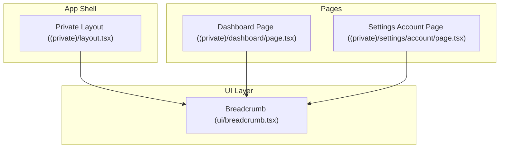
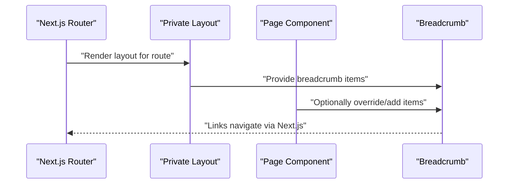
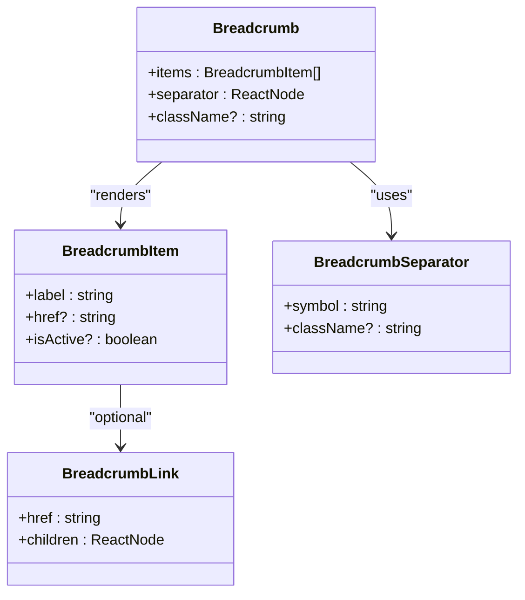
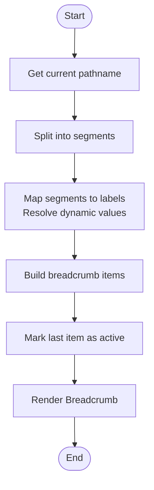
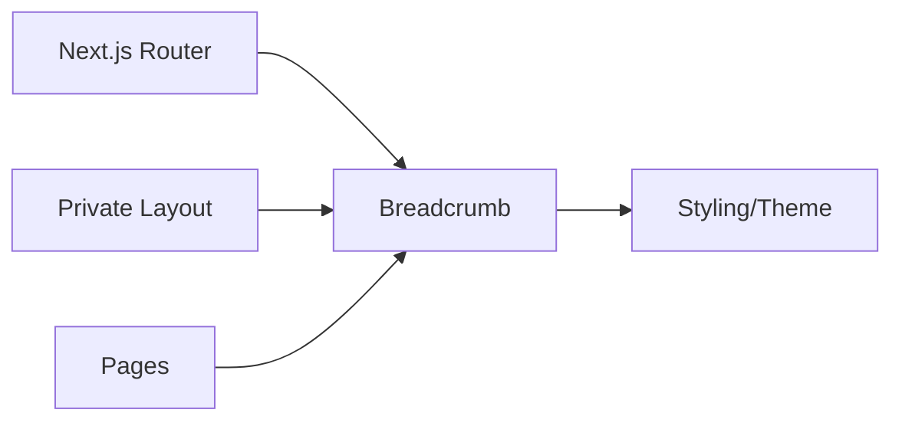

# Breadcrumb

<cite>
**Referenced Files in This Document**
- [breadcrumb.tsx](file://src/components/ui/breadcrumb.tsx)
- [layout.tsx](file://src/app/(private)/layout.tsx)
- [page.tsx](file://src/app/(private)/dashboard/page.tsx)
- [page.tsx](file://src/app/(private)/settings/account/page.tsx)
</cite>

## Table of Contents
1. [Introduction](#introduction)
2. [Project Structure](#project-structure)
3. [Core Components](#core-components)
4. [Architecture Overview](#architecture-overview)
5. [Detailed Component Analysis](#detailed-component-analysis)
6. [Dependency Analysis](#dependency-analysis)
7. [Performance Considerations](#performance-considerations)
8. [Troubleshooting Guide](#troubleshooting-guide)
9. [Conclusion](#conclusion)
10. [Appendices](#appendices)

## Introduction
This document explains the Breadcrumb component used across the application, focusing on its structure, routing integration, and responsive behavior. It also covers how to generate breadcrumbs from route hierarchy, handle dynamic segments, customize separators, and ensure accessibility and SEO best practices.

## Project Structure
The Breadcrumb is implemented as a UI primitive under the shared UI components and is consumed within private layouts and pages. The relevant files include:
- The Breadcrumb implementation file
- A layout that may render breadcrumbs for nested routes
- Example pages where breadcrumbs are rendered

**Diagram sources**
- [breadcrumb.tsx](file://src/components/ui/breadcrumb.tsx)
- [layout.tsx](file://src/app/(private)/layout.tsx)
- [page.tsx](file://src/app/(private)/dashboard/page.tsx)
- [page.tsx](file://src/app/(private)/settings/account/page.tsx)

**Section sources**
- [breadcrumb.tsx](file://src/components/ui/breadcrumb.tsx)
- [layout.tsx](file://src/app/(private)/layout.tsx)
- [page.tsx](file://src/app/(private)/dashboard/page.tsx)
- [page.tsx](file://src/app/(private)/settings/account/page.tsx)

## Core Components
- Breadcrumb primitive: Provides the building blocks for constructing breadcrumb trails, including items, separators, and navigation links.
- Integration points: Consumed by layouts and pages to reflect current location within the app’s route tree.

Key responsibilities:
- Render a list of navigable steps with appropriate semantic markup
- Provide accessible labels and roles for screen readers
- Support customization of separators and styling
- Work well with Next.js routing patterns, including nested and dynamic routes

**Section sources**
- [breadcrumb.tsx](file://src/components/ui/breadcrumb.tsx)

## Architecture Overview
The Breadcrumb integrates with the application’s routing by being placed in layouts or pages. It receives an array of breadcrumb items representing the current path. Each item typically includes a label and a link target. The last item represents the current page and is not clickable.

**Diagram sources**
- [layout.tsx](file://src/app/(private)/layout.tsx)
- [page.tsx](file://src/app/(private)/dashboard/page.tsx)
- [page.tsx](file://src/app/(private)/settings/account/page.tsx)
- [breadcrumb.tsx](file://src/components/ui/breadcrumb.tsx)

## Detailed Component Analysis

### Breadcrumb Implementation
The Breadcrumb component exposes a set of parts that compose a breadcrumb trail:
- Root container: Wraps the entire breadcrumb list
- Item: Represents a single step with optional link and active state
- Separator: Visual divider between items
- Link: Navigates using Next.js router when applicable

Responsibilities:
- Semantic HTML structure for accessibility
- Keyboard navigation support
- Styling hooks for customization (e.g., separator style)
- Optional truncation for long labels

**Diagram sources**
- [breadcrumb.tsx](file://src/components/ui/breadcrumb.tsx)

**Section sources**
- [breadcrumb.tsx](file://src/components/ui/breadcrumb.tsx)

### Routing Integration
- Generate breadcrumbs from route hierarchy by mapping the current pathname to a sequence of segments.
- For nested routes, each folder level corresponds to a breadcrumb step.
- Dynamic segments (e.g., [id]) should be resolved to human-readable labels before rendering.

Recommended approach:
- Build an array of items in the layout or page based on the current route.
- Use the last item as the active/current page without a link.
- Ensure all other items have valid hrefs pointing to their respective routes.

[No sources needed since this diagram shows conceptual workflow, not actual code structure]

### Responsive Behavior
- On small screens, consider truncating long labels and using ellipsis.
- Optionally collapse intermediate items into a “More” menu for mobile.
- Keep the separator minimal to save space.

Best practices:
- Use CSS classes or props to control truncation and overflow behavior.
- Ensure truncated items remain keyboard accessible.

[No sources needed since this section provides general guidance]

### Accessibility Features
- Use proper roles and landmarks so screen readers announce the breadcrumb context.
- Provide aria-label for the breadcrumb region.
- Indicate the current page clearly (e.g., aria-current="page").
- Ensure keyboard focus management and visible focus indicators.

Implementation tips:
- Wrap the breadcrumb in a landmark element with an accessible name.
- Mark the final item as current and non-clickable.
- Avoid decorative-only content interfering with announcements.

[No sources needed since this section provides general guidance]

### Customizing Separators
- Replace default separators with custom symbols or icons via props or CSS.
- Maintain sufficient contrast and spacing for readability.
- Ensure separators do not capture focus.

[No sources needed since this section provides general guidance]

### Handling Dynamic Segments
- Resolve parameters like [id] to readable names before rendering.
- If data is required to resolve labels, fetch it before rendering or show placeholders.
- Cache resolved labels to avoid repeated lookups.

[No sources needed since this section provides general guidance]

### Examples

#### Nested Routes
- Parent layout constructs base items (e.g., Home > Settings).
- Child page adds its own segment (e.g., Settings > Account).
- Final item is marked active.

[No sources needed since this section provides general guidance]

#### Truncation for Long Paths
- Apply truncation classes to labels exceeding a threshold.
- Provide tooltips for full text on hover/focus.

[No sources needed since this section provides general guidance]

#### Mobile Adaptations
- Collapse middle items into a dropdown or hide them behind a “...” action.
- Keep only essential items visible on very narrow screens.

[No sources needed since this section provides general guidance]

### Usage in Private Layout and Pages
- The private layout can provide common top-level items (e.g., Home).
- Individual pages extend the trail with their specific sections.
- Ensure consistency across routes by centralizing item generation logic.

**Section sources**
- [layout.tsx](file://src/app/(private)/layout.tsx)
- [page.tsx](file://src/app/(private)/dashboard/page.tsx)
- [page.tsx](file://src/app/(private)/settings/account/page.tsx)

## Dependency Analysis
The Breadcrumb depends on:
- Next.js router for navigation
- UI primitives for styling and composition
- Application layout and pages for providing breadcrumb items

**Diagram sources**
- [breadcrumb.tsx](file://src/components/ui/breadcrumb.tsx)
- [layout.tsx](file://src/app/(private)/layout.tsx)
- [page.tsx](file://src/app/(private)/dashboard/page.tsx)
- [page.tsx](file://src/app/(private)/settings/account/page.tsx)

**Section sources**
- [breadcrumb.tsx](file://src/components/ui/breadcrumb.tsx)
- [layout.tsx](file://src/app/(private)/layout.tsx)
- [page.tsx](file://src/app/(private)/dashboard/page.tsx)
- [page.tsx](file://src/app/(private)/settings/account/page.tsx)

## Performance Considerations
- Minimize re-renders by memoizing breadcrumb items when they depend on expensive computations.
- Avoid fetching data during render; precompute labels or use Suspense boundaries if necessary.
- Keep the number of items reasonable; truncate or collapse on small viewports.

[No sources needed since this section provides general guidance]

## Troubleshooting Guide
Common issues and resolutions:
- Missing links: Ensure every non-active item has a valid href.
- Incorrect active state: Verify the last item is marked as current and not linked.
- Accessibility warnings: Add aria-label to the breadcrumb region and aria-current to the active item.
- Mobile overflow: Implement truncation or collapsible menus for long paths.

[No sources needed since this section provides general guidance]

## Conclusion
The Breadcrumb component offers a flexible, accessible way to communicate site hierarchy and improve navigation. By generating items from route segments, handling dynamic parameters, and adapting to different screen sizes, it enhances both user experience and SEO. Follow the accessibility guidelines and performance tips to ensure a robust implementation.

[No sources needed since this section summarizes without analyzing specific files]

## Appendices

### SEO Benefits
- Improves crawlability by exposing clear hierarchical links.
- Enhances contextual understanding for search engines through structured navigation.

[No sources needed since this section provides general guidance]

### User Experience Best Practices
- Keep labels concise and meaningful.
- Limit depth to reduce cognitive load.
- Provide consistent placement across the app.

[No sources needed since this section provides general guidance]