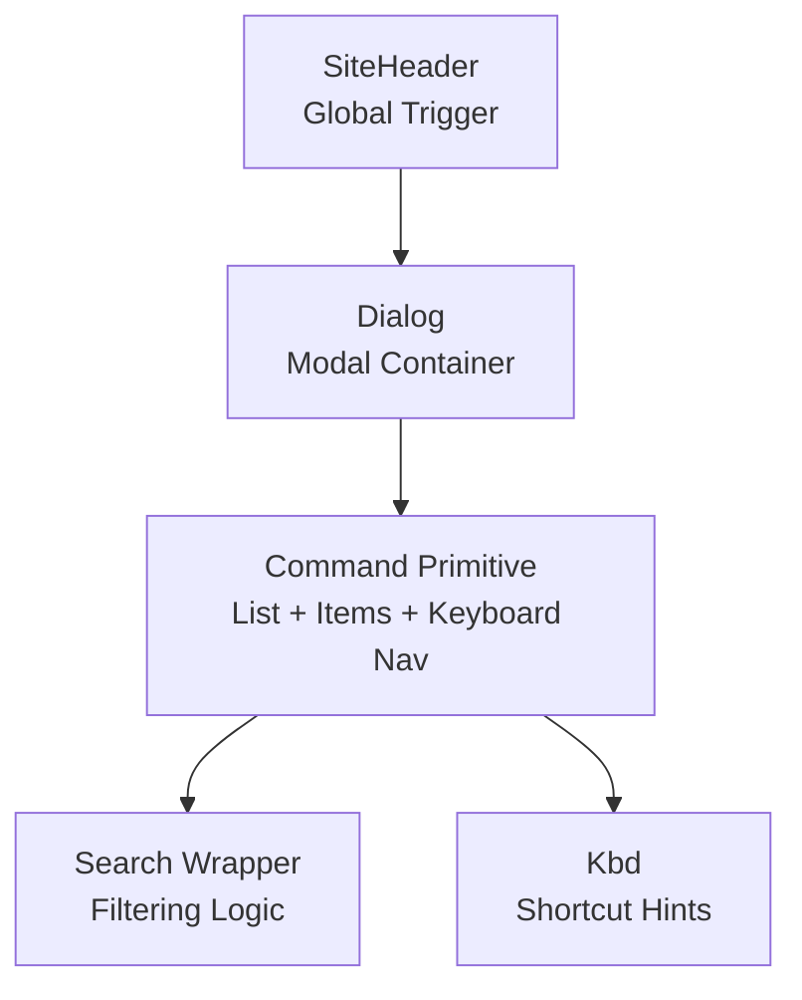
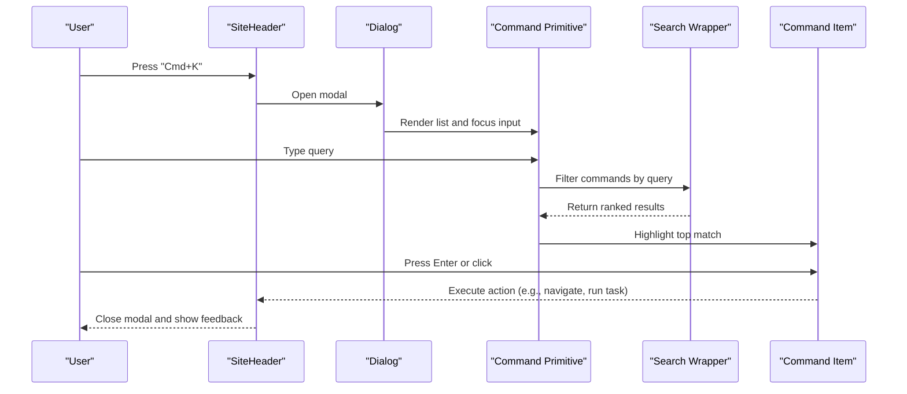
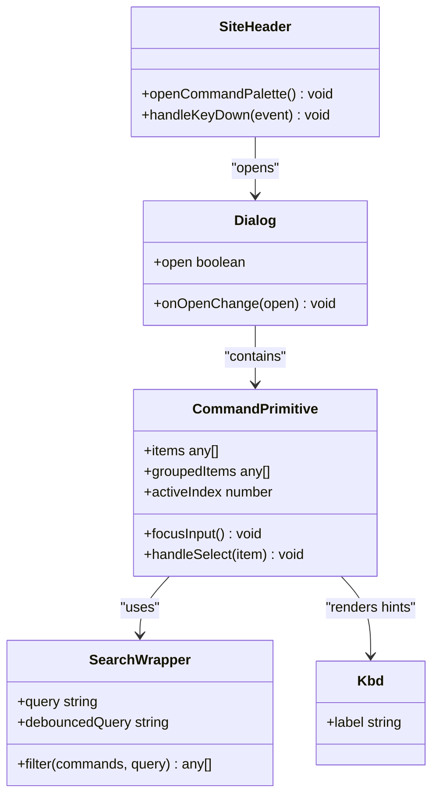
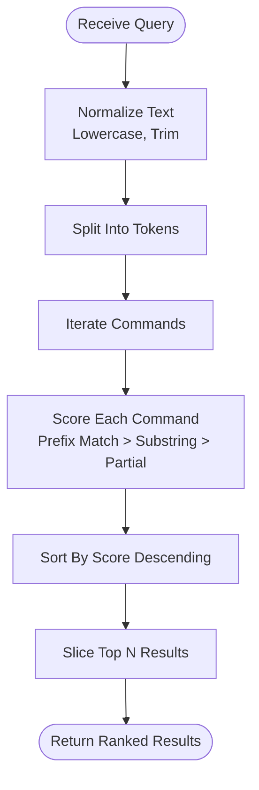
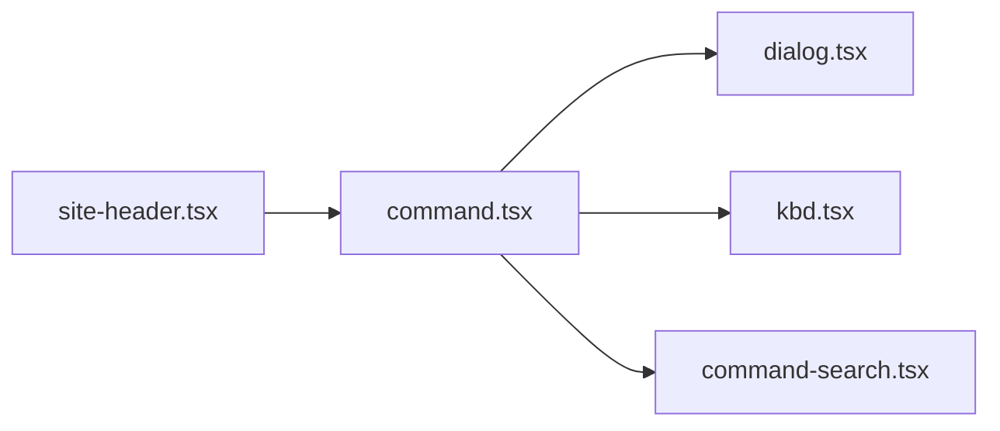

# Command Palette

<cite>
**Referenced Files in This Document**
- [command.tsx](file://src/components/ui/command.tsx)
- [dialog.tsx](file://src/components/ui/dialog.tsx)
- [kbd.tsx](file://src/components/ui/kbd.tsx)
- [command-search.tsx](file://src/components/command-search.tsx)
- [site-header.tsx](file://src/components/site-header.tsx)
</cite>

## Table of Contents
1. [Introduction](#introduction)
2. [Project Structure](#project-structure)
3. [Core Components](#core-components)
4. [Architecture Overview](#architecture-overview)
5. [Detailed Component Analysis](#detailed-component-analysis)
6. [Dependency Analysis](#dependency-analysis)
7. [Performance Considerations](#performance-considerations)
8. [Troubleshooting Guide](#troubleshooting-guide)
9. [Conclusion](#conclusion)
10. [Appendices](#appendices)

## Introduction
This document explains the Command Palette component, focusing on search functionality, keyboard shortcuts, and command execution patterns. It covers how to register commands, implement fuzzy search, handle async loading, organize command groups, and integrate with application workflows. It also provides guidance for modal dialogs, keyboard navigation (Cmd+K), command descriptions, visual feedback, performance optimization for large command sets, accessibility features, and best practices for creating intuitive command interfaces.

## Project Structure
The Command Palette is implemented as a reusable UI primitive and integrated into the application header. The key files involved are:
- A command palette primitive that composes dialog, input, list, and item primitives
- A search wrapper that encapsulates filtering logic
- A global trigger in the site header to open the palette via keyboard shortcut

**Diagram sources**
- [site-header.tsx](file://src/components/site-header.tsx)
- [dialog.tsx](file://src/components/ui/dialog.tsx)
- [command.tsx](file://src/components/ui/command.tsx)
- [command-search.tsx](file://src/components/command-search.tsx)
- [kbd.tsx](file://src/components/ui/kbd.tsx)

**Section sources**
- [command.tsx](file://src/components/ui/command.tsx)
- [dialog.tsx](file://src/components/ui/dialog.tsx)
- [kbd.tsx](file://src/components/ui/kbd.tsx)
- [command-search.tsx](file://src/components/command-search.tsx)
- [site-header.tsx](file://src/components/site-header.tsx)

## Core Components
- Command Primitive: Provides the core command list behavior, including focus management, keyboard navigation, grouping, and selection. It composes lower-level primitives such as dialog, input, list, and item components.
- Search Wrapper: Encapsulates filtering and fuzzy matching over a set of commands. It exposes a controlled interface for query state and filtered results.
- Global Trigger: A small integration point in the site header that opens the command palette and focuses the input when the user presses Cmd+K (or Ctrl+K).

Key responsibilities:
- Modal presentation and focus trapping
- Input handling and debounced filtering
- Grouped rendering with labels and separators
- Keyboard shortcuts for navigation and execution
- Visual feedback for selected items and loading states

**Section sources**
- [command.tsx](file://src/components/ui/command.tsx)
- [command-search.tsx](file://src/components/command-search.tsx)
- [site-header.tsx](file://src/components/site-header.tsx)

## Architecture Overview
The Command Palette follows a layered architecture:
- Presentation Layer: Dialog and layout primitives render the modal and structure.
- Interaction Layer: The command primitive manages focus, keyboard events, and selection state.
- Data Layer: The search wrapper filters and ranks commands based on the current query.
- Integration Layer: The site header listens for global keyboard shortcuts to open the palette.

**Diagram sources**
- [site-header.tsx](file://src/components/site-header.tsx)
- [dialog.tsx](file://src/components/ui/dialog.tsx)
- [command.tsx](file://src/components/ui/command.tsx)
- [command-search.tsx](file://src/components/command-search.tsx)

## Detailed Component Analysis

### Command Primitive
Responsibilities:
- Compose dialog, input, list, and item primitives
- Manage focus and keyboard navigation (arrow keys, enter, escape)
- Support grouped sections and separators
- Provide visual feedback for active/selected items
- Integrate with search wrapper for filtering

Usage pattern:
- Wrap the command list inside a dialog
- Provide an input field bound to the search wrapper
- Render groups with labels and items with descriptions and optional icons
- Handle selection callbacks to execute actions

Accessibility:
- Ensure proper roles and aria attributes for lists and items
- Focus trap within the modal
- Announce changes to screen readers via live regions where appropriate

**Section sources**
- [command.tsx](file://src/components/ui/command.tsx)
- [dialog.tsx](file://src/components/ui/dialog.tsx)

### Search Wrapper
Responsibilities:
- Maintain query state and debounce input
- Implement fuzzy search across command titles and descriptions
- Rank results by relevance
- Expose filtered results to the command primitive

Implementation notes:
- Normalize text for case-insensitive matching
- Prefer prefix matches and contiguous substrings
- Score partial matches and sort accordingly
- Provide empty-state messaging when no results match

**Section sources**
- [command-search.tsx](file://src/components/command-search.tsx)

### Global Trigger (Site Header)
Responsibilities:
- Listen for global keyboard shortcuts (Cmd+K / Ctrl+K)
- Open the command palette modal and focus the input
- Optionally close on Escape

Integration points:
- Import the command palette component
- Register a global keydown listener
- Control visibility through local state

**Section sources**
- [site-header.tsx](file://src/components/site-header.tsx)
- [kbd.tsx](file://src/components/ui/kbd.tsx)

### Class Diagram

**Diagram sources**
- [site-header.tsx](file://src/components/site-header.tsx)
- [dialog.tsx](file://src/components/ui/dialog.tsx)
- [command.tsx](file://src/components/ui/command.tsx)
- [command-search.tsx](file://src/components/command-search.tsx)
- [kbd.tsx](file://src/components/ui/kbd.tsx)

### Flowchart: Fuzzy Search Algorithm

[No sources needed since this diagram shows conceptual workflow, not actual code structure]

## Dependency Analysis
The Command Palette depends on foundational UI primitives and integrates with the application shell.

**Diagram sources**
- [command.tsx](file://src/components/ui/command.tsx)
- [dialog.tsx](file://src/components/ui/dialog.tsx)
- [kbd.tsx](file://src/components/ui/kbd.tsx)
- [command-search.tsx](file://src/components/command-search.tsx)
- [site-header.tsx](file://src/components/site-header.tsx)

**Section sources**
- [command.tsx](file://src/components/ui/command.tsx)
- [dialog.tsx](file://src/components/ui/dialog.tsx)
- [kbd.tsx](file://src/components/ui/kbd.tsx)
- [command-search.tsx](file://src/components/command-search.tsx)
- [site-header.tsx](file://src/components/site-header.tsx)

## Performance Considerations
For large command sets:
- Debounce input to reduce re-renders during typing
- Limit rendered items using virtualization or pagination
- Precompute searchable fields and normalize once
- Use memoization for expensive computations
- Avoid heavy operations in render paths; offload to workers if necessary
- Lazy-load command groups or modules to reduce initial bundle size
- Keep descriptions concise to minimize DOM size

[No sources needed since this section provides general guidance]

## Troubleshooting Guide
Common issues and resolutions:
- Keyboard shortcut not firing: Verify global listener registration and platform-specific modifiers (Cmd vs Ctrl). Ensure the event is not prevented elsewhere.
- No results shown: Confirm search wrapper receives the correct query and that command data includes searchable fields. Check normalization and tokenization.
- Focus not trapped: Validate dialog focus trap configuration and ensure the input is focused on open.
- Slow rendering: Inspect item count and consider virtualization or limiting visible items. Profile search scoring complexity.
- Accessibility problems: Ensure list and item roles are correct, aria-selected is updated, and announcements occur for dynamic updates.

**Section sources**
- [command.tsx](file://src/components/ui/command.tsx)
- [command-search.tsx](file://src/components/command-search.tsx)
- [site-header.tsx](file://src/components/site-header.tsx)

## Conclusion
The Command Palette provides a powerful, accessible, and keyboard-first interface for executing actions quickly. By composing robust primitives, implementing efficient fuzzy search, and integrating seamlessly with the application shell, it enables users to navigate and operate the app without touching the mouse. Following the patterns and recommendations here will help you build scalable, performant, and user-friendly command interfaces.

[No sources needed since this section summarizes without analyzing specific files]

## Appendices

### How to Register Commands
- Define commands with title, description, group, and action callback
- Organize commands into logical groups for clarity
- Include optional metadata like icon or shortcut hints
- Provide clear, actionable descriptions to aid searchability

**Section sources**
- [command.tsx](file://src/components/ui/command.tsx)
- [command-search.tsx](file://src/components/command-search.tsx)

### Handling Async Loading
- Show skeleton placeholders while fetching command data
- Debounce queries to avoid excessive requests
- Cache results locally and invalidate on relevant changes
- Display informative messages when loading or when no results are found

**Section sources**
- [command.tsx](file://src/components/ui/command.tsx)
- [command-search.tsx](file://src/components/command-search.tsx)

### Visual Feedback and Descriptions
- Highlight matched segments in titles and descriptions
- Indicate active selection with distinct styling
- Provide contextual descriptions to guide users
- Use consistent spacing and typography for readability

**Section sources**
- [command.tsx](file://src/components/ui/command.tsx)

### Accessibility Features
- Role and aria attributes for lists and items
- Focus management and trap within modal
- Keyboard navigation support (arrows, enter, escape)
- Screen reader announcements for dynamic updates

**Section sources**
- [command.tsx](file://src/components/ui/command.tsx)
- [dialog.tsx](file://src/components/ui/dialog.tsx)

### Integration With Application Workflows
- Wire command actions to navigation, modals, or API calls
- Update global state after successful execution
- Provide immediate feedback (toast or inline confirmation)
- Respect user permissions and context when enabling/disabling commands

**Section sources**
- [site-header.tsx](file://src/components/site-header.tsx)
- [command.tsx](file://src/components/ui/command.tsx)