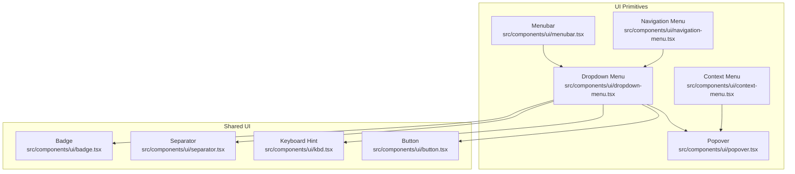
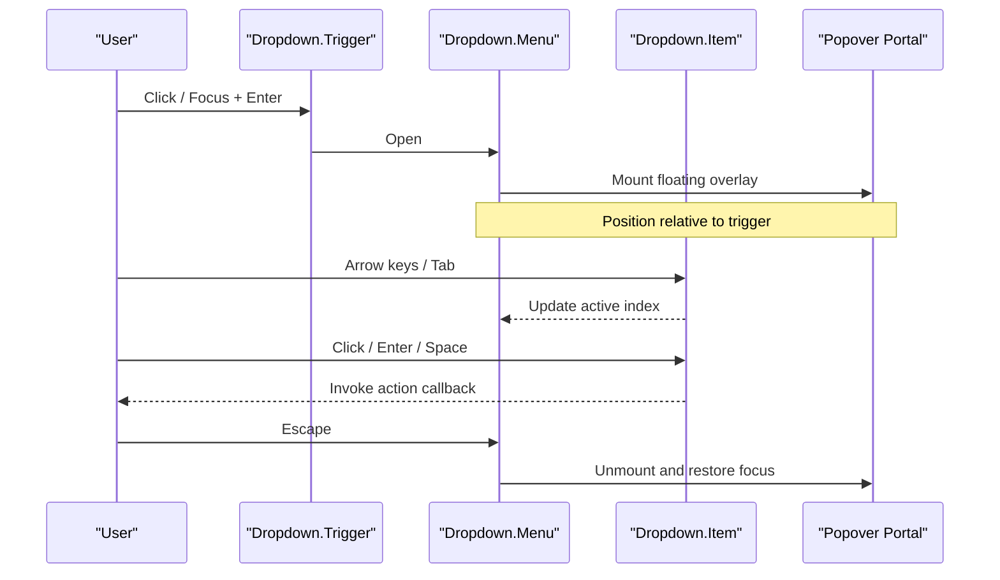
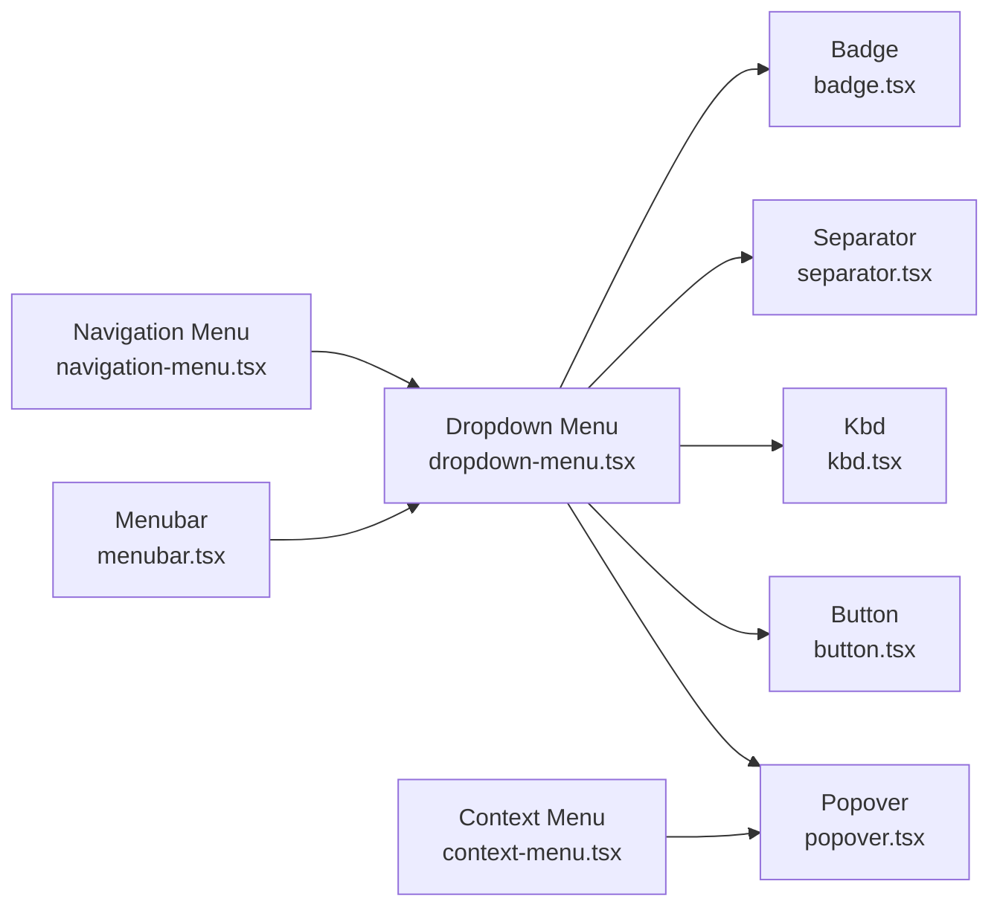

# Dropdown Menu

<cite>
**Referenced Files in This Document**
- [dropdown-menu.tsx](file://src/components/ui/dropdown-menu.tsx)
- [context-menu.tsx](file://src/components/ui/context-menu.tsx)
- [menubar.tsx](file://src/components/ui/menubar.tsx)
- [navigation-menu.tsx](file://src/components/ui/navigation-menu.tsx)
- [popover.tsx](file://src/components/ui/popover.tsx)
- [button.tsx](file://src/components/ui/button.tsx)
- [kbd.tsx](file://src/components/ui/kbd.tsx)
- [separator.tsx](file://src/components/ui/separator.tsx)
- [badge.tsx](file://src/components/ui/badge.tsx)
</cite>

## Table of Contents
1. [Introduction](#introduction)
2. [Project Structure](#project-structure)
3. [Core Components](#core-components)
4. [Architecture Overview](#architecture-overview)
5. [Detailed Component Analysis](#detailed-component-analysis)
6. [Dependency Analysis](#dependency-analysis)
7. [Performance Considerations](#performance-considerations)
8. [Troubleshooting Guide](#troubleshooting-guide)
9. [Conclusion](#conclusion)
10. [Appendices](#appendices)

## Introduction
This document provides comprehensive documentation for the Dropdown Menu component, including its API surface, positioning strategies, customization options, and usage patterns such as context menus, action menus, and nested dropdowns. It also covers keyboard navigation, focus management, portal rendering, trigger elements, accessibility features, screen reader support, touch device compatibility, and styling/theming guidance.

## Project Structure
The Dropdown Menu is implemented as a composable set of primitives under the UI components directory. Related menuing primitives include Context Menu, Menubar, Navigation Menu, and Popover, which can be combined to build advanced interactions.

**Diagram sources**
- [dropdown-menu.tsx](file://src/components/ui/dropdown-menu.tsx)
- [context-menu.tsx](file://src/components/ui/context-menu.tsx)
- [menubar.tsx](file://src/components/ui/menubar.tsx)
- [navigation-menu.tsx](file://src/components/ui/navigation-menu.tsx)
- [popover.tsx](file://src/components/ui/popover.tsx)
- [button.tsx](file://src/components/ui/button.tsx)
- [kbd.tsx](file://src/components/ui/kbd.tsx)
- [separator.tsx](file://src/components/ui/separator.tsx)
- [badge.tsx](file://src/components/ui/badge.tsx)

**Section sources**
- [dropdown-menu.tsx](file://src/components/ui/dropdown-menu.tsx)
- [context-menu.tsx](file://src/components/ui/context-menu.tsx)
- [menubar.tsx](file://src/components/ui/menubar.tsx)
- [navigation-menu.tsx](file://src/components/ui/navigation-menu.tsx)
- [popover.tsx](file://src/components/ui/popover.tsx)
- [button.tsx](file://src/components/ui/button.tsx)
- [kbd.tsx](file://src/components/ui/kbd.tsx)
- [separator.tsx](file://src/components/ui/separator.tsx)
- [badge.tsx](file://src/components/ui/badge.tsx)

## Core Components
- Dropdown Menu: A composable primitive that renders a floating menu with items, groups, separators, labels, and shortcuts. It supports open/close state, controlled or uncontrolled modes, and integrates with Popover for positioning and portal rendering.
- Context Menu: A right-click triggered menu variant using the same primitives.
- Menubar: A top-level horizontal menu bar that composes dropdowns for each menu item.
- Navigation Menu: A navigation-focused menu with hover/focus behaviors and nested submenus.
- Popover: The underlying floating container used by Dropdown and Context menus for positioning and portal rendering.

Key responsibilities:
- Manage open/close state and focus within the menu.
- Provide keyboard navigation (arrow keys, Enter/Space, Escape).
- Render content into a portal overlay positioned relative to the trigger.
- Support nested submenus and contextual actions.

**Section sources**
- [dropdown-menu.tsx](file://src/components/ui/dropdown-menu.tsx)
- [context-menu.tsx](file://src/components/ui/context-menu.tsx)
- [menubar.tsx](file://src/components/ui/menubar.tsx)
- [navigation-menu.tsx](file://src/components/ui/navigation-menu.tsx)
- [popover.tsx](file://src/components/ui/popover.tsx)

## Architecture Overview
The Dropdown Menu architecture centers on a composition pattern:
- Trigger element opens/closes the menu.
- Content area renders inside a floating container provided by Popover.
- Items are navigable via keyboard and accessible roles.
- Submenus nest by composing another Dropdown within an item.

**Diagram sources**
- [dropdown-menu.tsx](file://src/components/ui/dropdown-menu.tsx)
- [popover.tsx](file://src/components/ui/popover.tsx)

## Detailed Component Analysis

### Dropdown Menu API
The Dropdown Menu exposes a set of composable parts. Typical parts include:
- Root/Provider: Initializes context and manages shared state.
- Trigger: The button or element that toggles the menu.
- Content: The floating panel that holds items and groups.
- Item: An actionable row; supports disabled state and callbacks.
- Group: Logical grouping of items with optional label.
- Separator: Visual divider between sections.
- Label: Non-interactive text for section headers.
- Shortcut: Keyboard hint displayed alongside an item.
- Checkbox/Radio variants: For selection states when needed.

Common props and behaviors:
- Controlled vs uncontrolled open state.
- Default open value for uncontrolled mode.
- OnOpenChange handler for controlled integration.
- Positioning strategy and collision handling via Popover.
- Portal target configuration for mounting location.
- Accessibility attributes automatically applied (roles, aria-expanded, aria-haspopup, etc.).

Usage patterns:
- Action menu: Single-level list of commands.
- Nested dropdown: Submenu inside an item.
- Context menu: Right-click menu using Context Menu primitive.

**Section sources**
- [dropdown-menu.tsx](file://src/components/ui/dropdown-menu.tsx)

### Positioning Strategies
Positioning is delegated to the Popover primitive. Typical strategies include:
- Auto placement with collision detection to keep the menu within viewport.
- Fixed offset from the trigger.
- Alignment along axes (start/end, top/bottom).
- Flip behavior when space is limited.

Integration points:
- Configure alignment and side offsets through Popover’s positioning options.
- Use portal rendering to avoid clipping issues caused by overflow containers.

**Section sources**
- [dropdown-menu.tsx](file://src/components/ui/dropdown-menu.tsx)
- [popover.tsx](file://src/components/ui/popover.tsx)

### Customization Options
Styling and theming:
- Apply CSS classes or style props to root, content, items, separators, and labels.
- Compose with theme tokens if your design system uses CSS variables.
- Override default colors, spacing, typography, and shadows at the layer level.

Behavioral customization:
- Disable specific items.
- Add keyboard shortcuts display via Shortcut part.
- Integrate badges or icons next to items.

**Section sources**
- [dropdown-menu.tsx](file://src/components/ui/dropdown-menu.tsx)
- [separator.tsx](file://src/components/ui/separator.tsx)
- [badge.tsx](file://src/components/ui/badge.tsx)
- [kbd.tsx](file://src/components/ui/kbd.tsx)

### Creating Context Menus
Use the Context Menu primitive to render a menu on right-click or long-press contexts. It shares the same item semantics and keyboard navigation as the Dropdown Menu but is triggered by pointer events on a target region.

Typical steps:
- Wrap the interactive region with the Context Menu provider.
- Define items and handlers.
- Optionally add separators and labels.

**Section sources**
- [context-menu.tsx](file://src/components/ui/context-menu.tsx)
- [dropdown-menu.tsx](file://src/components/ui/dropdown-menu.tsx)

### Creating Action Menus
Action menus are single-level lists of commands. Build them by composing:
- Trigger (e.g., Button)
- Content
- Multiple Items
- Optional Separators and Labels

Best practices:
- Keep actions concise and grouped logically.
- Use disabled state for unavailable actions.
- Show keyboard hints where applicable.

**Section sources**
- [dropdown-menu.tsx](file://src/components/ui/dropdown-menu.tsx)
- [button.tsx](file://src/components/ui/button.tsx)

### Creating Nested Dropdowns
Nesting is achieved by placing a Dropdown Menu inside an Item of a parent menu. This enables hierarchical command structures.

Guidelines:
- Ensure proper focus trapping within nested levels.
- Provide clear visual hierarchy and indicators for submenu availability.
- Avoid deep nesting beyond two or three levels for usability.

**Section sources**
- [dropdown-menu.tsx](file://src/components/ui/dropdown-menu.tsx)

### Keyboard Shortcuts and Focus Management
Keyboard behavior:
- Arrow Up/Down to navigate items.
- Enter/Space to activate focused item.
- Escape to close and return focus to the trigger.
- Tab moves focus out of the menu according to natural tab order.

Focus management:
- Focus is moved to the first item on open.
- On close, focus returns to the trigger.
- Submenus maintain independent focus rings.

Accessibility:
- Roles and ARIA attributes are applied automatically.
- Screen readers announce menu state and item details.

**Section sources**
- [dropdown-menu.tsx](file://src/components/ui/dropdown-menu.tsx)

### Portal Rendering
The floating content is rendered into a portal overlay to avoid clipping and stacking context issues. This ensures the menu appears above other UI elements regardless of DOM structure.

Configuration:
- Specify portal container if needed.
- Ensure z-index layers are managed by the portal implementation.

**Section sources**
- [dropdown-menu.tsx](file://src/components/ui/dropdown-menu.tsx)
- [popover.tsx](file://src/components/ui/popover.tsx)

### Trigger Elements
Triggers can be any interactive element, commonly a Button. They should:
- Be focusable.
- Announce expanded state via ARIA.
- Support both click and keyboard activation.

**Section sources**
- [dropdown-menu.tsx](file://src/components/ui/dropdown-menu.tsx)
- [button.tsx](file://src/components/ui/button.tsx)

### Accessibility Features and Screen Reader Support
- Semantic roles: menu, menuitem, separator, group, and related ARIA attributes.
- Live regions may be used to announce changes.
- Proper focus management ensures predictable navigation.
- Color contrast and focus indicators should meet WCAG guidelines.

**Section sources**
- [dropdown-menu.tsx](file://src/components/ui/dropdown-menu.tsx)

### Touch Device Compatibility
- Tap triggers open the menu.
- Tapping outside closes it.
- Long-press can be mapped to context menu behavior if desired.
- Ensure hit targets are large enough for touch interaction.

**Section sources**
- [dropdown-menu.tsx](file://src/components/ui/dropdown-menu.tsx)

### Styling and Theming Guidance
- Style via class names or style props on each part.
- Use consistent spacing and typography tokens.
- Maintain sufficient color contrast for all states.
- Test in high-contrast and reduced motion modes.

**Section sources**
- [dropdown-menu.tsx](file://src/components/ui/dropdown-menu.tsx)
- [separator.tsx](file://src/components/ui/separator.tsx)
- [badge.tsx](file://src/components/ui/badge.tsx)
- [kbd.tsx](file://src/components/ui/kbd.tsx)

## Dependency Analysis
The Dropdown Menu depends on shared UI primitives and the Popover primitive for floating behavior.

**Diagram sources**
- [dropdown-menu.tsx](file://src/components/ui/dropdown-menu.tsx)
- [context-menu.tsx](file://src/components/ui/context-menu.tsx)
- [menubar.tsx](file://src/components/ui/menubar.tsx)
- [navigation-menu.tsx](file://src/components/ui/navigation-menu.tsx)
- [popover.tsx](file://src/components/ui/popover.tsx)
- [button.tsx](file://src/components/ui/button.tsx)
- [kbd.tsx](file://src/components/ui/kbd.tsx)
- [separator.tsx](file://src/components/ui/separator.tsx)
- [badge.tsx](file://src/components/ui/badge.tsx)

**Section sources**
- [dropdown-menu.tsx](file://src/components/ui/dropdown-menu.tsx)
- [context-menu.tsx](file://src/components/ui/context-menu.tsx)
- [menubar.tsx](file://src/components/ui/menubar.tsx)
- [navigation-menu.tsx](file://src/components/ui/navigation-menu.tsx)
- [popover.tsx](file://src/components/ui/popover.tsx)
- [button.tsx](file://src/components/ui/button.tsx)
- [kbd.tsx](file://src/components/ui/kbd.tsx)
- [separator.tsx](file://src/components/ui/separator.tsx)
- [badge.tsx](file://src/components/ui/badge.tsx)

## Performance Considerations
- Keep menu content lightweight; defer heavy computations until open.
- Avoid excessive re-renders by memoizing expensive children.
- Use virtualization for very long lists of items.
- Prefer stable IDs for items to optimize reconciliation.

[No sources needed since this section provides general guidance]

## Troubleshooting Guide
Common issues and resolutions:
- Menu clipped by parent overflow: Ensure portal rendering and correct z-index.
- Incorrect positioning near edges: Adjust alignment and flip settings.
- Focus not returning to trigger after close: Verify focus restoration logic.
- Keyboard navigation not working: Confirm items have correct roles and tabindex.
- Touch interactions not triggering: Check event listeners and hit areas.

**Section sources**
- [dropdown-menu.tsx](file://src/components/ui/dropdown-menu.tsx)
- [popover.tsx](file://src/components/ui/popover.tsx)

## Conclusion
The Dropdown Menu component offers a robust, accessible, and customizable foundation for building menus across applications. By leveraging its composable API, positioning strategies, and integration with Popover, you can create action menus, context menus, and nested dropdowns that work well on desktop and touch devices while maintaining strong accessibility standards.

[No sources needed since this section summarizes without analyzing specific files]

## Appendices

### Quick Start Recipes
- Action Menu: Combine Trigger, Content, and multiple Items.
- Context Menu: Use Context Menu around a target region.
- Nested Dropdown: Place a Dropdown inside an Item.
- With Shortcuts: Add Shortcut hints next to items.

**Section sources**
- [dropdown-menu.tsx](file://src/components/ui/dropdown-menu.tsx)
- [context-menu.tsx](file://src/components/ui/context-menu.tsx)
- [kbd.tsx](file://src/components/ui/kbd.tsx)