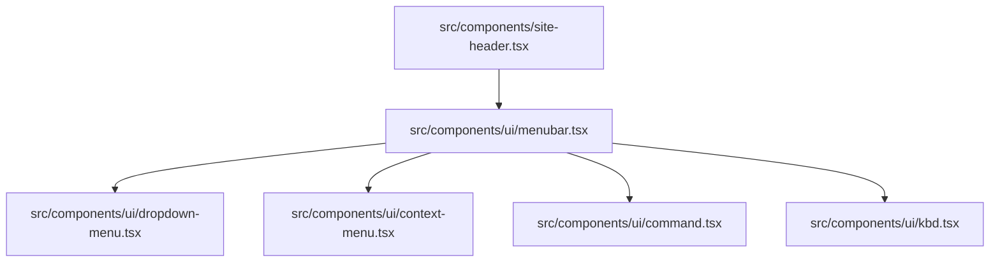
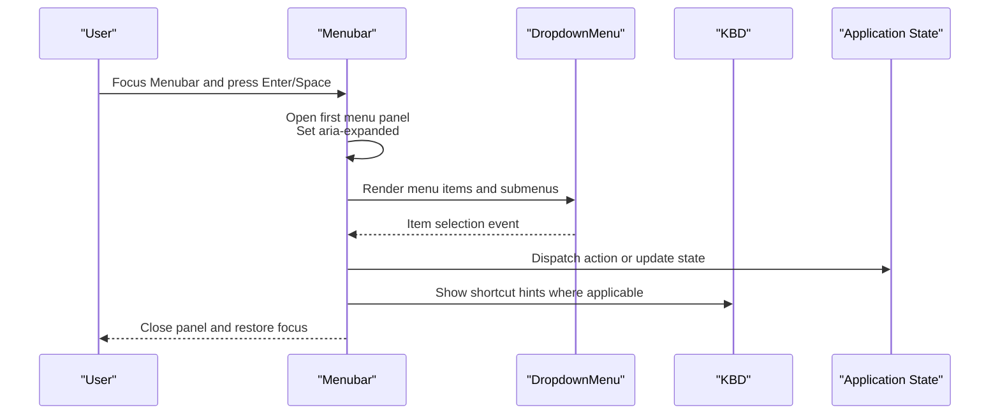
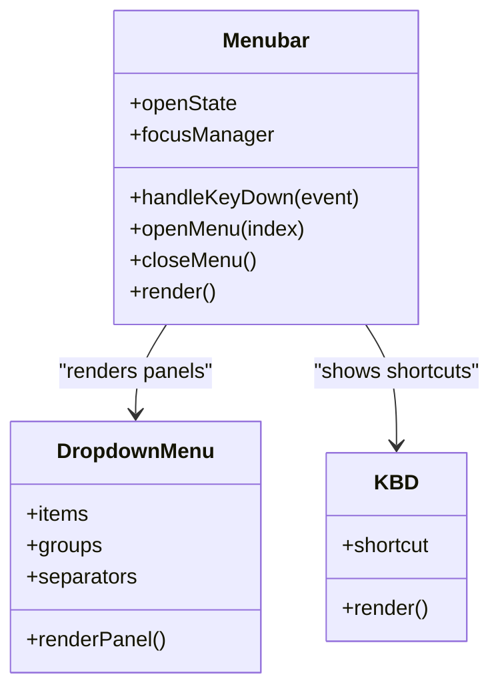
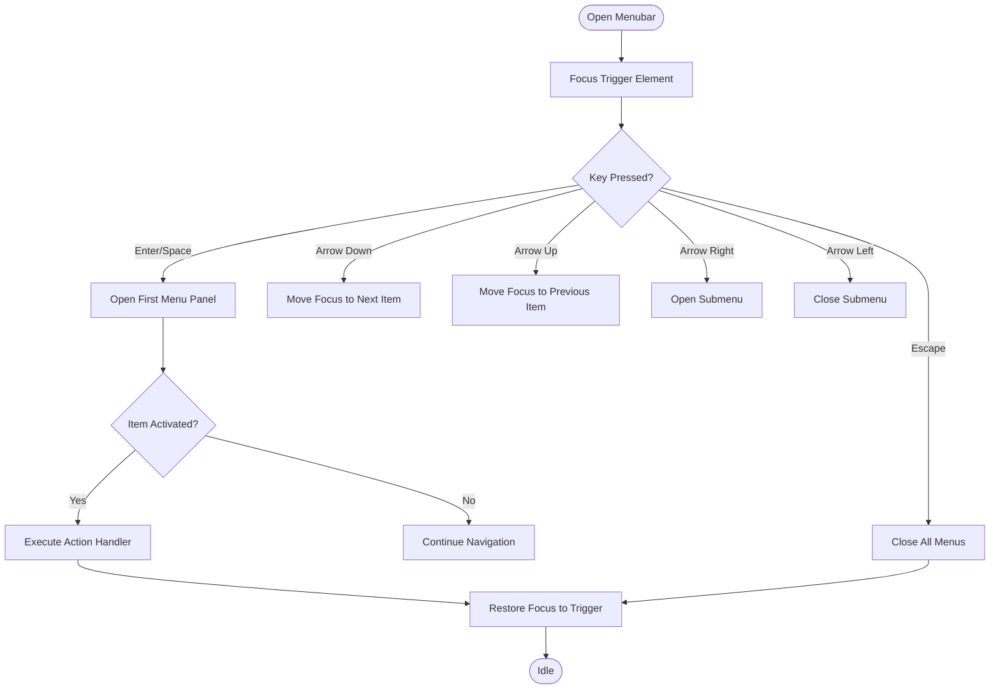
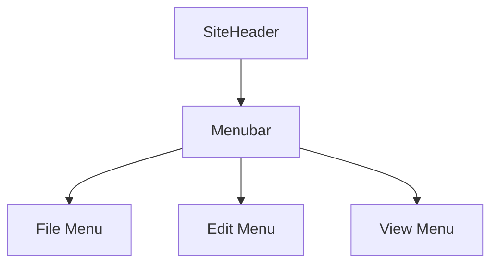
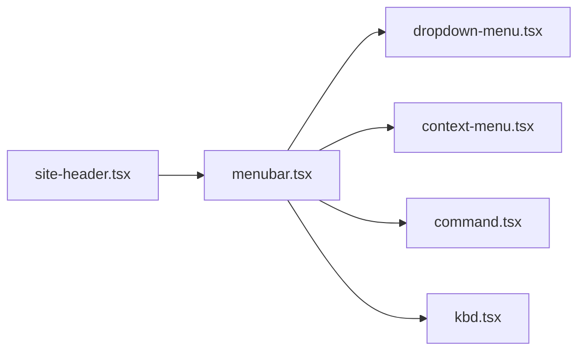

# Menubar

<cite>
**Referenced Files in This Document**
- [menubar.tsx](file://src/components/ui/menubar.tsx)
- [dropdown-menu.tsx](file://src/components/ui/dropdown-menu.tsx)
- [context-menu.tsx](file://src/components/ui/context-menu.tsx)
- [command.tsx](file://src/components/ui/command.tsx)
- [kbd.tsx](file://src/components/ui/kbd.tsx)
- [site-header.tsx](file://src/components/site-header.tsx)
</cite>

## Table of Contents
1. [Introduction](#introduction)
2. [Project Structure](#project-structure)
3. [Core Components](#core-components)
4. [Architecture Overview](#architecture-overview)
5. [Detailed Component Analysis](#detailed-component-analysis)
6. [Dependency Analysis](#dependency-analysis)
7. [Performance Considerations](#performance-considerations)
8. [Troubleshooting Guide](#troubleshooting-guide)
9. [Conclusion](#conclusion)
10. [Appendices](#appendices)

## Introduction
This document provides comprehensive documentation for the Menubar component, focusing on its desktop application-style menu implementation, keyboard navigation, and accessibility features. It explains how to create application menus with standard sections such as File, Edit, View, and more. The guide includes examples of menu item actions, shortcuts, separators, nested submenus, focus management, internationalization support, and integration with application state. It also offers guidelines for creating consistent menu experiences across platforms.

## Project Structure
The Menubar is implemented as a UI primitive under the shared components directory and can be composed into higher-level layouts like the site header. Related primitives include dropdown and context menus, command palette, and keyboard display utilities.

**Diagram sources**
- [menubar.tsx](file://src/components/ui/menubar.tsx)
- [dropdown-menu.tsx](file://src/components/ui/dropdown-menu.tsx)
- [context-menu.tsx](file://src/components/ui/context-menu.tsx)
- [command.tsx](file://src/components/ui/command.tsx)
- [kbd.tsx](file://src/components/ui/kbd.tsx)
- [site-header.tsx](file://src/components/site-header.tsx)

**Section sources**
- [menubar.tsx](file://src/components/ui/menubar.tsx)
- [site-header.tsx](file://src/components/site-header.tsx)

## Core Components
- Menubar: Provides a top-level container for application menus with desktop-like behavior, including focus management, role semantics, and keyboard navigation.
- Dropdown Menu: Used by Menubar to render submenu panels with items, groups, labels, and separators.
- Context Menu: Shares underlying primitives and patterns for positioning and focus handling.
- Command Palette: Complements Menubar by offering global keyboard-driven actions.
- Keyboard Display (KBD): Renders platform-appropriate shortcut hints.

Key responsibilities:
- Maintain focus within the menu system when opened.
- Provide correct ARIA roles and states for screen readers.
- Support nested submenus and hierarchical navigation.
- Render keyboard shortcuts consistently across platforms.

**Section sources**
- [menubar.tsx](file://src/components/ui/menubar.tsx)
- [dropdown-menu.tsx](file://src/components/ui/dropdown-menu.tsx)
- [context-menu.tsx](file://src/components/ui/context-menu.tsx)
- [command.tsx](file://src/components/ui/command.tsx)
- [kbd.tsx](file://src/components/ui/kbd.tsx)

## Architecture Overview
The Menubar composes lower-level primitives to deliver a cohesive desktop-style experience. It orchestrates open/close states, manages focus traversal, and delegates rendering of panels to dropdown primitives.

**Diagram sources**
- [menubar.tsx](file://src/components/ui/menubar.tsx)
- [dropdown-menu.tsx](file://src/components/ui/dropdown-menu.tsx)
- [kbd.tsx](file://src/components/ui/kbd.tsx)

## Detailed Component Analysis

### Menubar Implementation
The Menubar acts as a root container that:
- Exposes an API for adding menus and items.
- Manages open/close state per menu.
- Handles keyboard interactions (arrow keys, Enter/Space, Escape).
- Ensures proper focus trapping and restoration.
- Integrates with dropdown primitives for panel rendering.

Focus management highlights:
- On open, focus moves to the first actionable item.
- Arrow keys navigate between items and submenus.
- On close, focus returns to the triggering trigger element.

Accessibility highlights:
- Uses appropriate ARIA roles and attributes for menus and menu items.
- Announces expanded/collapsed state changes to assistive technologies.
- Supports label and description attributes for complex items.

Integration points:
- Connects to application state via callbacks for actions.
- Displays keyboard shortcuts using the KBD primitive.
- Can be embedded in layout components like the site header.

**Diagram sources**
- [menubar.tsx](file://src/components/ui/menubar.tsx)
- [dropdown-menu.tsx](file://src/components/ui/dropdown-menu.tsx)
- [kbd.tsx](file://src/components/ui/kbd.tsx)

**Section sources**
- [menubar.tsx](file://src/components/ui/menubar.tsx)
- [dropdown-menu.tsx](file://src/components/ui/dropdown-menu.tsx)
- [kbd.tsx](file://src/components/ui/kbd.tsx)

### Creating Application Menus (File, Edit, View, etc.)
To build a desktop-style menu bar:
- Define top-level menus (e.g., File, Edit, View).
- Add menu items with labels, optional icons, and keyboard shortcuts.
- Use separators to group related actions.
- Create nested submenus for complex hierarchies.
- Bind each item to an action handler that updates application state.

Example structure outline:
- File
  - New
  - Open...
  - Save
  - Separator
  - Exit
- Edit
  - Undo
  - Redo
  - Separator
  - Cut
  - Copy
  - Paste
- View
  - Toggle Sidebar
  - Zoom In
  - Zoom Out
  - Reset Zoom

Guidelines:
- Keep labels concise and action-oriented.
- Always show shortcuts next to items where applicable.
- Group related commands with separators.
- Use submenus sparingly; prefer flat structures when possible.

**Section sources**
- [menubar.tsx](file://src/components/ui/menubar.tsx)
- [dropdown-menu.tsx](file://src/components/ui/dropdown-menu.tsx)

### Keyboard Navigation and Shortcuts
Keyboard behaviors:
- Open menu: Enter or Space on a menu trigger.
- Navigate items: Arrow Up/Down.
- Open submenu: Arrow Right.
- Close submenu: Arrow Left or Escape.
- Activate item: Enter or Space.
- Global Escape: Close all menus and return focus.

Shortcut hints:
- Use the KBD primitive to render platform-appropriate key combinations.
- Align shortcut text with OS conventions (e.g., Cmd vs Ctrl).

**Diagram sources**
- [menubar.tsx](file://src/components/ui/menubar.tsx)
- [kbd.tsx](file://src/components/ui/kbd.tsx)

**Section sources**
- [menubar.tsx](file://src/components/ui/menubar.tsx)
- [kbd.tsx](file://src/components/ui/kbd.tsx)

### Accessibility Features
- Roles and states: Proper ARIA roles for menubar, menu, menuitem, and expanded states.
- Focus management: Predictable focus order and restoration after closing.
- Screen reader announcements: Clear feedback for open/close and active items.
- Labeling: Support for accessible names and descriptions for complex items.
- Keyboard-only operation: Full functionality without a mouse.

Best practices:
- Ensure every interactive item has a clear label.
- Avoid relying solely on color to convey state.
- Test with screen readers and keyboard-only navigation.

**Section sources**
- [menubar.tsx](file://src/components/ui/menubar.tsx)

### Internationalization Support
- Localize labels, tooltips, and shortcut hints.
- Respect locale-specific formatting for numbers and dates in menu content.
- Adapt shortcut hints to platform conventions.
- Ensure dynamic content updates do not break language switching.

Implementation tips:
- Centralize strings in a localization layer.
- Pass localized values to menu items and KBD hints.
- Validate translations for length and clarity.

**Section sources**
- [menubar.tsx](file://src/components/ui/menubar.tsx)
- [kbd.tsx](file://src/components/ui/kbd.tsx)

### Integration with Application State
- Bind menu actions to state updates or side effects.
- Reflect enabled/disabled states based on application context.
- Update menu visibility dynamically (e.g., hide “Save” when no file is open).
- Debounce heavy operations triggered from menu items.

Patterns:
- Use callbacks to dispatch actions to a store or service layer.
- Derive disabled states from current app state.
- Keep UI logic separate from business logic.

**Section sources**
- [menubar.tsx](file://src/components/ui/menubar.tsx)

### Composition in Layouts
Embed the Menubar in your application’s header or layout to provide consistent access to global actions.

**Diagram sources**
- [site-header.tsx](file://src/components/site-header.tsx)
- [menubar.tsx](file://src/components/ui/menubar.tsx)

**Section sources**
- [site-header.tsx](file://src/components/site-header.tsx)
- [menubar.tsx](file://src/components/ui/menubar.tsx)

## Dependency Analysis
The Menubar depends on several UI primitives to implement its behavior and appearance.

**Diagram sources**
- [menubar.tsx](file://src/components/ui/menubar.tsx)
- [dropdown-menu.tsx](file://src/components/ui/dropdown-menu.tsx)
- [context-menu.tsx](file://src/components/ui/context-menu.tsx)
- [command.tsx](file://src/components/ui/command.tsx)
- [kbd.tsx](file://src/components/ui/kbd.tsx)
- [site-header.tsx](file://src/components/site-header.tsx)

**Section sources**
- [menubar.tsx](file://src/components/ui/menubar.tsx)
- [dropdown-menu.tsx](file://src/components/ui/dropdown-menu.tsx)
- [context-menu.tsx](file://src/components/ui/context-menu.tsx)
- [command.tsx](file://src/components/ui/command.tsx)
- [kbd.tsx](file://src/components/ui/kbd.tsx)
- [site-header.tsx](file://src/components/site-header.tsx)

## Performance Considerations
- Minimize re-renders by memoizing menu configurations and handlers.
- Avoid heavy computations inside render paths; defer to event handlers.
- Use virtualization if rendering very large menus.
- Debounce or throttle actions that trigger expensive operations.
- Prefer stable references for callbacks to prevent unnecessary updates.

[No sources needed since this section provides general guidance]

## Troubleshooting Guide
Common issues and resolutions:
- Focus not returning after closing: Verify focus restoration logic and ensure triggers are focusable.
- Submenus not opening with arrow keys: Confirm keydown handlers and aria-expanded state updates.
- Shortcuts not displaying correctly: Check KBD usage and platform detection.
- Disabled items still receiving focus: Ensure disabled items are not focusable and visually distinct.
- Screen reader not announcing state changes: Validate ARIA attributes and live region usage.

Debugging tips:
- Log focus changes and key events during development.
- Inspect ARIA attributes in the DOM to verify correctness.
- Test with keyboard-only navigation and a screen reader.

**Section sources**
- [menubar.tsx](file://src/components/ui/menubar.tsx)
- [kbd.tsx](file://src/components/ui/kbd.tsx)

## Conclusion
The Menubar delivers a robust, accessible, and keyboard-friendly desktop-style menu experience. By composing it with dropdown primitives, managing focus carefully, and integrating with application state, you can create consistent, cross-platform menu experiences. Follow the guidelines for structure, shortcuts, and internationalization to ensure usability and maintainability.

[No sources needed since this section summarizes without analyzing specific files]

## Appendices

### Quick Reference: Typical Menu Sections
- File: New, Open, Save, Export, Print, Exit
- Edit: Undo, Redo, Cut, Copy, Paste, Find
- View: Toggle Sidebar, Zoom In/Out, Reset Zoom, Theme
- Help: Documentation, Feedback, About

[No sources needed since this section doesn't analyze specific files]