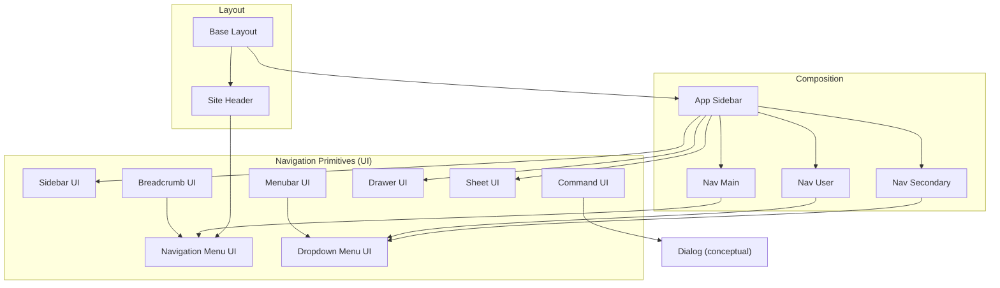
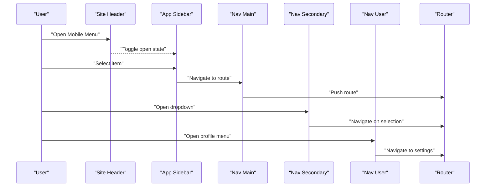
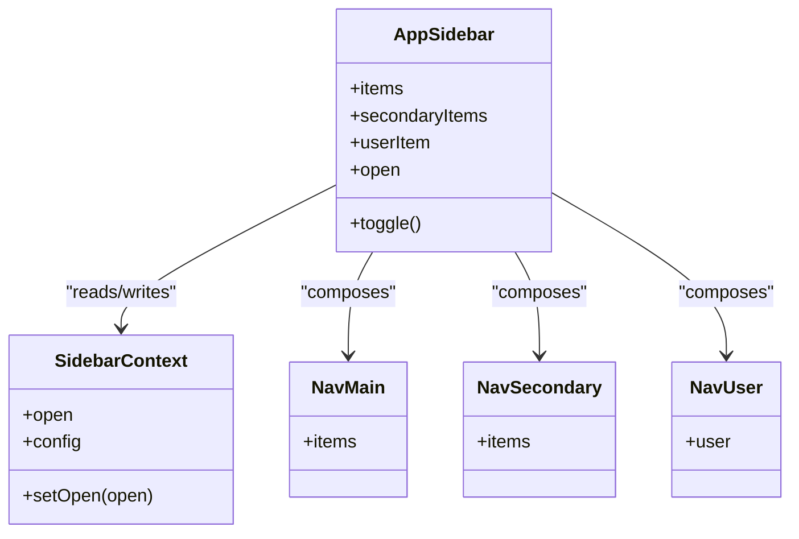
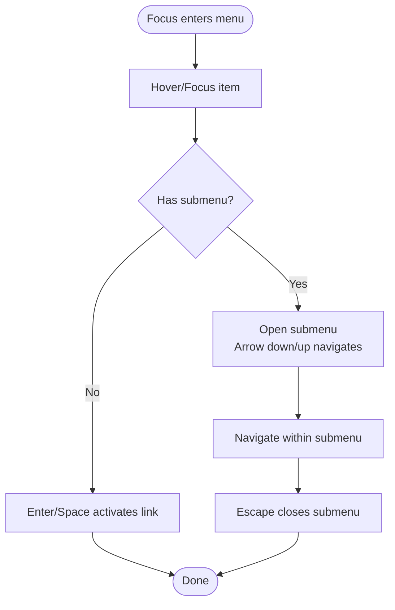
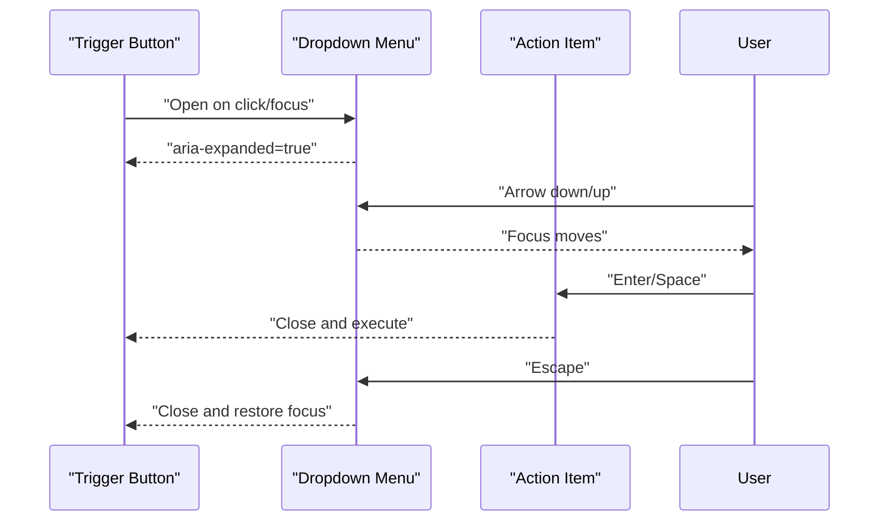
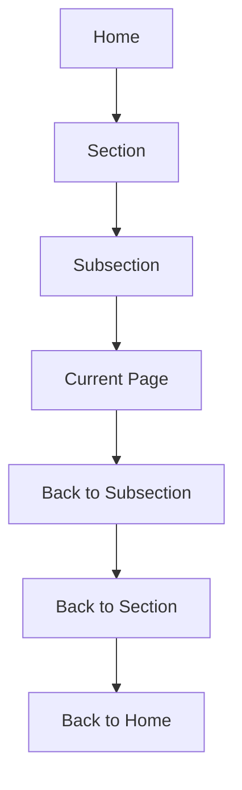
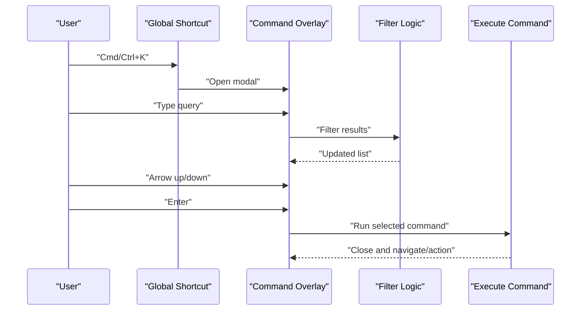
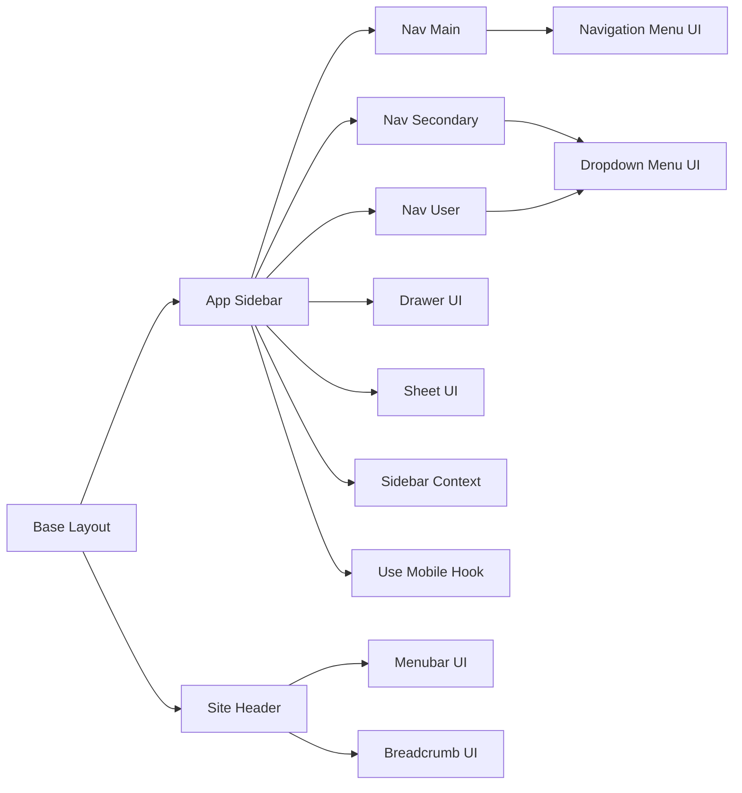

# Navigation Components

<cite>
**Referenced Files in This Document**
- [app-sidebar.tsx](file://src/components/app-sidebar.tsx)
- [sidebar.tsx](file://src/components/ui/sidebar.tsx)
- [navigation-menu.tsx](file://src/components/ui/navigation-menu.tsx)
- [dropdown-menu.tsx](file://src/components/ui/dropdown-menu.tsx)
- [menubar.tsx](file://src/components/ui/menubar.tsx)
- [breadcrumb.tsx](file://src/components/ui/breadcrumb.tsx)
- [command.tsx](file://src/components/ui/command.tsx)
- [nav-main.tsx](file://src/components/nav-main.tsx)
- [nav-secondary.tsx](file://src/components/nav-secondary.tsx)
- [nav-user.tsx](file://src/components/nav-user.tsx)
- [site-header.tsx](file://src/components/site-header.tsx)
- [base-layout.tsx](file://src/components/layouts/base-layout.tsx)
- [sidebar-context.tsx](file://src/contexts/sidebar-context.tsx)
- [use-mobile.ts](file://src/hooks/use-mobile.ts)
- [drawer.tsx](file://src/components/ui/drawer.tsx)
- [sheet.tsx](file://src/components/ui/sheet.tsx)
</cite>

## Table of Contents
1. [Introduction](#introduction)
2. [Project Structure](#project-structure)
3. [Core Components](#core-components)
4. [Architecture Overview](#architecture-overview)
5. [Detailed Component Analysis](#detailed-component-analysis)
6. [Dependency Analysis](#dependency-analysis)
7. [Performance Considerations](#performance-considerations)
8. [Troubleshooting Guide](#troubleshooting-guide)
9. [Conclusion](#conclusion)

## Introduction
This document provides comprehensive documentation for navigation components including App Sidebar, Navigation Menu, Dropdown Menu, Menubar, Breadcrumb, and Command palette. It covers navigation patterns, keyboard shortcuts, accessibility features, responsive behavior, nested navigation structures, dynamic menu generation, command interface implementation, and mobile navigation patterns with touch interactions.

## Project Structure
The navigation system is composed of reusable UI primitives under src/components/ui and higher-level composition components under src/components. The layout integration occurs via base-layout and site-header, while state coordination is handled by sidebar-context and hooks like use-mobile.

**Diagram sources**
- [base-layout.tsx](file://src/components/layouts/base-layout.tsx)
- [site-header.tsx](file://src/components/site-header.tsx)
- [app-sidebar.tsx](file://src/components/app-sidebar.tsx)
- [sidebar.tsx](file://src/components/ui/sidebar.tsx)
- [navigation-menu.tsx](file://src/components/ui/navigation-menu.tsx)
- [dropdown-menu.tsx](file://src/components/ui/dropdown-menu.tsx)
- [menubar.tsx](file://src/components/ui/menubar.tsx)
- [breadcrumb.tsx](file://src/components/ui/breadcrumb.tsx)
- [command.tsx](file://src/components/ui/command.tsx)
- [drawer.tsx](file://src/components/ui/drawer.tsx)
- [sheet.tsx](file://src/components/ui/sheet.tsx)

**Section sources**
- [base-layout.tsx](file://src/components/layouts/base-layout.tsx)
- [site-header.tsx](file://src/components/site-header.tsx)
- [app-sidebar.tsx](file://src/components/app-sidebar.tsx)

## Core Components
- App Sidebar: Primary left-side navigation container that composes main, secondary, and user sections; supports collapsible states and mobile drawer presentation.
- Navigation Menu: Top-level horizontal menu used in headers and within the sidebar for primary routes.
- Dropdown Menu: Contextual action menus triggered from buttons or items.
- Menubar: Application-wide top bar with standard menu semantics and keyboard navigation.
- Breadcrumb: Hierarchical path indicator for deep pages.
- Command Palette: Global search-and-execute overlay for commands and quick actions.

Key responsibilities:
- Provide consistent keyboard navigation and focus management.
- Ensure ARIA roles and labels for screen readers.
- Adapt to small screens using drawers/sheets.
- Support nested structures and dynamic data-driven rendering.

**Section sources**
- [app-sidebar.tsx](file://src/components/app-sidebar.tsx)
- [sidebar.tsx](file://src/components/ui/sidebar.tsx)
- [navigation-menu.tsx](file://src/components/ui/navigation-menu.tsx)
- [dropdown-menu.tsx](file://src/components/ui/dropdown-menu.tsx)
- [menubar.tsx](file://src/components/ui/menubar.tsx)
- [breadcrumb.tsx](file://src/components/ui/breadcrumb.tsx)
- [command.tsx](file://src/components/ui/command.tsx)

## Architecture Overview
The navigation architecture separates concerns between low-level primitives (UI), mid-level compositions (NavMain, NavSecondary, NavUser), and high-level containers (App Sidebar, Site Header). State for sidebar visibility and configuration is centralized in a context, and mobile responsiveness is driven by a hook.

**Diagram sources**
- [site-header.tsx](file://src/components/site-header.tsx)
- [app-sidebar.tsx](file://src/components/app-sidebar.tsx)
- [nav-main.tsx](file://src/components/nav-main.tsx)
- [nav-secondary.tsx](file://src/components/nav-secondary.tsx)
- [nav-user.tsx](file://src/components/nav-user.tsx)

## Detailed Component Analysis

### App Sidebar
Responsibilities:
- Compose NavMain, NavSecondary, and NavUser.
- Manage collapsed/expanded states and mobile drawer presentation.
- Integrate with global sidebar context for coordinated behavior across the app.

Keyboard and Accessibility:
- Focus trapping when open on mobile.
- Proper ARIA attributes for tree-like navigation.
- Escape to close on mobile drawer.

Responsive Behavior:
- On small screens, renders as a slide-out drawer.
- On larger screens, inline persistent panel with collapse toggle.

Dynamic Generation:
- Accepts arrays of navigation items to render lists and nested groups.

**Diagram sources**
- [app-sidebar.tsx](file://src/components/app-sidebar.tsx)
- [sidebar-context.tsx](file://src/contexts/sidebar-context.tsx)
- [nav-main.tsx](file://src/components/nav-main.tsx)
- [nav-secondary.tsx](file://src/components/nav-secondary.tsx)
- [nav-user.tsx](file://src/components/nav-user.tsx)

**Section sources**
- [app-sidebar.tsx](file://src/components/app-sidebar.tsx)
- [sidebar-context.tsx](file://src/contexts/sidebar-context.tsx)
- [use-mobile.ts](file://src/hooks/use-mobile.ts)
- [drawer.tsx](file://src/components/ui/drawer.tsx)
- [sheet.tsx](file://src/components/ui/sheet.tsx)

### Navigation Menu
Responsibilities:
- Horizontal menu for top-level navigation.
- Supports nested submenus with hover/focus-triggered popovers.

Keyboard Shortcuts:
- Arrow keys navigate items.
- Enter/Space activates links.
- Escape closes open submenus.

Accessibility:
- Uses appropriate ARIA roles (menu, menuitem, menubar where applicable).
- Focus ring management and visible indicators.

Responsive Behavior:
- Collapses into a vertical list or hamburger pattern on small screens.

**Diagram sources**
- [navigation-menu.tsx](file://src/components/ui/navigation-menu.tsx)

**Section sources**
- [navigation-menu.tsx](file://src/components/ui/navigation-menu.tsx)

### Dropdown Menu
Responsibilities:
- Contextual action menus attached to buttons or items.
- Supports grouping, separators, and disabled states.

Keyboard Shortcuts:
- Arrow keys move focus among items.
- Enter/Space triggers selected action.
- Escape dismisses the menu.

Accessibility:
- Role="menu" with proper aria-haspopup and aria-expanded.
- Focus restoration to trigger element on close.

Mobile Behavior:
- Full-screen or bottom-sheet presentation on small viewports if needed.

**Diagram sources**
- [dropdown-menu.tsx](file://src/components/ui/dropdown-menu.tsx)

**Section sources**
- [dropdown-menu.tsx](file://src/components/ui/dropdown-menu.tsx)

### Menubar
Responsibilities:
- Application-wide top-level menu following desktop conventions.
- Provides access to common actions and navigation.

Keyboard Shortcuts:
- Alt+M or similar to focus menubar.
- Arrow keys switch between menus and items.
- Enter/Space opens and selects.

Accessibility:
- Role="menubar" with child role="menu".
- Proper labeling and focus management.

Integration:
- Often placed above content or integrated into header.

**Section sources**
- [menubar.tsx](file://src/components/ui/menubar.tsx)

### Breadcrumb
Responsibilities:
- Displays hierarchical location within the application.
- Links to parent levels for quick navigation.

Keyboard and Accessibility:
- Navigable with arrow keys between segments.
- Semantic list structure with current page marked.

Responsive Behavior:
- Truncates long paths and shows ellipsis on narrow screens.

**Diagram sources**
- [breadcrumb.tsx](file://src/components/ui/breadcrumb.tsx)

**Section sources**
- [breadcrumb.tsx](file://src/components/ui/breadcrumb.tsx)

### Command Palette
Responsibilities:
- Global overlay for searching and executing commands.
- Supports categories, icons, and keyboard-driven filtering.

Keyboard Shortcuts:
- Global shortcut to open (e.g., Cmd/Ctrl+K).
- Arrow keys navigate results.
- Enter executes highlighted command.
- Escape closes.

Accessibility:
- Modal dialog semantics with aria-modal and focus trap.
- Live region updates for filtered results.

Implementation Notes:
- Can be triggered from header or keyboard shortcut.
- Integrates with routing and actions.

**Diagram sources**
- [command.tsx](file://src/components/ui/command.tsx)

**Section sources**
- [command.tsx](file://src/components/ui/command.tsx)

### Composition Components
- Nav Main: Renders primary navigation items, often linking to core routes.
- Nav Secondary: Renders grouped or contextual items, frequently using dropdowns.
- Nav User: Renders user profile and account-related actions.

These compose the App Sidebar and integrate with routing and authentication contexts.

**Section sources**
- [nav-main.tsx](file://src/components/nav-main.tsx)
- [nav-secondary.tsx](file://src/components/nav-secondary.tsx)
- [nav-user.tsx](file://src/components/nav-user.tsx)

## Dependency Analysis
High-level dependencies among navigation components and utilities:

**Diagram sources**
- [base-layout.tsx](file://src/components/layouts/base-layout.tsx)
- [app-sidebar.tsx](file://src/components/app-sidebar.tsx)
- [site-header.tsx](file://src/components/site-header.tsx)
- [nav-main.tsx](file://src/components/nav-main.tsx)
- [nav-secondary.tsx](file://src/components/nav-secondary.tsx)
- [nav-user.tsx](file://src/components/nav-user.tsx)
- [navigation-menu.tsx](file://src/components/ui/navigation-menu.tsx)
- [dropdown-menu.tsx](file://src/components/ui/dropdown-menu.tsx)
- [menubar.tsx](file://src/components/ui/menubar.tsx)
- [breadcrumb.tsx](file://src/components/ui/breadcrumb.tsx)
- [drawer.tsx](file://src/components/ui/drawer.tsx)
- [sheet.tsx](file://src/components/ui/sheet.tsx)
- [sidebar-context.tsx](file://src/contexts/sidebar-context.tsx)
- [use-mobile.ts](file://src/hooks/use-mobile.ts)

**Section sources**
- [base-layout.tsx](file://src/components/layouts/base-layout.tsx)
- [app-sidebar.tsx](file://src/components/app-sidebar.tsx)
- [site-header.tsx](file://src/components/site-header.tsx)
- [sidebar-context.tsx](file://src/contexts/sidebar-context.tsx)
- [use-mobile.ts](file://src/hooks/use-mobile.ts)

## Performance Considerations
- Prefer lazy loading for heavy command palette results and large nested menus.
- Memoize computed navigation trees to avoid unnecessary re-renders.
- Avoid deep nesting beyond two levels to reduce DOM complexity and improve keyboard traversal performance.
- Debounce search input in command palette for large datasets.
- Use virtualization for very long lists in command results or secondary navigation.

## Troubleshooting Guide
Common issues and resolutions:
- Keyboard navigation not working:
  - Verify ARIA roles and tabindex usage.
  - Ensure focus traps are active in overlays (command palette, dropdowns).
- Focus not restored after closing:
  - Confirm focus restoration logic in dropdown and command components.
- Mobile drawer does not close:
  - Check backdrop click handlers and escape key listeners.
- Inconsistent responsive behavior:
  - Validate breakpoint detection via use-mobile hook.
- Dynamic menus not updating:
  - Ensure state changes propagate and keys are stable for list items.

**Section sources**
- [dropdown-menu.tsx](file://src/components/ui/dropdown-menu.tsx)
- [command.tsx](file://src/components/ui/command.tsx)
- [drawer.tsx](file://src/components/ui/drawer.tsx)
- [use-mobile.ts](file://src/hooks/use-mobile.ts)

## Conclusion
The navigation system combines robust UI primitives with thoughtful composition to deliver accessible, keyboard-friendly, and responsive navigation across devices. By leveraging shared context and hooks, it maintains consistency while supporting dynamic content and complex hierarchies. Following the patterns outlined here will help ensure a cohesive user experience and maintainable codebase.