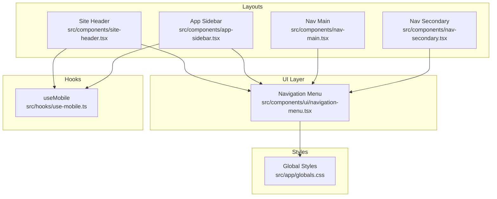
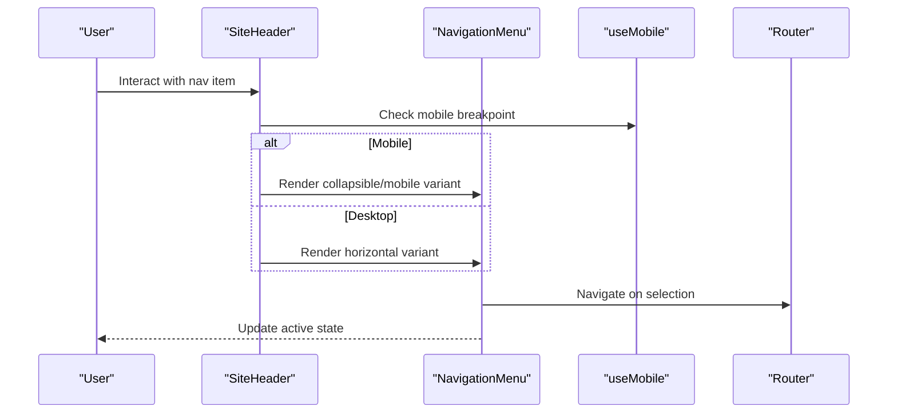
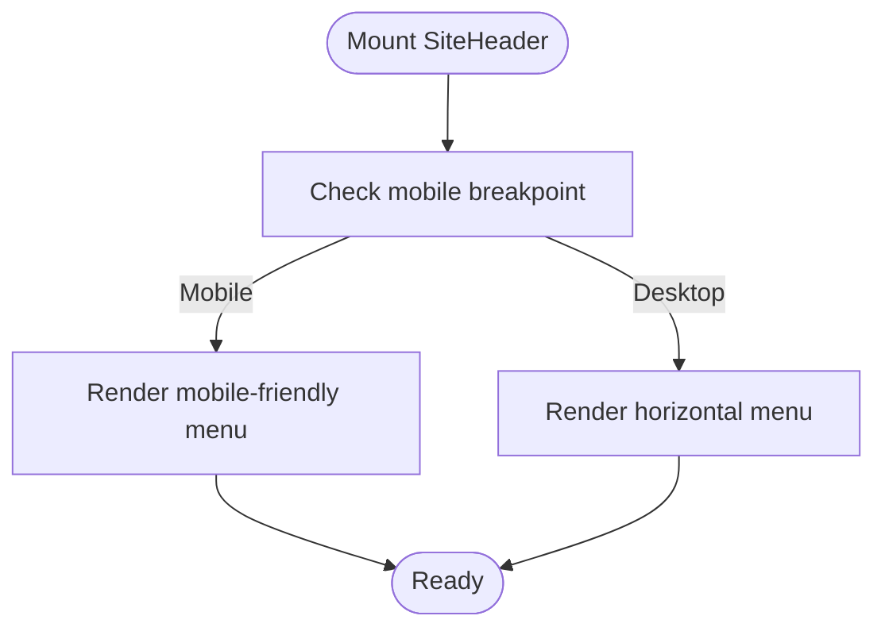
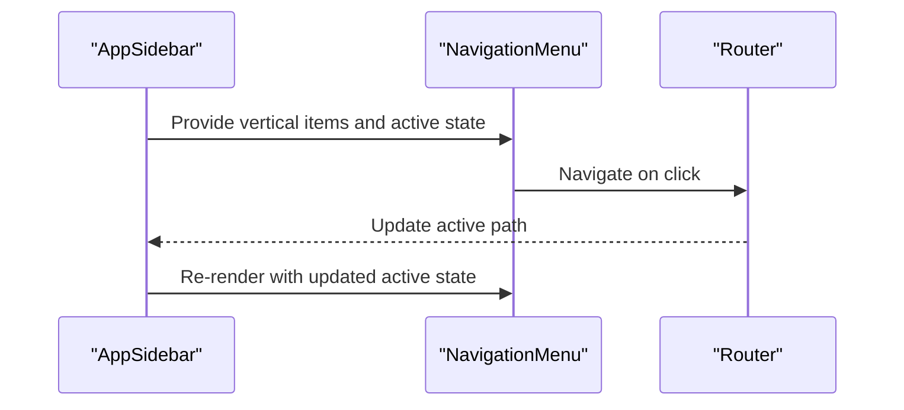
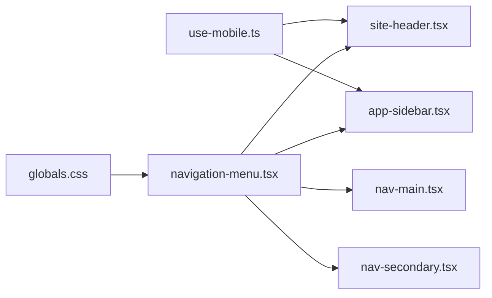

# Navigation Menu

<cite>
**Referenced Files in This Document**
- [navigation-menu.tsx](file://src/components/ui/navigation-menu.tsx)
- [site-header.tsx](file://src/components/site-header.tsx)
- [nav-main.tsx](file://src/components/nav-main.tsx)
- [nav-secondary.tsx](file://src/components/nav-secondary.tsx)
- [app-sidebar.tsx](file://src/components/app-sidebar.tsx)
- [use-mobile.ts](file://src/hooks/use-mobile.ts)
- [globals.css](file://src/app/globals.css)
</cite>

## Table of Contents
1. [Introduction](#introduction)
2. [Project Structure](#project-structure)
3. [Core Components](#core-components)
4. [Architecture Overview](#architecture-overview)
5. [Detailed Component Analysis](#detailed-component-analysis)
6. [Dependency Analysis](#dependency-analysis)
7. [Performance Considerations](#performance-considerations)
8. [Troubleshooting Guide](#troubleshooting-guide)
9. [Conclusion](#conclusion)
10. [Appendices](#appendices)

## Introduction
This document provides comprehensive documentation for the Navigation Menu component used across the application. It explains how to create horizontal navigation menus, handle dropdowns and nested menus, implement active states, manage responsive breakpoints, and ensure keyboard accessibility. It also covers styling options, performance optimization, and browser compatibility considerations.

## Project Structure
The Navigation Menu is implemented as a reusable UI primitive and composed into higher-level layout components:
- The core primitive lives under the shared UI layer.
- Header and sidebar layouts compose the menu with site-specific data and behavior.
- A mobile hook drives responsive behavior.
- Global styles provide base theming and utility classes.



**Diagram sources**
- [navigation-menu.tsx](file://src/components/ui/navigation-menu.tsx)
- [site-header.tsx](file://src/components/site-header.tsx)
- [app-sidebar.tsx](file://src/components/app-sidebar.tsx)
- [nav-main.tsx](file://src/components/nav-main.tsx)
- [nav-secondary.tsx](file://src/components/nav-secondary.tsx)
- [use-mobile.ts](file://src/hooks/use-mobile.ts)
- [globals.css](file://src/app/globals.css)

**Section sources**
- [navigation-menu.tsx](file://src/components/ui/navigation-menu.tsx)
- [site-header.tsx](file://src/components/site-header.tsx)
- [app-sidebar.tsx](file://src/components/app-sidebar.tsx)
- [nav-main.tsx](file://src/components/nav-main.tsx)
- [nav-secondary.tsx](file://src/components/nav-secondary.tsx)
- [use-mobile.ts](file://src/hooks/use-mobile.ts)
- [globals.css](file://src/app/globals.css)

## Core Components
- Navigation Menu Primitive: Provides the foundation for building accessible, keyboard-navigable menus with support for dropdowns and nested items. It exposes props for controlling open state, orientation, and styling hooks.
- Site Header: Composes the horizontal navigation menu at the top of the app, integrating brand/logo, primary links, and actions. It uses a mobile hook to switch between desktop and mobile patterns.
- App Sidebar: Uses the same primitives to render vertical navigation, including grouped sections and secondary items.
- Nav Main/Secondary: Reusable building blocks that structure main and secondary navigation groups, often used within header or sidebar contexts.

Key responsibilities:
- Keyboard navigation (arrow keys, Enter/Space, Escape).
- Dropdown and nested menu behaviors.
- Active link highlighting based on current route.
- Responsive adaptation via mobile breakpoint detection.

**Section sources**
- [navigation-menu.tsx](file://src/components/ui/navigation-menu.tsx)
- [site-header.tsx](file://src/components/site-header.tsx)
- [app-sidebar.tsx](file://src/components/app-sidebar.tsx)
- [nav-main.tsx](file://src/components/nav-main.tsx)
- [nav-secondary.tsx](file://src/components/nav-secondary.tsx)

## Architecture Overview
The navigation system follows a layered architecture:
- UI primitives define interaction semantics and DOM structure.
- Layout components wire up data, routing, and responsive behavior.
- Hooks encapsulate responsive logic.
- Global styles provide consistent theming.



**Diagram sources**
- [site-header.tsx](file://src/components/site-header.tsx)
- [navigation-menu.tsx](file://src/components/ui/navigation-menu.tsx)
- [use-mobile.ts](file://src/hooks/use-mobile.ts)

## Detailed Component Analysis

### Navigation Menu Primitive
Responsibilities:
- Renders a list-based navigation with proper ARIA roles and attributes.
- Supports dropdowns and nested submenus.
- Implements keyboard navigation: arrow keys move focus, Enter/Space activates, Escape closes open menus.
- Exposes props for orientation, active state, and styling customization.

Styling options:
- Use CSS classes or theme tokens to customize colors, spacing, typography, and transitions.
- Provide hover/focus/active variants through class composition.

Accessibility:
- Semantic list structure with correct roles and aria-expanded/aria-haspopup where applicable.
- Focus management ensures logical tab order and trap-free modal-like behavior for dropdowns.

```mermaid
classDiagram
class NavigationMenu {
+props : { "items", "orientation", "activeItem", "onSelect" }
+render()
-handleKeyDown(event)
-toggleDropdown(index)
-setActive(index)
}
```

**Diagram sources**
- [navigation-menu.tsx](file://src/components/ui/navigation-menu.tsx)

**Section sources**
- [navigation-menu.tsx](file://src/components/ui/navigation-menu.tsx)

### Site Header Composition
Responsibilities:
- Assembles the top-level horizontal navigation.
- Integrates logo, primary links, and user actions.
- Adapts layout for mobile using the mobile hook.

Responsive behavior:
- On small screens, collapses into a drawer or stacked list.
- On larger screens, displays a horizontal row.



**Diagram sources**
- [site-header.tsx](file://src/components/site-header.tsx)
- [use-mobile.ts](file://src/hooks/use-mobile.ts)

**Section sources**
- [site-header.tsx](file://src/components/site-header.tsx)
- [use-mobile.ts](file://src/hooks/use-mobile.ts)

### Sidebar Navigation Composition
Responsibilities:
- Builds vertical navigation with grouped sections.
- Uses the same primitives for consistency across orientations.
- Highlights active routes and supports nested items.



**Diagram sources**
- [app-sidebar.tsx](file://src/components/app-sidebar.tsx)
- [navigation-menu.tsx](file://src/components/ui/navigation-menu.tsx)

**Section sources**
- [app-sidebar.tsx](file://src/components/app-sidebar.tsx)
- [navigation-menu.tsx](file://src/components/ui/navigation-menu.tsx)

### Nav Main and Nav Secondary
Responsibilities:
- Encapsulate common structures for primary and secondary navigation groups.
- Simplify composition in header/sidebar by providing prebuilt sections.

Usage patterns:
- Pass arrays of items with labels, icons, and hrefs.
- Control visibility and grouping via props.

**Section sources**
- [nav-main.tsx](file://src/components/nav-main.tsx)
- [nav-secondary.tsx](file://src/components/nav-secondary.tsx)

### Styling Options and Customization
- Base styles are provided globally; override via CSS variables or Tailwind utilities.
- Customize:
  - Colors for default, hover, focus, and active states.
  - Spacing and typography for menu items and dropdowns.
  - Transitions for opening/closing dropdowns.
- For complex themes, extend global style definitions to maintain consistency.

**Section sources**
- [globals.css](file://src/app/globals.css)
- [navigation-menu.tsx](file://src/components/ui/navigation-menu.tsx)

### Interaction Patterns
- Horizontal menus:
  - Left/right arrows navigate items.
  - Enter/Space opens dropdowns.
  - Arrow keys navigate within dropdowns.
  - Escape closes open menus and returns focus to the trigger.
- Nested menus:
  - Right arrow opens submenu; left arrow returns to parent.
  - Focus remains within the menu tree until Escape is pressed.
- Active states:
  - Highlight the current route based on the active path prop.
  - Ensure focus-visible outlines for keyboard users.

**Section sources**
- [navigation-menu.tsx](file://src/components/ui/navigation-menu.tsx)

### Responsive Breakpoints
- Use the mobile hook to detect viewport size and switch between horizontal and collapsed layouts.
- Apply different rendering branches for mobile vs desktop.
- Ensure touch targets meet minimum size guidelines on mobile.

**Section sources**
- [use-mobile.ts](file://src/hooks/use-mobile.ts)
- [site-header.tsx](file://src/components/site-header.tsx)

### Accessibility Compliance
- Semantic HTML lists with appropriate roles.
- ARIA attributes for expanded state and popup behavior.
- Keyboard navigation with predictable focus movement.
- Sufficient color contrast and visible focus indicators.
- Screen reader announcements for dynamic content changes.

**Section sources**
- [navigation-menu.tsx](file://src/components/ui/navigation-menu.tsx)

## Dependency Analysis
The navigation system has clear separation of concerns:
- UI primitives depend only on global styles and minimal runtime logic.
- Layout components depend on primitives and routing context.
- The mobile hook is a lightweight dependency for responsive decisions.



**Diagram sources**
- [navigation-menu.tsx](file://src/components/ui/navigation-menu.tsx)
- [site-header.tsx](file://src/components/site-header.tsx)
- [app-sidebar.tsx](file://src/components/app-sidebar.tsx)
- [nav-main.tsx](file://src/components/nav-main.tsx)
- [nav-secondary.tsx](file://src/components/nav-secondary.tsx)
- [use-mobile.ts](file://src/hooks/use-mobile.ts)
- [globals.css](file://src/app/globals.css)

**Section sources**
- [navigation-menu.tsx](file://src/components/ui/navigation-menu.tsx)
- [site-header.tsx](file://src/components/site-header.tsx)
- [app-sidebar.tsx](file://src/components/app-sidebar.tsx)
- [nav-main.tsx](file://src/components/nav-main.tsx)
- [nav-secondary.tsx](file://src/components/nav-secondary.tsx)
- [use-mobile.ts](file://src/hooks/use-mobile.ts)
- [globals.css](file://src/app/globals.css)

## Performance Considerations
- Keep menu item lists static when possible; avoid heavy computations during render.
- Memoize expensive computations for derived data (e.g., filtered or sorted items).
- Avoid unnecessary re-renders by stabilizing props and using selective updates.
- Prefer CSS transitions over JS animations for smoother interactions.
- Lazy-load large dropdown contents if needed.

[No sources needed since this section provides general guidance]

## Troubleshooting Guide
Common issues and resolutions:
- Dropdown not closing on Escape:
  - Verify keydown handlers and focus restoration logic.
- Incorrect active state:
  - Ensure active path comparison accounts for trailing slashes and query parameters.
- Keyboard navigation broken:
  - Confirm focus trapping within dropdowns and correct tabindex values.
- Mobile layout misalignment:
  - Validate breakpoint thresholds and container widths.
- Contrast or focus visibility problems:
  - Adjust color tokens and focus ring styles in global styles.

**Section sources**
- [navigation-menu.tsx](file://src/components/ui/navigation-menu.tsx)
- [globals.css](file://src/app/globals.css)

## Conclusion
The Navigation Menu component provides a robust, accessible, and customizable foundation for both horizontal and vertical navigation. By composing it with layout components and leveraging responsive hooks, teams can build consistent navigation experiences across devices while maintaining strong keyboard and screen reader support.

[No sources needed since this section summarizes without analyzing specific files]

## Appendices

### Quick Start Examples
- Horizontal menu:
  - Compose the primitive in the site header with an array of items and set orientation to horizontal.
- Dropdowns:
  - Add nested children to items and enable dropdown behavior via props.
- Nested menus:
  - Chain multiple levels of children; ensure keyboard traversal is supported.
- Active states:
  - Pass the current route to highlight the active item.
- Responsive behavior:
  - Use the mobile hook to toggle between collapsed and expanded layouts.

[No sources needed since this section provides general guidance]