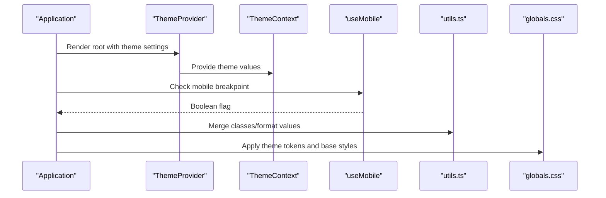
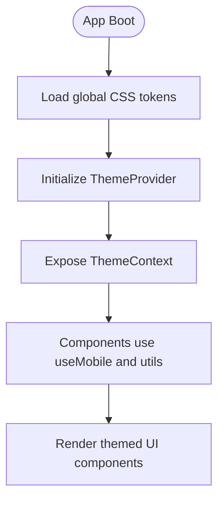
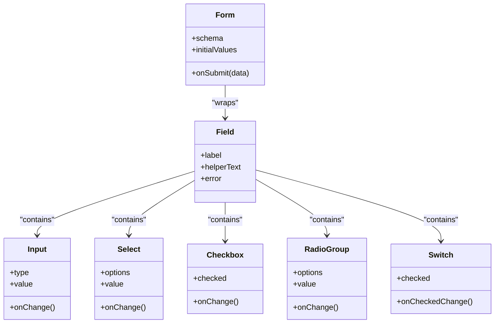
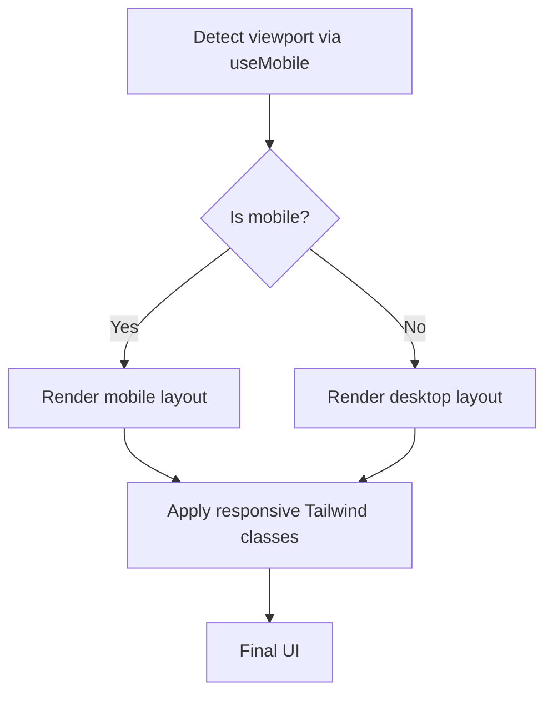
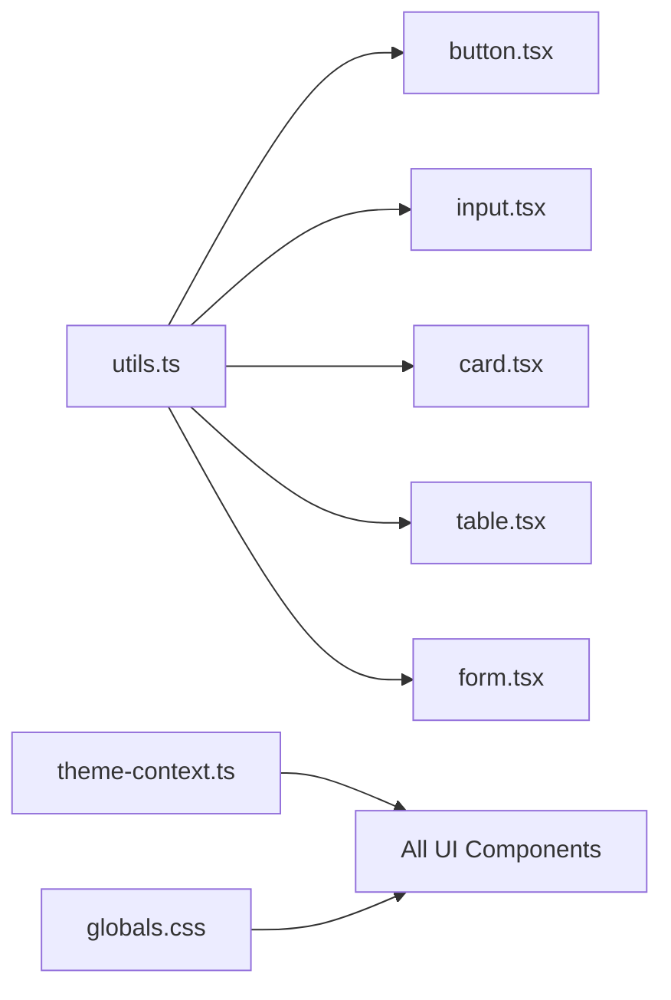

# UI Component Library

<cite>
**Referenced Files in This Document**
- [components.json](file://components.json)
- [src/components/ui/button.tsx](file://src/components/ui/button.tsx)
- [src/components/ui/input.tsx](file://src/components/ui/input.tsx)
- [src/components/ui/card.tsx](file://src/components/ui/card.tsx)
- [src/components/ui/dialog.tsx](file://src/components/ui/dialog.tsx)
- [src/components/ui/accordion.tsx](file://src/components/ui/accordion.tsx)
- [src/components/ui/alert-dialog.tsx](file://src/components/ui/alert-dialog.tsx)
- [src/components/ui/badge.tsx](file://src/components/ui/badge.tsx)
- [src/components/ui/avatar.tsx](file://src/components/ui/avatar.tsx)
- [src/components/ui/table.tsx](file://src/components/ui/table.tsx)
- [src/components/ui/tabs.tsx](file://src/components/ui/tabs.tsx)
- [src/components/ui/select.tsx](file://src/components/ui/select.tsx)
- [src/components/ui/checkbox.tsx](file://src/components/ui/checkbox.tsx)
- [src/components/ui/radio-group.tsx](file://src/components/ui/radio-group.tsx)
- [src/components/ui/switch.tsx](file://src/components/ui/switch.tsx)
- [src/components/ui/slider.tsx](file://src/components/ui/slider.tsx)
- [src/components/ui/calendar.tsx](file://src/components/ui/calendar.tsx)
- [src/components/ui/command.tsx](file://src/components/ui/command.tsx)
- [src/components/ui/popover.tsx](file://src/components/ui/popover.tsx)
- [src/components/ui/dropdown-menu.tsx](file://src/components/ui/dropdown-menu.tsx)
- [src/components/ui/navigation-menu.tsx](file://src/components/ui/navigation-menu.tsx)
- [src/components/ui/menubar.tsx](file://src/components/ui/menubar.tsx)
- [src/components/ui/context-menu.tsx](file://src/components/ui/context-menu.tsx)
- [src/components/ui/hover-card.tsx](file://src/components/ui/hover-card.tsx)
- [src/components/ui/sheet.tsx](file://src/components/ui/sheet.tsx)
- [src/components/ui/drawer.tsx](file://src/components/ui/drawer.tsx)
- [src/components/ui/collapsible.tsx](file://src/components/ui/collapsible.tsx)
- [src/components/ui/progress.tsx](file://src/components/ui/progress.tsx)
- [src/components/ui/separator.tsx](file://src/components/ui/separator.tsx)
- [src/components/ui/tooltip.tsx](file://src/components/ui/tooltip.tsx)
- [src/components/ui/kbd.tsx](file://src/components/ui/kbd.tsx)
- [src/components/ui/aspect-ratio.tsx](file://src/components/ui/aspect-ratio.tsx)
- [src/components/ui/resizable.tsx](file://src/components/ui/resizable.tsx)
- [src/components/ui/scroll-area.tsx](file://src/components/ui/scroll-area.tsx)
- [src/components/ui/pagination.tsx](file://src/components/ui/pagination.tsx)
- [src/components/ui/carousel.tsx](file://src/components/ui/carousel.tsx)
- [src/components/ui/chart.tsx](file://src/components/ui/chart.tsx)
- [src/components/ui/form.tsx](file://src/components/ui/form.tsx)
- [src/components/ui/field.tsx](file://src/components/ui/field.tsx)
- [src/components/ui/input-group.tsx](file://src/components/ui/input-group.tsx)
- [src/components/ui/input-otp.tsx](file://src/components/ui/input-otp.tsx)
- [src/components/ui/native-select.tsx](file://src/components/ui/native-select.tsx)
- [src/components/ui/loading-spinner.tsx](file://src/components/ui/loading-spinner.tsx)
- [src/components/ui/spinner.tsx](file://src/components/ui/spinner.tsx)
- [src/components/ui/skeleton.tsx](file://src/components/ui/skeleton.tsx)
- [src/components/ui/empty.tsx](file://src/components/ui/empty.tsx)
- [src/components/ui/sidebar.tsx](file://src/components/ui/sidebar.tsx)
- [src/components/ui/message.tsx](file://src/components/ui/message.tsx)
- [src/components/ui/message-scroller.tsx](file://src/components/ui/message-scroller.tsx)
- [src/components/ui/bubble.tsx](file://src/components/ui/bubble.tsx)
- [src/components/ui/attachment.tsx](file://src/components/ui/attachment.tsx)
- [src/components/ui/item.tsx](file://src/components/ui/item.tsx)
- [src/components/ui/marker.tsx](file://src/components/ui/marker.tsx)
- [src/components/ui/button-group.tsx](file://src/components/ui/button-group.tsx)
- [src/components/ui/toggle.tsx](file://src/components/ui/toggle.tsx)
- [src/components/ui/toggle-group.tsx](file://src/components/ui/toggle-group.tsx)
- [src/components/ui/combobox.tsx](file://src/components/ui/combobox.tsx)
- [src/components/ui/breadcrumb.tsx](file://src/components/ui/breadcrumb.tsx)
- [src/components/ui/sonner.tsx](file://src/components/ui/sonner.tsx)
- [src/components/theme-provider.tsx](file://src/components/theme-provider.tsx)
- [src/contexts/theme-context.ts](file://src/contexts/theme-context.ts)
- [src/hooks/use-mobile.ts](file://src/hooks/use-mobile.ts)
- [src/lib/utils.ts](file://src/lib/utils.ts)
- [src/app/globals.css](file://src/app/globals.css)
</cite>

## Table of Contents
1. [Introduction](#introduction)
2. [Project Structure](#project-structure)
3. [Core Components](#core-components)
4. [Architecture Overview](#architecture-overview)
5. [Detailed Component Analysis](#detailed-component-analysis)
6. [Dependency Analysis](#dependency-analysis)
7. [Performance Considerations](#performance-considerations)
8. [Troubleshooting Guide](#troubleshooting-guide)
9. [Conclusion](#conclusion)
10. [Appendices](#appendices)

## Introduction
This document provides comprehensive documentation for the reusable UI component library built on ShadCN UI primitives within a Next.js dashboard application. It covers component APIs, props and attributes, events, customization options, usage examples, styling guidelines, accessibility compliance, composition patterns, theme integration, responsive design, testing strategies, and performance optimization techniques. The goal is to enable both new and experienced developers to adopt, extend, and maintain the component library effectively.

## Project Structure
The UI components are organized under src/components/ui with additional layout and theming utilities. The project uses Tailwind CSS classes and Radix UI primitives via ShadCN. Theme context and provider are centralized for consistent appearance across the app.

```mermaid
graph TB
subgraph "UI Components"
A["button.tsx"]
B["input.tsx"]
C["card.tsx"]
D["dialog.tsx"]
E["table.tsx"]
F["form.tsx"]
G["select.tsx"]
H["tabs.tsx"]
I["popover.tsx"]
J["dropdown-menu.tsx"]
K["navigation-menu.tsx"]
L["menubar.tsx"]
M["context-menu.tsx"]
N["hover-card.tsx"]
O["sheet.tsx"]
P["drawer.tsx"]
Q["collapsible.tsx"]
R["progress.tsx"]
S["separator.tsx"]
T["tooltip.tsx"]
U["kbd.tsx"]
V["aspect-ratio.tsx"]
W["resizable.tsx"]
X["scroll-area.tsx"]
Y["pagination.tsx"]
Z["carousel.tsx"]
AA["chart.tsx"]
AB["field.tsx"]
AC["input-group.tsx"]
AD["input-otp.tsx"]
AE["native-select.tsx"]
AF["loading-spinner.tsx"]
AG["spinner.tsx"]
AH["skeleton.tsx"]
AI["empty.tsx"]
AJ["sidebar.tsx"]
AK["message.tsx"]
AL["message-scroller.tsx"]
AM["bubble.tsx"]
AN["attachment.tsx"]
AO["item.tsx"]
AP["marker.tsx"]
AQ["button-group.tsx"]
AR["toggle.tsx"]
AS["toggle-group.tsx"]
AT["combobox.tsx"]
AU["breadcrumb.tsx"]
AV["sonner.tsx"]
end
subgraph "Theming & Utilities"
TP["theme-provider.tsx"]
TC["contexts/theme-context.ts"]
UM["hooks/use-mobile.ts"]
UT["lib/utils.ts"]
GC["app/globals.css"]
end
A --> UT
B --> UT
C --> UT
D --> UT
E --> UT
F --> UT
G --> UT
H --> UT
I --> UT
J --> UT
K --> UT
L --> UT
M --> UT
N --> UT
O --> UT
P --> UT
Q --> UT
R --> UT
S --> UT
T --> UT
U --> UT
V --> UT
W --> UT
X --> UT
Y --> UT
Z --> UT
AA --> UT
AB --> UT
AC --> UT
AD --> UT
AE --> UT
AF --> UT
AG --> UT
AH --> UT
AI --> UT
AJ --> UT
AK --> UT
AL --> UT
AM --> UT
AN --> UT
AO --> UT
AP --> UT
AQ --> UT
AR --> UT
AS --> UT
AT --> UT
AU --> UT
AV --> UT
TP --> TC
TP --> GC
UM --> GC
```

**Diagram sources**
- [src/components/ui/button.tsx](file://src/components/ui/button.tsx)
- [src/components/ui/input.tsx](file://src/components/ui/input.tsx)
- [src/components/ui/card.tsx](file://src/components/ui/card.tsx)
- [src/components/ui/dialog.tsx](file://src/components/ui/dialog.tsx)
- [src/components/ui/table.tsx](file://src/components/ui/table.tsx)
- [src/components/ui/form.tsx](file://src/components/ui/form.tsx)
- [src/components/ui/select.tsx](file://src/components/ui/select.tsx)
- [src/components/ui/tabs.tsx](file://src/components/ui/tabs.tsx)
- [src/components/ui/popover.tsx](file://src/components/ui/popover.tsx)
- [src/components/ui/dropdown-menu.tsx](file://src/components/ui/dropdown-menu.tsx)
- [src/components/ui/navigation-menu.tsx](file://src/components/ui/navigation-menu.tsx)
- [src/components/ui/menubar.tsx](file://src/components/ui/menubar.tsx)
- [src/components/ui/context-menu.tsx](file://src/components/ui/context-menu.tsx)
- [src/components/ui/hover-card.tsx](file://src/components/ui/hover-card.tsx)
- [src/components/ui/sheet.tsx](file://src/components/ui/sheet.tsx)
- [src/components/ui/drawer.tsx](file://src/components/ui/drawer.tsx)
- [src/components/ui/collapsible.tsx](file://src/components/ui/collapsible.tsx)
- [src/components/ui/progress.tsx](file://src/components/ui/progress.tsx)
- [src/components/ui/separator.tsx](file://src/components/ui/separator.tsx)
- [src/components/ui/tooltip.tsx](file://src/components/ui/tooltip.tsx)
- [src/components/ui/kbd.tsx](file://src/components/ui/kbd.tsx)
- [src/components/ui/aspect-ratio.tsx](file://src/components/ui/aspect-ratio.tsx)
- [src/components/ui/resizable.tsx](file://src/components/ui/resizable.tsx)
- [src/components/ui/scroll-area.tsx](file://src/components/ui/scroll-area.tsx)
- [src/components/ui/pagination.tsx](file://src/components/ui/pagination.tsx)
- [src/components/ui/carousel.tsx](file://src/components/ui/carousel.tsx)
- [src/components/ui/chart.tsx](file://src/components/ui/chart.tsx)
- [src/components/ui/field.tsx](file://src/components/ui/field.tsx)
- [src/components/ui/input-group.tsx](file://src/components/ui/input-group.tsx)
- [src/components/ui/input-otp.tsx](file://src/components/ui/input-otp.tsx)
- [src/components/ui/native-select.tsx](file://src/components/ui/native-select.tsx)
- [src/components/ui/loading-spinner.tsx](file://src/components/ui/loading-spinner.tsx)
- [src/components/ui/spinner.tsx](file://src/components/ui/spinner.tsx)
- [src/components/ui/skeleton.tsx](file://src/components/ui/skeleton.tsx)
- [src/components/ui/empty.tsx](file://src/components/ui/empty.tsx)
- [src/components/ui/sidebar.tsx](file://src/components/ui/sidebar.tsx)
- [src/components/ui/message.tsx](file://src/components/ui/message.tsx)
- [src/components/ui/message-scroller.tsx](file://src/components/ui/message-scroller.tsx)
- [src/components/ui/bubble.tsx](file://src/components/ui/bubble.tsx)
- [src/components/ui/attachment.tsx](file://src/components/ui/attachment.tsx)
- [src/components/ui/item.tsx](file://src/components/ui/item.tsx)
- [src/components/ui/marker.tsx](file://src/components/ui/marker.tsx)
- [src/components/ui/button-group.tsx](file://src/components/ui/button-group.tsx)
- [src/components/ui/toggle.tsx](file://src/components/ui/toggle.tsx)
- [src/components/ui/toggle-group.tsx](file://src/components/ui/toggle-group.tsx)
- [src/components/ui/combobox.tsx](file://src/components/ui/combobox.tsx)
- [src/components/ui/breadcrumb.tsx](file://src/components/ui/breadcrumb.tsx)
- [src/components/ui/sonner.tsx](file://src/components/ui/sonner.tsx)
- [src/components/theme-provider.tsx](file://src/components/theme-provider.tsx)
- [src/contexts/theme-context.ts](file://src/contexts/theme-context.ts)
- [src/hooks/use-mobile.ts](file://src/hooks/use-mobile.ts)
- [src/lib/utils.ts](file://src/lib/utils.ts)
- [src/app/globals.css](file://src/app/globals.css)

**Section sources**
- [components.json](file://components.json)
- [src/components/theme-provider.tsx](file://src/components/theme-provider.tsx)
- [src/contexts/theme-context.ts](file://src/contexts/theme-context.ts)
- [src/hooks/use-mobile.ts](file://src/hooks/use-mobile.ts)
- [src/lib/utils.ts](file://src/lib/utils.ts)
- [src/app/globals.css](file://src/app/globals.css)

## Core Components
This section documents foundational UI primitives that are used extensively across the application. Each component includes API overview, common props, events, customization guidance, and accessibility notes.

### Button
- Purpose: Primary interactive element for actions.
- Common props: variant (e.g., default, destructive, outline, ghost), size (e.g., sm, md, lg), disabled, loading state, icon support.
- Events: onClick, onKeyDown.
- Customization: Use Tailwind variants; compose with icons; adjust sizes via props or class overrides.
- Accessibility: Focusable, keyboard navigable, supports aria-disabled when needed.

**Section sources**
- [src/components/ui/button.tsx](file://src/components/ui/button.tsx)

### Input
- Purpose: Text input field for user data entry.
- Common props: type, placeholder, value, onChange, disabled, readOnly, required, error state, helper text.
- Events: onChange, onBlur, onFocus, onKeyDown.
- Customization: Combine with Field and Form for validation; style via Tailwind classes.
- Accessibility: Associated label via htmlFor; aria-describedby for helper/error messages.

**Section sources**
- [src/components/ui/input.tsx](file://src/components/ui/input.tsx)

### Card
- Purpose: Container for grouping related content and actions.
- Common props: header, body, footer sections; padding; shadow; border.
- Events: None intrinsic; composed with other components.
- Customization: Use Tailwind spacing and borders; nest other UI components.
- Accessibility: Semantic structure; ensure headings and landmarks are correct.

**Section sources**
- [src/components/ui/card.tsx](file://src/components/ui/card.tsx)

### Dialog
- Purpose: Modal overlay for focused interactions.
- Common props: open, onOpenChange, title, description, children, close behavior.
- Events: onOpenChange, onClose.
- Customization: Compose with Header, Body, Footer; control focus trap and backdrop.
- Accessibility: Focus management, role="dialog", aria-modal, escape key handling.

**Section sources**
- [src/components/ui/dialog.tsx](file://src/components/ui/dialog.tsx)

### Accordion
- Purpose: Vertical stack of collapsible sections.
- Common props: type (single/multiple), defaultValue, onValueChange, collapsible.
- Events: onValueChange.
- Customization: Nest headers and content; style via Tailwind.
- Accessibility: Keyboard navigation, aria-expanded, role="region".

**Section sources**
- [src/components/ui/accordion.tsx](file://src/components/ui/accordion.tsx)

### Alert Dialog
- Purpose: Confirmation dialogs for destructive or important actions.
- Common props: open, onOpenChange, title, description, action buttons.
- Events: onOpenChange, onConfirm.
- Customization: Compose with Button; customize styles.
- Accessibility: Focus trap, role="alertdialog", keyboard support.

**Section sources**
- [src/components/ui/alert-dialog.tsx](file://src/components/ui/alert-dialog.tsx)

### Badge
- Purpose: Status indicator or small label.
- Common props: variant (default, secondary, destructive, outline), size.
- Events: None intrinsic.
- Customization: Color and shape via Tailwind variants.
- Accessibility: Use semantic roles only when conveying status; avoid relying solely on color.

**Section sources**
- [src/components/ui/badge.tsx](file://src/components/ui/badge.tsx)

### Avatar
- Purpose: User image with fallback initials.
- Common props: src, alt, fallback text, size.
- Events: onError for image load failure.
- Customization: Rounded corners, borders, sizing.
- Accessibility: alt text for images; meaningful fallback.

**Section sources**
- [src/components/ui/avatar.tsx](file://src/components/ui/avatar.tsx)

### Table
- Purpose: Structured data display with rows and columns.
- Common props: data, columns, pagination, sorting, filtering, selection.
- Events: onRowClick, onSortChange, onFilterChange.
- Customization: Cell renderers, row actions, sticky headers.
- Accessibility: Proper table semantics, headers, captions, keyboard navigation.

**Section sources**
- [src/components/ui/table.tsx](file://src/components/ui/table.tsx)

### Tabs
- Purpose: Horizontal tabbed interface for organizing content.
- Common props: tabs array, activeTab, onTabChange, orientation.
- Events: onTabChange.
- Customization: Styling per tab; nested content panels.
- Accessibility: role="tablist", aria-selected, arrow key navigation.

**Section sources**
- [src/components/ui/tabs.tsx](file://src/components/ui/tabs.tsx)

### Select
- Purpose: Dropdown select for choosing from options.
- Common props: options, value, onChange, placeholder, disabled.
- Events: onChange, onOpenChange.
- Customization: Grouped options, search/filter, multi-select.
- Accessibility: aria-label, aria-required, keyboard navigation.

**Section sources**
- [src/components/ui/select.tsx](file://src/components/ui/select.tsx)

### Checkbox
- Purpose: Binary choice control.
- Common props: checked, onChange, disabled, label, error.
- Events: onChange.
- Customization: Indeterminate state, custom icons.
- Accessibility: Associated label, aria-checked, keyboard toggle.

**Section sources**
- [src/components/ui/checkbox.tsx](file://src/components/ui/checkbox.tsx)

### Radio Group
- Purpose: Single-choice selection among multiple options.
- Common props: options, value, onChange, orientation.
- Events: onChange.
- Customization: Inline or vertical layouts.
- Accessibility: role="radiogroup", aria-labelledby, arrow keys.

**Section sources**
- [src/components/ui/radio-group.tsx](file://src/components/ui/radio-group.tsx)

### Switch
- Purpose: Toggle control for binary states.
- Common props: checked, onCheckedChange, disabled, label.
- Events: onCheckedChange.
- Customization: Colors and sizes.
- Accessibility: role="switch", aria-checked, keyboard toggle.

**Section sources**
- [src/components/ui/switch.tsx](file://src/components/ui/switch.tsx)

### Slider
- Purpose: Range selection between min and max values.
- Common props: min, max, step, value, onValueChange, disabled.
- Events: onValueChange.
- Customization: Orientation, ticks, labels.
- Accessibility: aria-valuemin/max/current, keyboard increments.

**Section sources**
- [src/components/ui/slider.tsx](file://src/components/ui/slider.tsx)

### Calendar
- Purpose: Date picker with month view.
- Common props: selectedDate, onSelect, locale, format.
- Events: onSelect.
- Customization: Locale formatting, disabled dates.
- Accessibility: aria-live for announcements, keyboard navigation.

**Section sources**
- [src/components/ui/calendar.tsx](file://src/components/ui/calendar.tsx)

### Command
- Purpose: Quick command palette for actions and navigation.
- Common props: commands array, filterFn, onCommandSelect.
- Events: onCommandSelect.
- Customization: Grouped commands, icons, shortcuts.
- Accessibility: Role and live regions for dynamic updates.

**Section sources**
- [src/components/ui/command.tsx](file://src/components/ui/command.tsx)

### Popover
- Purpose: Floating container anchored to a trigger.
- Common props: open, onOpenChange, trigger, content, align.
- Events: onOpenChange.
- Customization: Positioning, padding, shadows.
- Accessibility: Focus management, aria-haspopup.

**Section sources**
- [src/components/ui/popover.tsx](file://src/components/ui/popover.tsx)

### Dropdown Menu
- Purpose: Contextual menu with items and separators.
- Common props: items, onItemSelect, align.
- Events: onItemSelect.
- Customization: Nested menus, icons, disabled items.
- Accessibility: Arrow key navigation, role="menu".

**Section sources**
- [src/components/ui/dropdown-menu.tsx](file://src/components/ui/dropdown-menu.tsx)

### Navigation Menu
- Purpose: Top-level navigation bar with links and dropdowns.
- Common props: items, activePath, onNavigate.
- Events: onNavigate.
- Customization: Responsive collapse, icons.
- Accessibility: role="navigation", aria-current.

**Section sources**
- [src/components/ui/navigation-menu.tsx](file://src/components/ui/navigation-menu.tsx)

### Menubar
- Purpose: Application-style menu bar with groups and items.
- Common props: menus, onSelect.
- Events: onSelect.
- Customization: Submenus, keyboard shortcuts.
- Accessibility: role="menubar", arrow keys.

**Section sources**
- [src/components/ui/menubar.tsx](file://src/components/ui/menubar.tsx)

### Context Menu
- Purpose: Right-click contextual menu.
- Common props: items, onItemSelect.
- Events: onItemSelect.
- Customization: Dynamic items based on context.
- Accessibility: Focus and keyboard support.

**Section sources**
- [src/components/ui/context-menu.tsx](file://src/components/ui/context-menu.tsx)

### Hover Card
- Purpose: Preview card shown on hover/focus.
- Common props: trigger, content, delay.
- Events: onOpenChange.
- Customization: Content complexity, positioning.
- Accessibility: Focus-visible triggers, aria-describedby.

**Section sources**
- [src/components/ui/hover-card.tsx](file://src/components/ui/hover-card.tsx)

### Sheet
- Purpose: Side panel overlay for forms or details.
- Common props: side (left/right/top/bottom), open, onOpenChange, content.
- Events: onOpenChange.
- Customization: Size, backdrop, scroll behavior.
- Accessibility: Focus trap, escape to close.

**Section sources**
- [src/components/ui/sheet.tsx](file://src/components/ui/sheet.tsx)

### Drawer
- Purpose: Mobile-friendly slide-out panel.
- Common props: open, onOpenChange, direction, content.
- Events: onOpenChange.
- Customization: Swipe gestures, snap points.
- Accessibility: Focus management, touch support.

**Section sources**
- [src/components/ui/drawer.tsx](file://src/components/ui/drawer.tsx)

### Collapsible
- Purpose: Expandable/collapsible content block.
- Common props: open, onOpenChange, duration.
- Events: onOpenChange.
- Customization: Animation speed, nested collapsibles.
- Accessibility: aria-expanded, keyboard toggle.

**Section sources**
- [src/components/ui/collapsible.tsx](file://src/components/ui/collapsible.tsx)

### Progress
- Purpose: Linear progress indicator.
- Common props: value, max, showValue, indeterminate.
- Events: None intrinsic.
- Customization: Colors, height.
- Accessibility: role="progressbar", aria-valuenow/min/max.

**Section sources**
- [src/components/ui/progress.tsx](file://src/components/ui/progress.tsx)

### Separator
- Purpose: Visual divider between content sections.
- Common props: orientation (horizontal/vertical).
- Events: None intrinsic.
- Customization: Thickness, color.
- Accessibility: role="separator" where appropriate.

**Section sources**
- [src/components/ui/separator.tsx](file://src/components/ui/separator.tsx)

### Tooltip
- Purpose: Small hint text on hover/focus.
- Common props: content, side, delay.
- Events: onOpenChange.
- Customization: Positioning, padding.
- Accessibility: aria-describedby, focus-visible.

**Section sources**
- [src/components/ui/tooltip.tsx](file://src/components/ui/tooltip.tsx)

### Kbd
- Purpose: Keyboard shortcut display.
- Common props: keys array.
- Events: None intrinsic.
- Customization: Styling per key.
- Accessibility: Descriptive text for screen readers.

**Section sources**
- [src/components/ui/kbd.tsx](file://src/components/ui/kbd.tsx)

### Aspect Ratio
- Purpose: Maintain aspect ratio for media.
- Common props: ratio (e.g., 16/9).
- Events: None intrinsic.
- Customization: Responsive scaling.
- Accessibility: Ensure media has proper alt text.

**Section sources**
- [src/components/ui/aspect-ratio.tsx](file://src/components/ui/aspect-ratio.tsx)

### Resizable
- Purpose: Draggable resizable containers.
- Common props: minWidth, maxWidth, initialSize.
- Events: onResize.
- Customization: Handle styling.
- Accessibility: Keyboard resizing hints.

**Section sources**
- [src/components/ui/resizable.tsx](file://src/components/ui/resizable.tsx)

### Scroll Area
- Purpose: Custom styled scrollable region.
- Common props: hideScrollbar, orientation.
- Events: onScroll.
- Customization: Thumbs, padding.
- Accessibility: Preserve native scroll semantics.

**Section sources**
- [src/components/ui/scroll-area.tsx](file://src/components/ui/scroll-area.tsx)

### Pagination
- Purpose: Navigate through pages of data.
- Common props: totalItems, pageSize, currentPage, onPageChange.
- Events: onPageChange.
- Customization: Compact mode, ellipsis.
- Accessibility: aria-label for page controls.

**Section sources**
- [src/components/ui/pagination.tsx](file://src/components/ui/pagination.tsx)

### Carousel
- Purpose: Sliding content carousel.
- Common props: slides, autoplay, loop, indicators.
- Events: onSlideChange.
- Customization: Arrows, dots, swipe.
- Accessibility: aria-live for slide changes.

**Section sources**
- [src/components/ui/carousel.tsx](file://src/components/ui/carousel.tsx)

### Chart
- Purpose: Data visualization chart wrapper.
- Common props: data, type, config, colors.
- Events: onHover, onClick.
- Customization: Themes, legends, tooltips.
- Accessibility: Alt text, data tables fallback.

**Section sources**
- [src/components/ui/chart.tsx](file://src/components/ui/chart.tsx)

### Form
- Purpose: Controlled form with validation and submission.
- Common props: schema, initialValues, onSubmit, validators.
- Events: onSubmit, onChange.
- Customization: Field rendering, error display.
- Accessibility: Labels, aria-invalid, aria-describedby.

**Section sources**
- [src/components/ui/form.tsx](file://src/components/ui/form.tsx)

### Field
- Purpose: Reusable form field wrapper with label and helpers.
- Common props: label, helperText, error, required.
- Events: onChange, onBlur.
- Customization: Layout, inline errors.
- Accessibility: htmlFor association, aria attributes.

**Section sources**
- [src/components/ui/field.tsx](file://src/components/ui/field.tsx)

### Input Group
- Purpose: Group inputs with addons (prefix/suffix).
- Common props: prefix, suffix, children.
- Events: Propagated from child inputs.
- Customization: Spacing, borders.
- Accessibility: Label association for grouped inputs.

**Section sources**
- [src/components/ui/input-group.tsx](file://src/components/ui/input-group.tsx)

### Input OTP
- Purpose: One-time password input with multiple slots.
- Common props: length, onComplete, mask.
- Events: onComplete.
- Customization: Slot styling, auto-focus.
- Accessibility: Live region for completion.

**Section sources**
- [src/components/ui/input-otp.tsx](file://src/components/ui/input-otp.tsx)

### Native Select
- Purpose: Lightweight select using native HTML select.
- Common props: options, value, onChange.
- Events: onChange.
- Customization: Minimal styling.
- Accessibility: Native semantics preserved.

**Section sources**
- [src/components/ui/native-select.tsx](file://src/components/ui/native-select.tsx)

### Loading Spinner / Spinner
- Purpose: Indeterminate loading indicator.
- Common props: size, color, ariaLabel.
- Events: None intrinsic.
- Customization: Tailwind classes.
- Accessibility: aria-busy, role="status".

**Section sources**
- [src/components/ui/loading-spinner.tsx](file://src/components/ui/loading-spinner.tsx)
- [src/components/ui/spinner.tsx](file://src/components/ui/spinner.tsx)

### Skeleton
- Purpose: Placeholder while content loads.
- Common props: width, height, animate.
- Events: None intrinsic.
- Customization: Shape, animation.
- Accessibility: Avoid blocking real content; use sparingly.

**Section sources**
- [src/components/ui/skeleton.tsx](file://src/components/ui/skeleton.tsx)

### Empty
- Purpose: State when no data is available.
- Common props: title, description, action.
- Events: onAction.
- Customization: Illustration, button.
- Accessibility: Meaningful message and call-to-action.

**Section sources**
- [src/components/ui/empty.tsx](file://src/components/ui/empty.tsx)

### Sidebar
- Purpose: Navigational sidebar with sections and items.
- Common props: items, collapsed, onToggle.
- Events: onToggle.
- Customization: Icons, badges, nested groups.
- Accessibility: Landmark role, keyboard navigation.

**Section sources**
- [src/components/ui/sidebar.tsx](file://src/components/ui/sidebar.tsx)

### Message / Bubble / Attachment / Item / Marker
- Purpose: Chat-related components for messages, bubbles, attachments, list items, markers.
- Common props: content, timestamp, sender, actions.
- Events: onAction, onSend.
- Customization: Avatars, reactions, read receipts.
- Accessibility: Roles for chat lists, aria-live for new messages.

**Section sources**
- [src/components/ui/message.tsx](file://src/components/ui/message.tsx)
- [src/components/ui/message-scroller.tsx](file://src/components/ui/message-scroller.tsx)
- [src/components/ui/bubble.tsx](file://src/components/ui/bubble.tsx)
- [src/components/ui/attachment.tsx](file://src/components/ui/attachment.tsx)
- [src/components/ui/item.tsx](file://src/components/ui/item.tsx)
- [src/components/ui/marker.tsx](file://src/components/ui/marker.tsx)

### Button Group / Toggle / Toggle Group
- Purpose: Grouped buttons and toggles for related actions.
- Common props: items, selected, onChange.
- Events: onChange.
- Customization: Sizes, variants, alignment.
- Accessibility: Role="group", aria-pressed for toggles.

**Section sources**
- [src/components/ui/button-group.tsx](file://src/components/ui/button-group.tsx)
- [src/components/ui/toggle.tsx](file://src/components/ui/toggle.tsx)
- [src/components/ui/toggle-group.tsx](file://src/components/ui/toggle-group.tsx)

### Combobox
- Purpose: Searchable dropdown combining input and select.
- Common props: options, value, onChange, filterFn.
- Events: onChange.
- Customization: Async loading, virtualization.
- Accessibility: aria-autocomplete, role="combobox".

**Section sources**
- [src/components/ui/combobox.tsx](file://src/components/ui/combobox.tsx)

### Breadcrumb
- Purpose: Hierarchical navigation trail.
- Common props: items, separator.
- Events: onNavigate.
- Customization: Truncation, icons.
- Accessibility: role="navigation", aria-current.

**Section sources**
- [src/components/ui/breadcrumb.tsx](file://src/components/ui/breadcrumb.tsx)

### Sonner
- Purpose: Toast notifications.
- Common props: title, description, type, duration.
- Events: onClose.
- Customization: Position, theme.
- Accessibility: aria-live="polite" for non-blocking messages.

**Section sources**
- [src/components/ui/sonner.tsx](file://src/components/ui/sonner.tsx)

## Architecture Overview
The component library integrates with the application’s theming system and utility functions. ThemeProvider wraps the app to provide theme context, while hooks like useMobile assist responsive behaviors. Utility functions standardize class merging and common logic.

**Diagram sources**
- [src/components/theme-provider.tsx](file://src/components/theme-provider.tsx)
- [src/contexts/theme-context.ts](file://src/contexts/theme-context.ts)
- [src/hooks/use-mobile.ts](file://src/hooks/use-mobile.ts)
- [src/lib/utils.ts](file://src/lib/utils.ts)
- [src/app/globals.css](file://src/app/globals.css)

## Detailed Component Analysis

### Theming and Style Integration
- ThemeProvider initializes theme values and exposes them via ThemeContext.
- Global CSS defines tokens and base styles consumed by components.
- Hooks like useMobile provide responsive flags for adaptive layouts.
- Utility functions centralize class merging and formatting.

**Diagram sources**
- [src/components/theme-provider.tsx](file://src/components/theme-provider.tsx)
- [src/contexts/theme-context.ts](file://src/contexts/theme-context.ts)
- [src/hooks/use-mobile.ts](file://src/hooks/use-mobile.ts)
- [src/lib/utils.ts](file://src/lib/utils.ts)
- [src/app/globals.css](file://src/app/globals.css)

**Section sources**
- [src/components/theme-provider.tsx](file://src/components/theme-provider.tsx)
- [src/contexts/theme-context.ts](file://src/contexts/theme-context.ts)
- [src/hooks/use-mobile.ts](file://src/hooks/use-mobile.ts)
- [src/lib/utils.ts](file://src/lib/utils.ts)
- [src/app/globals.css](file://src/app/globals.css)

### Composition Patterns
- Forms: Combine Field, Input, Select, Checkbox, Radio Group, Switch, and Form for validated, accessible forms.
- Overlays: Dialog, Sheet, Drawer, Popover, Dropdown Menu, Tooltip, Hover Card for layered interactions.
- Navigation: Navigation Menu, Menubar, Breadcrumb, Sidebar for hierarchical navigation.
- Data Display: Table, Tabs, Accordion, Carousel, Chart for structured information presentation.
- Feedback: Progress, Spinner, Skeleton, Empty, Sonner for loading and state feedback.

**Diagram sources**
- [src/components/ui/form.tsx](file://src/components/ui/form.tsx)
- [src/components/ui/field.tsx](file://src/components/ui/field.tsx)
- [src/components/ui/input.tsx](file://src/components/ui/input.tsx)
- [src/components/ui/select.tsx](file://src/components/ui/select.tsx)
- [src/components/ui/checkbox.tsx](file://src/components/ui/checkbox.tsx)
- [src/components/ui/radio-group.tsx](file://src/components/ui/radio-group.tsx)
- [src/components/ui/switch.tsx](file://src/components/ui/switch.tsx)

**Section sources**
- [src/components/ui/form.tsx](file://src/components/ui/form.tsx)
- [src/components/ui/field.tsx](file://src/components/ui/field.tsx)
- [src/components/ui/input.tsx](file://src/components/ui/input.tsx)
- [src/components/ui/select.tsx](file://src/components/ui/select.tsx)
- [src/components/ui/checkbox.tsx](file://src/components/ui/checkbox.tsx)
- [src/components/ui/radio-group.tsx](file://src/components/ui/radio-group.tsx)
- [src/components/ui/switch.tsx](file://src/components/ui/switch.tsx)

### Responsive Design Implementation
- Use useMobile hook to conditionally render mobile-specific layouts.
- Leverage Tailwind breakpoints for responsive classes.
- Prefer fluid spacing and typography scales defined in globals.css.

**Diagram sources**
- [src/hooks/use-mobile.ts](file://src/hooks/use-mobile.ts)
- [src/app/globals.css](file://src/app/globals.css)

**Section sources**
- [src/hooks/use-mobile.ts](file://src/hooks/use-mobile.ts)
- [src/app/globals.css](file://src/app/globals.css)

### Accessibility Compliance
- Ensure all interactive elements have appropriate roles and aria attributes.
- Provide labels and descriptions for inputs and complex widgets.
- Support keyboard navigation and focus management for overlays and menus.
- Use live regions for dynamic updates (e.g., toast notifications, chat messages).

**Section sources**
- [src/components/ui/dialog.tsx](file://src/components/ui/dialog.tsx)
- [src/components/ui/dropdown-menu.tsx](file://src/components/ui/dropdown-menu.tsx)
- [src/components/ui/tooltip.tsx](file://src/components/ui/tooltip.tsx)
- [src/components/ui/sonner.tsx](file://src/components/ui/sonner.tsx)
- [src/components/ui/message-scroller.tsx](file://src/components/ui/message-scroller.tsx)

## Dependency Analysis
The UI components primarily depend on shared utilities and theme context. They avoid direct coupling to business logic, promoting reusability.

**Diagram sources**
- [src/lib/utils.ts](file://src/lib/utils.ts)
- [src/contexts/theme-context.ts](file://src/contexts/theme-context.ts)
- [src/app/globals.css](file://src/app/globals.css)
- [src/components/ui/button.tsx](file://src/components/ui/button.tsx)
- [src/components/ui/input.tsx](file://src/components/ui/input.tsx)
- [src/components/ui/card.tsx](file://src/components/ui/card.tsx)
- [src/components/ui/table.tsx](file://src/components/ui/table.tsx)
- [src/components/ui/form.tsx](file://src/components/ui/form.tsx)

**Section sources**
- [src/lib/utils.ts](file://src/lib/utils.ts)
- [src/contexts/theme-context.ts](file://src/contexts/theme-context.ts)
- [src/app/globals.css](file://src/app/globals.css)

## Performance Considerations
- Prefer memoization for expensive components (React.memo) and stable references for callbacks.
- Virtualize large lists in tables and carousels to reduce DOM size.
- Lazy-load heavy components (charts, calendars) using dynamic imports.
- Minimize re-renders by lifting state appropriately and avoiding unnecessary prop changes.
- Use skeleton placeholders during async data fetching to improve perceived performance.

[No sources needed since this section provides general guidance]

## Troubleshooting Guide
Common issues and resolutions:
- Theme not applied: Ensure ThemeProvider wraps the app and globals.css is included.
- Focus traps not working: Verify overlay components receive correct open/onOpenChange props.
- Form validation errors not showing: Confirm Field and Form are wired with schema and error mapping.
- Mobile layout not adapting: Check useMobile usage and Tailwind breakpoints.
- Accessibility warnings: Validate aria attributes and keyboard navigation for custom widgets.

**Section sources**
- [src/components/theme-provider.tsx](file://src/components/theme-provider.tsx)
- [src/components/ui/dialog.tsx](file://src/components/ui/dialog.tsx)
- [src/components/ui/form.tsx](file://src/components/ui/form.tsx)
- [src/hooks/use-mobile.ts](file://src/hooks/use-mobile.ts)

## Conclusion
This UI component library provides a robust, accessible, and customizable set of primitives built on ShadCN. By following the documented APIs, composition patterns, and accessibility guidelines, teams can build consistent, high-quality interfaces efficiently. The theming system and responsive utilities further streamline development across devices and themes.

[No sources needed since this section summarizes without analyzing specific files]

## Appendices

### Usage Examples
- Basic Button: See [src/components/ui/button.tsx](file://src/components/ui/button.tsx) for variants and sizes.
- Validated Form: See [src/components/ui/form.tsx](file://src/components/ui/form.tsx) and [src/components/ui/field.tsx](file://src/components/ui/field.tsx).
- Data Table: See [src/components/ui/table.tsx](file://src/components/ui/table.tsx) for sorting, filtering, and pagination.
- Overlay Dialog: See [src/components/ui/dialog.tsx](file://src/components/ui/dialog.tsx) for modal patterns.
- Notifications: See [src/components/ui/sonner.tsx](file://src/components/ui/sonner.tsx) for toast usage.

**Section sources**
- [src/components/ui/button.tsx](file://src/components/ui/button.tsx)
- [src/components/ui/form.tsx](file://src/components/ui/form.tsx)
- [src/components/ui/field.tsx](file://src/components/ui/field.tsx)
- [src/components/ui/table.tsx](file://src/components/ui/table.tsx)
- [src/components/ui/dialog.tsx](file://src/components/ui/dialog.tsx)
- [src/components/ui/sonner.tsx](file://src/components/ui/sonner.tsx)

### Testing Strategies
- Unit tests: Assert component rendering and prop-driven behavior using React Testing Library.
- Interaction tests: Simulate keyboard and mouse events for overlays, menus, and forms.
- Snapshot tests: Capture visual regressions for static components (use cautiously).
- Accessibility tests: Run axe-core checks to detect violations.
- Mock services: Isolate UI from data layers using mocks for charts and tables.

[No sources needed since this section provides general guidance]

### Styling Guidelines
- Use Tailwind classes consistently; prefer utility-first over custom CSS.
- Centralize tokens in globals.css and consume via ThemeContext.
- Keep component props minimal; derive styling from variants and sizes.
- Ensure contrast ratios meet WCAG standards for text and interactive elements.

**Section sources**
- [src/app/globals.css](file://src/app/globals.css)
- [src/contexts/theme-context.ts](file://src/contexts/theme-context.ts)