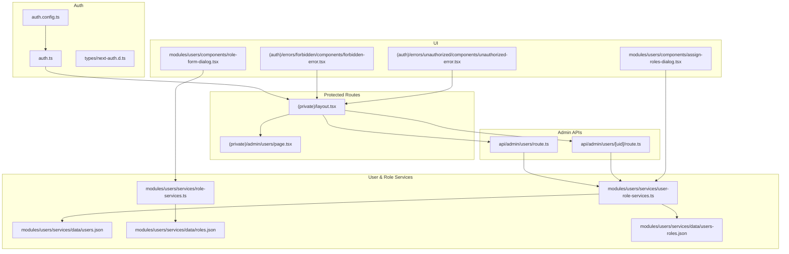
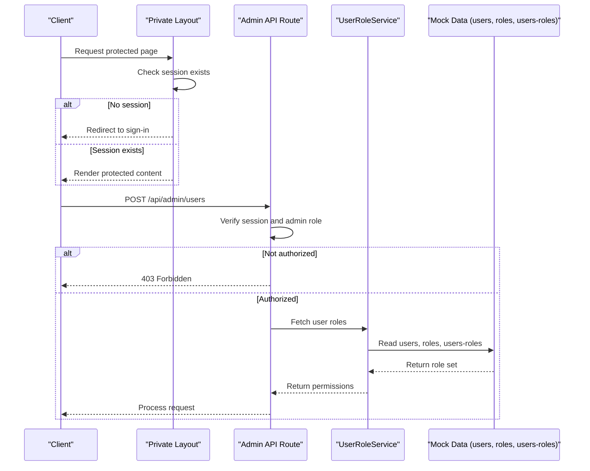
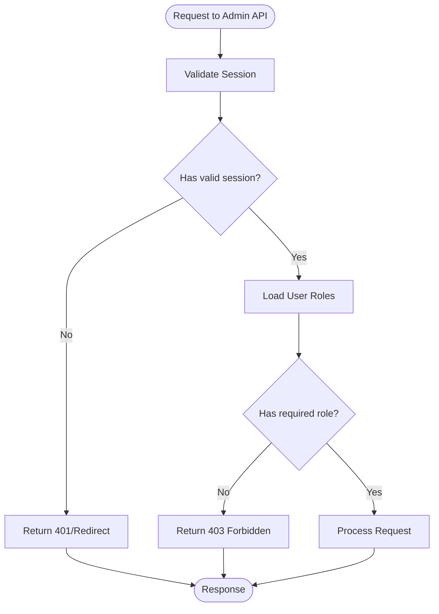
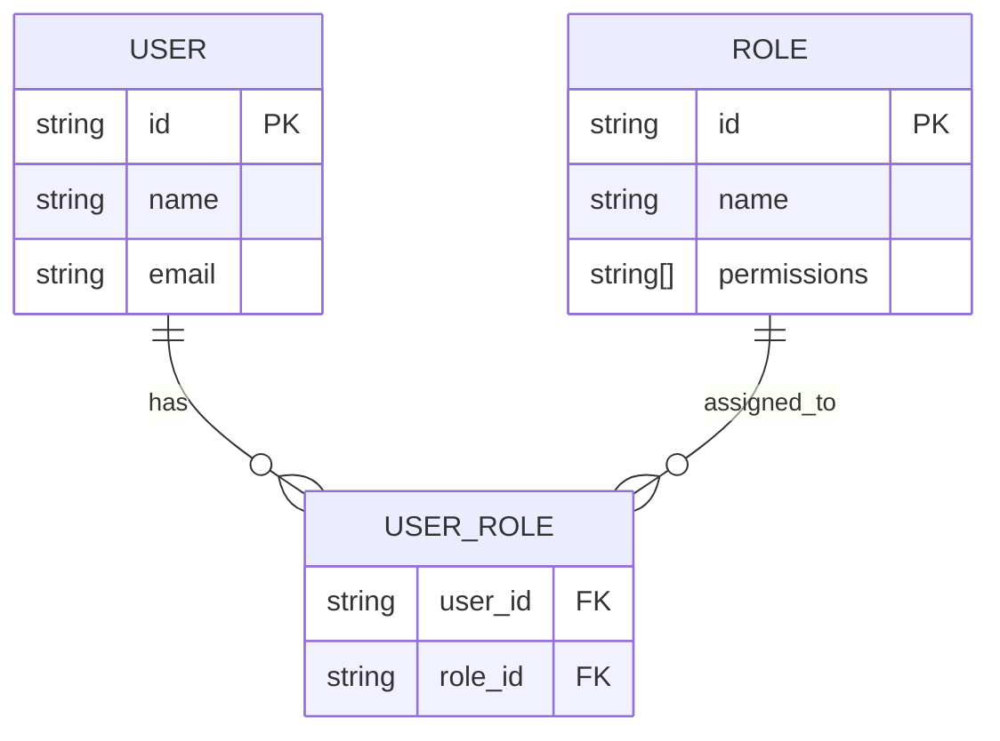
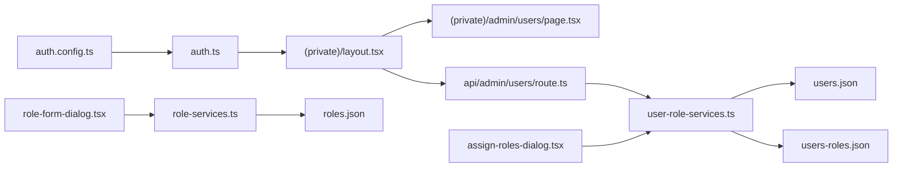

# Permission System

<cite>
**Referenced Files in This Document**
- [auth.config.ts](file://src/auth.config.ts)
- [auth.ts](file://src/auth.ts)
- [next-auth.d.ts](file://src/types/next-auth.d.ts)
- [layout.tsx](file://src/app/(private)/layout.tsx)
- [page.tsx](file://src/app/(private)/admin/users/page.tsx)
- [route.ts](file://src/app/api/admin/users/route.ts)
- [route.ts](file://src/app/api/admin/users/[uid]/route.ts)
- [role-services.ts](file://src/modules/users/services/role-services.ts)
- [user-role-services.ts](file://src/modules/users/services/user-role-services.ts)
- [users.json](file://src/modules/users/services/data/users.json)
- [roles.json](file://src/modules/users/services/data/roles.json)
- [users-roles.json](file://src/modules/users/services/data/users-roles.json)
- [assign-roles-dialog.tsx](file://src/modules/users/components/assign-roles-dialog.tsx)
- [role-form-dialog.tsx](file://src/modules/users/components/role-form-dialog.tsx)
- [forbidden-error.tsx](file://src/app/(auth)/errors/forbidden/components/forbidden-error.tsx)
- [unauthorized-error.tsx](file://src/app/(auth)/errors/unauthorized/components/unauthorized-error.tsx)
</cite>

## Table of Contents
1. [Introduction](#introduction)
2. [Project Structure](#project-structure)
3. [Core Components](#core-components)
4. [Architecture Overview](#architecture-overview)
5. [Detailed Component Analysis](#detailed-component-analysis)
6. [Dependency Analysis](#dependency-analysis)
7. [Performance Considerations](#performance-considerations)
8. [Troubleshooting Guide](#troubleshooting-guide)
9. [Conclusion](#conclusion)
10. [Appendices](#appendices)

## Introduction
This document explains the permission system implementation across the application, focusing on how permissions are defined, assigned, and enforced. It covers the relationships between users, roles, and permissions; demonstrates how to implement permission checks in components, API routes, and middleware; and addresses inheritance, dynamic evaluation, and security best practices for protecting sensitive operations.

The project uses NextAuth for authentication and a role-based access control (RBAC) model backed by mock data services. Permissions are derived from user roles, and enforcement occurs at both the server-side (API routes) and client-side (protected layouts and UI).

## Project Structure
Permission-related code is primarily located under:
- Authentication configuration and session handling
- Protected route layout
- Admin API routes with authorization guards
- User and role management modules with mock data services
- Error pages for unauthorized and forbidden states

**Diagram sources**
- [auth.config.ts](file://src/auth.config.ts)
- [auth.ts](file://src/auth.ts)
- [next-auth.d.ts](file://src/types/next-auth.d.ts)
- [layout.tsx](file://src/app/(private)/layout.tsx)
- [page.tsx](file://src/app/(private)/admin/users/page.tsx)
- [route.ts](file://src/app/api/admin/users/route.ts)
- [route.ts](file://src/app/api/admin/users/[uid]/route.ts)
- [role-services.ts](file://src/modules/users/services/role-services.ts)
- [user-role-services.ts](file://src/modules/users/services/user-role-services.ts)
- [users.json](file://src/modules/users/services/data/users.json)
- [roles.json](file://src/modules/users/services/data/roles.json)
- [users-roles.json](file://src/modules/users/services/data/users-roles.json)
- [assign-roles-dialog.tsx](file://src/modules/users/components/assign-roles-dialog.tsx)
- [role-form-dialog.tsx](file://src/modules/users/components/role-form-dialog.tsx)
- [forbidden-error.tsx](file://src/app/(auth)/errors/forbidden/components/forbidden-error.tsx)
- [unauthorized-error.tsx](file://src/app/(auth)/errors/unauthorized/components/unauthorized-error.tsx)

**Section sources**
- [auth.config.ts](file://src/auth.config.ts)
- [auth.ts](file://src/auth.ts)
- [next-auth.d.ts](file://src/types/next-auth.d.ts)
- [layout.tsx](file://src/app/(private)/layout.tsx)
- [page.tsx](file://src/app/(private)/admin/users/page.tsx)
- [route.ts](file://src/app/api/admin/users/route.ts)
- [route.ts](file://src/app/api/admin/users/[uid]/route.ts)
- [role-services.ts](file://src/modules/users/services/role-services.ts)
- [user-role-services.ts](file://src/modules/users/services/user-role-services.ts)
- [users.json](file://src/modules/users/services/data/users.json)
- [roles.json](file://src/modules/users/services/data/roles.json)
- [users-roles.json](file://src/modules/users/services/data/users-roles.json)
- [assign-roles-dialog.tsx](file://src/modules/users/components/assign-roles-dialog.tsx)
- [role-form-dialog.tsx](file://src/modules/users/components/role-form-dialog.tsx)
- [forbidden-error.tsx](file://src/app/(auth)/errors/forbidden/components/forbidden-error.tsx)
- [unauthorized-error.tsx](file://src/app/(auth)/errors/unauthorized/components/unauthorized-error.tsx)

## Core Components
- Authentication provider and session:
  - Auth configuration and callbacks define how sessions are constructed and extended.
  - Session shape is augmented via type declarations to include role information.
- Protected layout:
  - The private layout enforces authentication before rendering protected routes.
- Admin API routes:
  - Server-side authorization checks ensure only authorized users can perform admin actions.
- User and role services:
  - Mock data services provide users, roles, and user-role mappings used to derive permissions.
- UI dialogs:
  - Assign roles and manage roles through dedicated dialogs that interact with services.
- Error pages:
  - Dedicated error pages handle unauthorized and forbidden states.

Key responsibilities:
- Define roles and permissions in data files.
- Map users to roles.
- Derive permissions from roles.
- Enforce checks in routes and UI.

**Section sources**
- [auth.config.ts](file://src/auth.config.ts)
- [auth.ts](file://src/auth.ts)
- [next-auth.d.ts](file://src/types/next-auth.d.ts)
- [layout.tsx](file://src/app/(private)/layout.tsx)
- [route.ts](file://src/app/api/admin/users/route.ts)
- [route.ts](file://src/app/api/admin/users/[uid]/route.ts)
- [role-services.ts](file://src/modules/users/services/role-services.ts)
- [user-role-services.ts](file://src/modules/users/services/user-role-services.ts)
- [users.json](file://src/modules/users/services/data/users.json)
- [roles.json](file://src/modules/users/services/data/roles.json)
- [users-roles.json](file://src/modules/users/services/data/users-roles.json)
- [assign-roles-dialog.tsx](file://src/modules/users/components/assign-roles-dialog.tsx)
- [role-form-dialog.tsx](file://src/modules/users/components/role-form-dialog.tsx)
- [forbidden-error.tsx](file://src/app/(auth)/errors/forbidden/components/forbidden-error.tsx)
- [unauthorized-error.tsx](file://src/app/(auth)/errors/unauthorized/components/unauthorized-error.tsx)

## Architecture Overview
The permission system follows an RBAC model:
- Users have one or more roles.
- Roles carry permissions.
- Permissions are evaluated at runtime based on the current user’s roles.
- Enforcement happens in:
  - Server-side API routes (hard boundary).
  - Client-side protected layouts and UI (soft boundary).

**Diagram sources**
- [layout.tsx](file://src/app/(private)/layout.tsx)
- [route.ts](file://src/app/api/admin/users/route.ts)
- [user-role-services.ts](file://src/modules/users/services/user-role-services.ts)
- [users.json](file://src/modules/users/services/data/users.json)
- [roles.json](file://src/modules/users/services/data/roles.json)
- [users-roles.json](file://src/modules/users/services/data/users-roles.json)

## Detailed Component Analysis

### Authentication and Session Augmentation
- Auth configuration defines providers and session strategy.
- Session callback augments session object with user roles and derived permissions.
- Type augmentation ensures TypeScript recognizes the extended session shape.

Implementation notes:
- Ensure session includes role identifiers and computed permissions.
- Centralize permission derivation logic to avoid duplication.

**Section sources**
- [auth.config.ts](file://src/auth.config.ts)
- [auth.ts](file://src/auth.ts)
- [next-auth.d.ts](file://src/types/next-auth.d.ts)

### Protected Layout Enforcement
- The private layout requires authentication before rendering child routes.
- Unauthenticated requests are redirected to sign-in.

Usage guidance:
- Wrap all protected routes under this layout.
- For fine-grained access, add additional checks inside specific pages or components.

**Section sources**
- [layout.tsx](file://src/app/(private)/layout.tsx)

### Admin API Authorization
- Admin endpoints verify the current user’s role before processing requests.
- Unauthorized requests receive a 403 response.

Flow overview:
- Validate session.
- Resolve user roles.
- Check required permission.
- Proceed or reject.

**Diagram sources**
- [route.ts](file://src/app/api/admin/users/route.ts)
- [route.ts](file://src/app/api/admin/users/[uid]/route.ts)
- [user-role-services.ts](file://src/modules/users/services/user-role-services.ts)

**Section sources**
- [route.ts](file://src/app/api/admin/users/route.ts)
- [route.ts](file://src/app/api/admin/users/[uid]/route.ts)
- [user-role-services.ts](file://src/modules/users/services/user-role-services.ts)

### User and Role Management Services
- Role service provides CRUD-like operations over roles.
- User-role service maps users to roles and computes permissions.
- Mock data files store users, roles, and user-role associations.

Data relationships:
- Users reference roles.
- Roles define permissions.
- User-role mapping resolves effective permissions per user.

**Diagram sources**
- [users.json](file://src/modules/users/services/data/users.json)
- [roles.json](file://src/modules/users/services/data/roles.json)
- [users-roles.json](file://src/modules/users/services/data/users-roles.json)

**Section sources**
- [role-services.ts](file://src/modules/users/services/role-services.ts)
- [user-role-services.ts](file://src/modules/users/services/user-role-services.ts)
- [users.json](file://src/modules/users/services/data/users.json)
- [roles.json](file://src/modules/users/services/data/roles.json)
- [users-roles.json](file://src/modules/users/services/data/users-roles.json)

### UI Dialogs for Role Assignment
- Assign roles dialog allows administrators to assign roles to users.
- Role form dialog supports creating/updating roles and their permissions.

Integration points:
- Both dialogs call respective services to persist changes.
- After updates, recompute user permissions to reflect new assignments.

**Section sources**
- [assign-roles-dialog.tsx](file://src/modules/users/components/assign-roles-dialog.tsx)
- [role-form-dialog.tsx](file://src/modules/users/components/role-form-dialog.tsx)
- [role-services.ts](file://src/modules/users/services/role-services.ts)
- [user-role-services.ts](file://src/modules/users/services/user-role-services.ts)

### Error Pages for Authorization Failures
- Unauthorized page handles unauthenticated access attempts.
- Forbidden page handles insufficient permissions.

Usage:
- Redirect to these pages when auth checks fail.
- Provide clear messaging and recovery options.

**Section sources**
- [unauthorized-error.tsx](file://src/app/(auth)/errors/unauthorized/components/unauthorized-error.tsx)
- [forbidden-error.tsx](file://src/app/(auth)/errors/forbidden/components/forbidden-error.tsx)

## Dependency Analysis
High-level dependencies:
- Auth configuration depends on NextAuth setup and session callbacks.
- Private layout depends on authenticated session availability.
- Admin API routes depend on user-role services and mock data.
- UI dialogs depend on role and user-role services.

**Diagram sources**
- [auth.config.ts](file://src/auth.config.ts)
- [auth.ts](file://src/auth.ts)
- [layout.tsx](file://src/app/(private)/layout.tsx)
- [page.tsx](file://src/app/(private)/admin/users/page.tsx)
- [route.ts](file://src/app/api/admin/users/route.ts)
- [user-role-services.ts](file://src/modules/users/services/user-role-services.ts)
- [users.json](file://src/modules/users/services/data/users.json)
- [users-roles.json](file://src/modules/users/services/data/users-roles.json)
- [role-services.ts](file://src/modules/users/services/role-services.ts)
- [roles.json](file://src/modules/users/services/data/roles.json)
- [assign-roles-dialog.tsx](file://src/modules/users/components/assign-roles-dialog.tsx)
- [role-form-dialog.tsx](file://src/modules/users/components/role-form-dialog.tsx)

**Section sources**
- [auth.config.ts](file://src/auth.config.ts)
- [auth.ts](file://src/auth.ts)
- [layout.tsx](file://src/app/(private)/layout.tsx)
- [page.tsx](file://src/app/(private)/admin/users/page.tsx)
- [route.ts](file://src/app/api/admin/users/route.ts)
- [user-role-services.ts](file://src/modules/users/services/user-role-services.ts)
- [users.json](file://src/modules/users/services/data/users.json)
- [users-roles.json](file://src/modules/users/services/data/users-roles.json)
- [role-services.ts](file://src/modules/users/services/role-services.ts)
- [roles.json](file://src/modules/users/services/data/roles.json)
- [assign-roles-dialog.tsx](file://src/modules/users/components/assign-roles-dialog.tsx)
- [role-form-dialog.tsx](file://src/modules/users/components/role-form-dialog.tsx)

## Performance Considerations
- Cache user roles and permissions in the session to avoid repeated lookups.
- Minimize network calls by batching role and permission resolution where possible.
- Use memoization in components to prevent redundant permission checks during renders.
- Keep mock data small and structured efficiently for faster reads.

[No sources needed since this section provides general guidance]

## Troubleshooting Guide
Common issues and resolutions:
- Missing session:
  - Ensure authentication flow completes and session is established before accessing protected routes.
- Incorrect role assignment:
  - Verify user-role mappings in mock data and confirm service reads correct associations.
- Permission not reflected after update:
  - Invalidate cached session or refresh the page to reload permissions.
- Unauthorized vs Forbidden:
  - Unauthorized indicates no session; Forbidden indicates insufficient permissions.

Operational tips:
- Log permission checks during development to trace failures.
- Use dedicated error pages to guide users after failed checks.

**Section sources**
- [unauthorized-error.tsx](file://src/app/(auth)/errors/unauthorized/components/unauthorized-error.tsx)
- [forbidden-error.tsx](file://src/app/(auth)/errors/forbidden/components/forbidden-error.tsx)
- [user-role-services.ts](file://src/modules/users/services/user-role-services.ts)

## Conclusion
The permission system implements a clear RBAC model using NextAuth for authentication and mock data services for roles and permissions. Enforcement occurs at both server and client boundaries, ensuring consistent protection across the application. By centralizing permission derivation and leveraging dedicated services, the system remains maintainable and extensible. Follow the recommended patterns for implementing checks in components, API routes, and middleware, and adhere to security best practices to protect sensitive operations.

[No sources needed since this section summarizes without analyzing specific files]

## Appendices

### Implementing Permission Checks

- In components:
  - Access session and compute permissions via user-role services.
  - Conditionally render UI elements based on permissions.

- In API routes:
  - Validate session and required role/permission early in the handler.
  - Return appropriate status codes (401/403) when checks fail.

- In middleware:
  - Apply global checks for routes requiring authentication or specific roles.
  - Redirect unauthenticated users to sign-in.

Security best practices:
- Always enforce checks server-side; never rely solely on client-side visibility.
- Avoid storing sensitive permissions in client-only state without validation.
- Regularly audit role definitions and user-role mappings.
- Use least privilege principles when defining roles and permissions.

[No sources needed since this section provides general guidance]