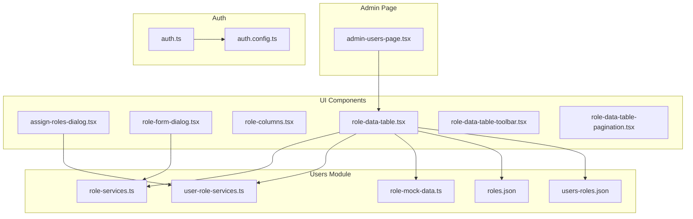
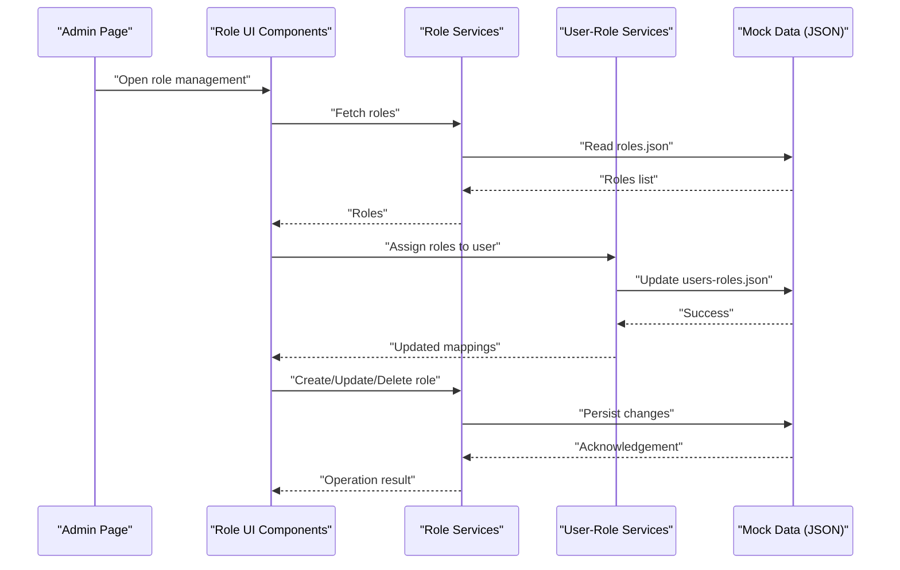
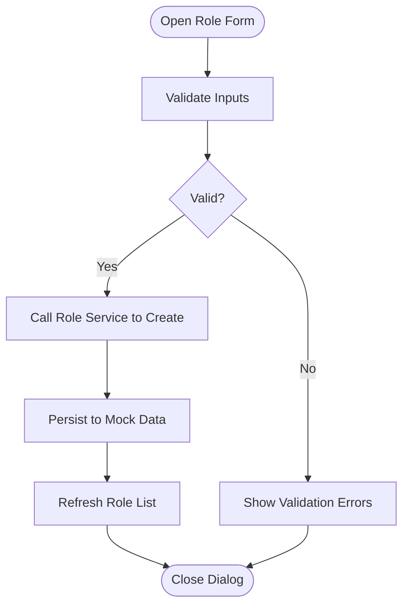
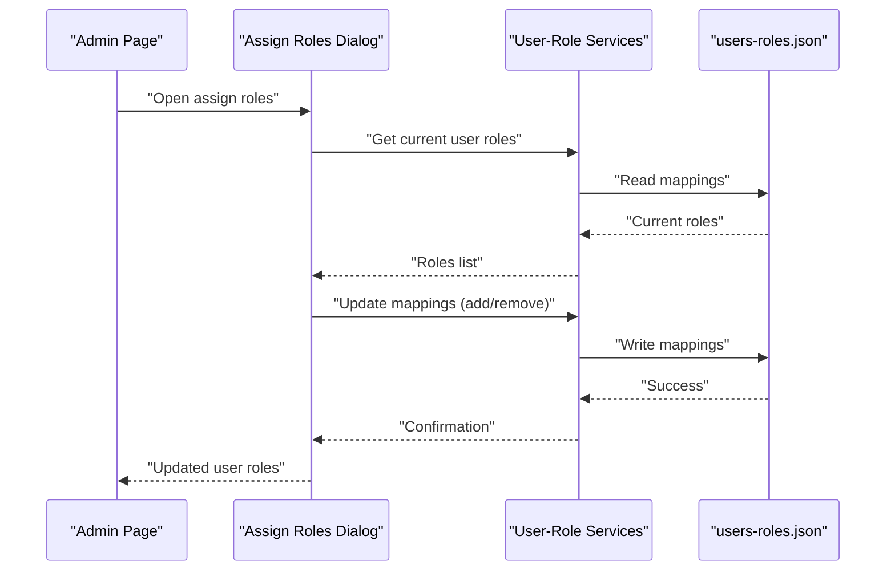
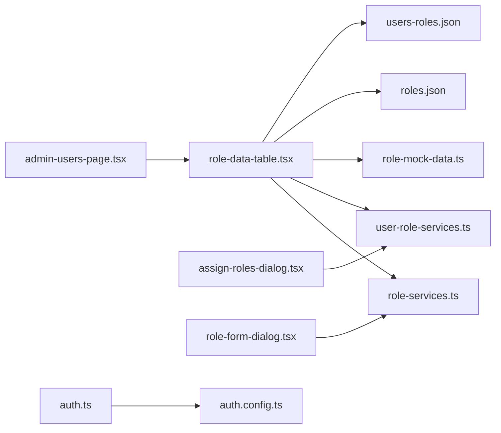

# Role Management

<cite>
**Referenced Files in This Document**
- [role-services.ts](file://src/modules/users/services/role-services.ts)
- [role-mock-data.ts](file://src/modules/users/services/role-mock-data.ts)
- [roles.json](file://src/modules/users/services/data/roles.json)
- [users-roles.json](file://src/modules/users/services/data/users-roles.json)
- [user-role-services.ts](file://src/modules/users/services/user-role-services.ts)
- [assign-roles-dialog.tsx](file://src/modules/users/components/assign-roles-dialog.tsx)
- [role-form-dialog.tsx](file://src/modules/users/components/role-form-dialog.tsx)
- [role-columns.tsx](file://src/modules/users/components/role-columns.tsx)
- [role-data-table.tsx](file://src/modules/users/components/role-data-table.tsx)
- [role-data-table-toolbar.tsx](file://src/modules/users/components/role-data-table-toolbar.tsx)
- [role-data-table-pagination.tsx](file://src/modules/users/components/role-data-table-pagination.tsx)
- [admin-users-page.tsx](file://src/app/(private)/admin/users/page.tsx)
- [auth.ts](file://src/auth.ts)
- [auth.config.ts](file://src/auth.config.ts)
</cite>

## Table of Contents
1. [Introduction](#introduction)
2. [Project Structure](#project-structure)
3. [Core Components](#core-components)
4. [Architecture Overview](#architecture-overview)
5. [Detailed Component Analysis](#detailed-component-analysis)
6. [Dependency Analysis](#dependency-analysis)
7. [Performance Considerations](#performance-considerations)
8. [Troubleshooting Guide](#troubleshooting-guide)
9. [Conclusion](#conclusion)

## Introduction
This document explains the role management system and how it implements role-based access control (RBAC). It covers the data model for roles, permission inheritance and hierarchy, and the workflows for creating, modifying, and deleting roles. It also provides guidance on assigning permissions to roles, implementing role checks in components, validation rules, security considerations, and best practices for managing administrative roles.

## Project Structure
The role management feature is implemented under the users module with a clear separation between UI components, services, and mock data:
- Services define the core RBAC logic and data operations.
- Components provide the user interface for role administration.
- Mock data simulates persistent storage for roles and user-role mappings.

**Diagram sources**
- [role-services.ts](file://src/modules/users/services/role-services.ts)
- [role-mock-data.ts](file://src/modules/users/services/role-mock-data.ts)
- [user-role-services.ts](file://src/modules/users/services/user-role-services.ts)
- [roles.json](file://src/modules/users/services/data/roles.json)
- [users-roles.json](file://src/modules/users/services/data/users-roles.json)
- [assign-roles-dialog.tsx](file://src/modules/users/components/assign-roles-dialog.tsx)
- [role-form-dialog.tsx](file://src/modules/users/components/role-form-dialog.tsx)
- [role-columns.tsx](file://src/modules/users/components/role-columns.tsx)
- [role-data-table.tsx](file://src/modules/users/components/role-data-table.tsx)
- [role-data-table-toolbar.tsx](file://src/modules/users/components/role-data-table-toolbar.tsx)
- [role-data-table-pagination.tsx](file://src/modules/users/components/role-data-table-pagination.tsx)
- [admin-users-page.tsx](file://src/app/(private)/admin/users/page.tsx)
- [auth.ts](file://src/auth.ts)
- [auth.config.ts](file://src/auth.config.ts)

**Section sources**
- [role-services.ts](file://src/modules/users/services/role-services.ts)
- [role-mock-data.ts](file://src/modules/users/services/role-mock-data.ts)
- [user-role-services.ts](file://src/modules/users/services/user-role-services.ts)
- [roles.json](file://src/modules/users/services/data/roles.json)
- [users-roles.json](file://src/modules/users/services/data/users-roles.json)
- [assign-roles-dialog.tsx](file://src/modules/users/components/assign-roles-dialog.tsx)
- [role-form-dialog.tsx](file://src/modules/users/components/role-form-dialog.tsx)
- [role-columns.tsx](file://src/modules/users/components/role-columns.tsx)
- [role-data-table.tsx](file://src/modules/users/components/role-data-table.tsx)
- [role-data-table-toolbar.tsx](file://src/modules/users/components/role-data-table-toolbar.tsx)
- [role-data-table-pagination.tsx](file://src/modules/users/components/role-data-table-pagination.tsx)
- [admin-users-page.tsx](file://src/app/(private)/admin/users/page.tsx)
- [auth.ts](file://src/auth.ts)
- [auth.config.ts](file://src/auth.config.ts)

## Core Components
- Role services: Provide CRUD operations for roles and manage role metadata such as name, description, and permissions.
- User-role services: Manage the mapping between users and roles, enabling assignment and removal of roles per user.
- Role UI components: Offer forms and tables for creating, editing, listing, and deleting roles; include dialogs for assigning roles to users.
- Admin page: Orchestrates role-related UI interactions and delegates to services for data operations.

Key responsibilities:
- Role creation and modification: Validate inputs, persist changes via services, and update UI state.
- Role deletion: Enforce constraints (e.g., prevent deletion if referenced by active users) and confirm destructive actions.
- Permission assignment: Attach permissions to roles and propagate them to assigned users.
- Role checks: Evaluate whether a user has required roles or permissions before rendering protected features.

**Section sources**
- [role-services.ts](file://src/modules/users/services/role-services.ts)
- [user-role-services.ts](file://src/modules/users/services/user-role-services.ts)
- [role-form-dialog.tsx](file://src/modules/users/components/role-form-dialog.tsx)
- [assign-roles-dialog.tsx](file://src/modules/users/components/assign-roles-dialog.tsx)
- [role-data-table.tsx](file://src/modules/users/components/role-data-table.tsx)
- [admin-users-page.tsx](file://src/app/(private)/admin/users/page.tsx)

## Architecture Overview
The RBAC architecture separates concerns into services and UI layers, using mock JSON files to simulate persistence. The admin page composes role tables and dialogs, which call services to perform operations. Auth configuration integrates with NextAuth to support session-based authorization where applicable.

**Diagram sources**
- [admin-users-page.tsx](file://src/app/(private)/admin/users/page.tsx)
- [role-data-table.tsx](file://src/modules/users/components/role-data-table.tsx)
- [role-form-dialog.tsx](file://src/modules/users/components/role-form-dialog.tsx)
- [assign-roles-dialog.tsx](file://src/modules/users/components/assign-roles-dialog.tsx)
- [role-services.ts](file://src/modules/users/services/role-services.ts)
- [user-role-services.ts](file://src/modules/users/services/user-role-services.ts)
- [roles.json](file://src/modules/users/services/data/roles.json)
- [users-roles.json](file://src/modules/users/services/data/users-roles.json)

## Detailed Component Analysis

### Role Data Model and Hierarchy
- Roles are represented as entities with identifiers, names, descriptions, and associated permissions.
- Permissions can be granular (e.g., resource-action pairs) and may be aggregated into higher-level roles.
- Role hierarchy supports inheritance where a child role inherits permissions from parent roles.
- User-role mappings link users to one or more roles, enabling composite permissions.

Implementation notes:
- Role definitions and mappings are stored in JSON files for development and testing.
- Services abstract read/write operations over these files, providing a consistent API for UI components.

Best practices:
- Keep permission names consistent and versioned to avoid drift.
- Use explicit parent-child relationships to clarify inheritance.
- Avoid circular references in role hierarchies.

**Section sources**
- [roles.json](file://src/modules/users/services/data/roles.json)
- [users-roles.json](file://src/modules/users/services/data/users-roles.json)
- [role-services.ts](file://src/modules/users/services/role-services.ts)
- [user-role-services.ts](file://src/modules/users/services/user-role-services.ts)

### Role Creation Workflow
- The role form dialog collects role details and validates inputs.
- On submit, the role service persists the new role and updates the local state.
- The table refreshes to reflect the newly created role.

**Diagram sources**
- [role-form-dialog.tsx](file://src/modules/users/components/role-form-dialog.tsx)
- [role-services.ts](file://src/modules/users/services/role-services.ts)
- [role-mock-data.ts](file://src/modules/users/services/role-mock-data.ts)
- [roles.json](file://src/modules/users/services/data/roles.json)

**Section sources**
- [role-form-dialog.tsx](file://src/modules/users/components/role-form-dialog.tsx)
- [role-services.ts](file://src/modules/users/services/role-services.ts)
- [role-mock-data.ts](file://src/modules/users/services/role-mock-data.ts)
- [roles.json](file://src/modules/users/services/data/roles.json)

### Role Modification Workflow
- Editing opens the same form pre-populated with existing role data.
- Changes are validated and persisted through the role service.
- Dependent UI elements (tables, lists) update accordingly.

Security considerations:
- Ensure only authorized users can modify roles.
- Log significant changes for auditability.

**Section sources**
- [role-form-dialog.tsx](file://src/modules/users/components/role-form-dialog.tsx)
- [role-services.ts](file://src/modules/users/services/role-services.ts)

### Role Deletion Workflow
- Deletion prompts for confirmation and checks for dependencies (e.g., active user assignments).
- If safe, the role service removes the role and updates mappings.
- The UI reflects the updated role list.

Constraints:
- Prevent deletion if the role is referenced by active users unless explicitly allowed.
- Maintain referential integrity in user-role mappings.

**Section sources**
- [role-data-table.tsx](file://src/modules/users/components/role-data-table.tsx)
- [role-services.ts](file://src/modules/users/services/role-services.ts)
- [user-role-services.ts](file://src/modules/users/services/user-role-services.ts)

### Assigning Roles to Users
- The assign roles dialog allows selecting roles for a specific user.
- The user-role service updates the mapping and persists changes.
- Subsequent role checks for the user incorporate the new assignments.

**Diagram sources**
- [assign-roles-dialog.tsx](file://src/modules/users/components/assign-roles-dialog.tsx)
- [user-role-services.ts](file://src/modules/users/services/user-role-services.ts)
- [users-roles.json](file://src/modules/users/services/data/users-roles.json)

**Section sources**
- [assign-roles-dialog.tsx](file://src/modules/users/components/assign-roles-dialog.tsx)
- [user-role-services.ts](file://src/modules/users/services/user-role-services.ts)
- [users-roles.json](file://src/modules/users/services/data/users-roles.json)

### Role Checks in Components
- Components should check a user’s roles before rendering sensitive controls or routes.
- Use a centralized utility or hook to evaluate permissions based on assigned roles.
- Combine role checks with route guards to enforce server-side authorization when available.

Recommendations:
- Prefer declarative checks near the UI boundary for clarity.
- Cache role evaluations to avoid repeated computations.

**Section sources**
- [auth.ts](file://src/auth.ts)
- [auth.config.ts](file://src/auth.config.ts)
- [role-data-table.tsx](file://src/modules/users/components/role-data-table.tsx)

### Role Tables and Toolbars
- The role data table displays roles with actions for edit and delete.
- The toolbar provides search, filters, and bulk actions.
- Pagination improves performance for large datasets.

Operational tips:
- Debounce search input to reduce re-renders.
- Use stable keys for rows to optimize diffing.

**Section sources**
- [role-data-table.tsx](file://src/modules/users/components/role-data-table.tsx)
- [role-data-table-toolbar.tsx](file://src/modules/users/components/role-data-table-toolbar.tsx)
- [role-data-table-pagination.tsx](file://src/modules/users/components/role-data-table-pagination.tsx)
- [role-columns.tsx](file://src/modules/users/components/role-columns.tsx)

## Dependency Analysis
The following diagram shows key dependencies among role management components and data sources.

**Diagram sources**
- [admin-users-page.tsx](file://src/app/(private)/admin/users/page.tsx)
- [role-data-table.tsx](file://src/modules/users/components/role-data-table.tsx)
- [role-services.ts](file://src/modules/users/services/role-services.ts)
- [user-role-services.ts](file://src/modules/users/services/user-role-services.ts)
- [role-mock-data.ts](file://src/modules/users/services/role-mock-data.ts)
- [roles.json](file://src/modules/users/services/data/roles.json)
- [users-roles.json](file://src/modules/users/services/data/users-roles.json)
- [assign-roles-dialog.tsx](file://src/modules/users/components/assign-roles-dialog.tsx)
- [role-form-dialog.tsx](file://src/modules/users/components/role-form-dialog.tsx)
- [auth.ts](file://src/auth.ts)
- [auth.config.ts](file://src/auth.config.ts)

**Section sources**
- [admin-users-page.tsx](file://src/app/(private)/admin/users/page.tsx)
- [role-data-table.tsx](file://src/modules/users/components/role-data-table.tsx)
- [role-services.ts](file://src/modules/users/services/role-services.ts)
- [user-role-services.ts](file://src/modules/users/services/user-role-services.ts)
- [role-mock-data.ts](file://src/modules/users/services/role-mock-data.ts)
- [roles.json](file://src/modules/users/services/data/roles.json)
- [users-roles.json](file://src/modules/users/services/data/users-roles.json)
- [assign-roles-dialog.tsx](file://src/modules/users/components/assign-roles-dialog.tsx)
- [role-form-dialog.tsx](file://src/modules/users/components/role-form-dialog.tsx)
- [auth.ts](file://src/auth.ts)
- [auth.config.ts](file://src/auth.config.ts)

## Performance Considerations
- Minimize re-renders by memoizing computed role sets and permission checks.
- Paginate and filter role lists to handle large datasets efficiently.
- Debounce search inputs and batch updates when assigning multiple roles.
- Cache role-permission mappings at appropriate scopes to avoid redundant reads.

[No sources needed since this section provides general guidance]

## Troubleshooting Guide
Common issues and resolutions:
- Role not applied immediately: Ensure the UI refreshes after role assignments and that role checks use up-to-date data.
- Circular inheritance detected: Review role hierarchy and remove cycles.
- Missing permissions after role change: Verify that permission aggregation includes inherited roles and that caches are invalidated.
- Unauthorized actions: Confirm that role checks are enforced both client-side and server-side where possible.

Validation and error handling:
- Validate role names and descriptions for uniqueness and length constraints.
- Provide clear error messages when operations fail due to constraints or missing dependencies.

**Section sources**
- [role-services.ts](file://src/modules/users/services/role-services.ts)
- [user-role-services.ts](file://src/modules/users/services/user-role-services.ts)
- [role-form-dialog.tsx](file://src/modules/users/components/role-form-dialog.tsx)
- [assign-roles-dialog.tsx](file://src/modules/users/components/assign-roles-dialog.tsx)

## Conclusion
The role management system provides a structured approach to RBAC with clear separation between UI and services, robust data modeling for roles and permissions, and practical workflows for creating, modifying, and deleting roles. By adhering to validation rules, enforcing security checks, and following best practices for administrative roles, teams can maintain a secure and scalable authorization model.

[No sources needed since this section summarizes without analyzing specific files]