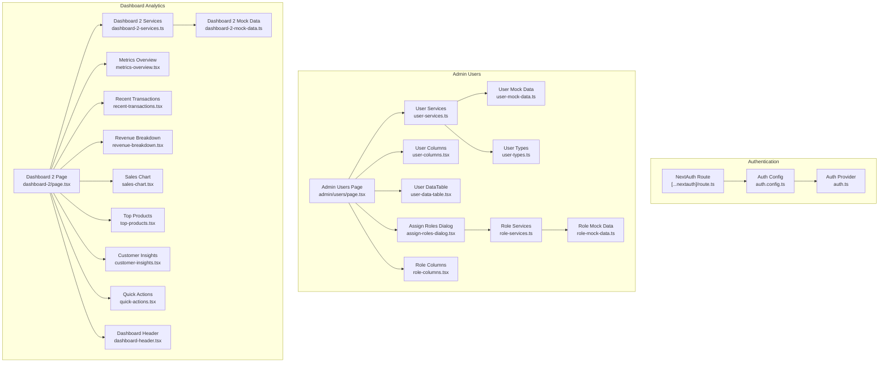
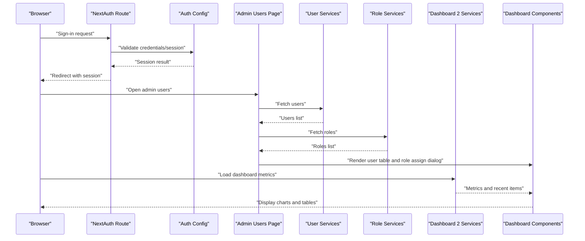
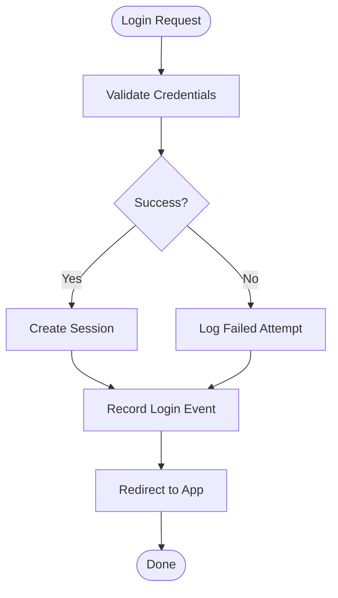
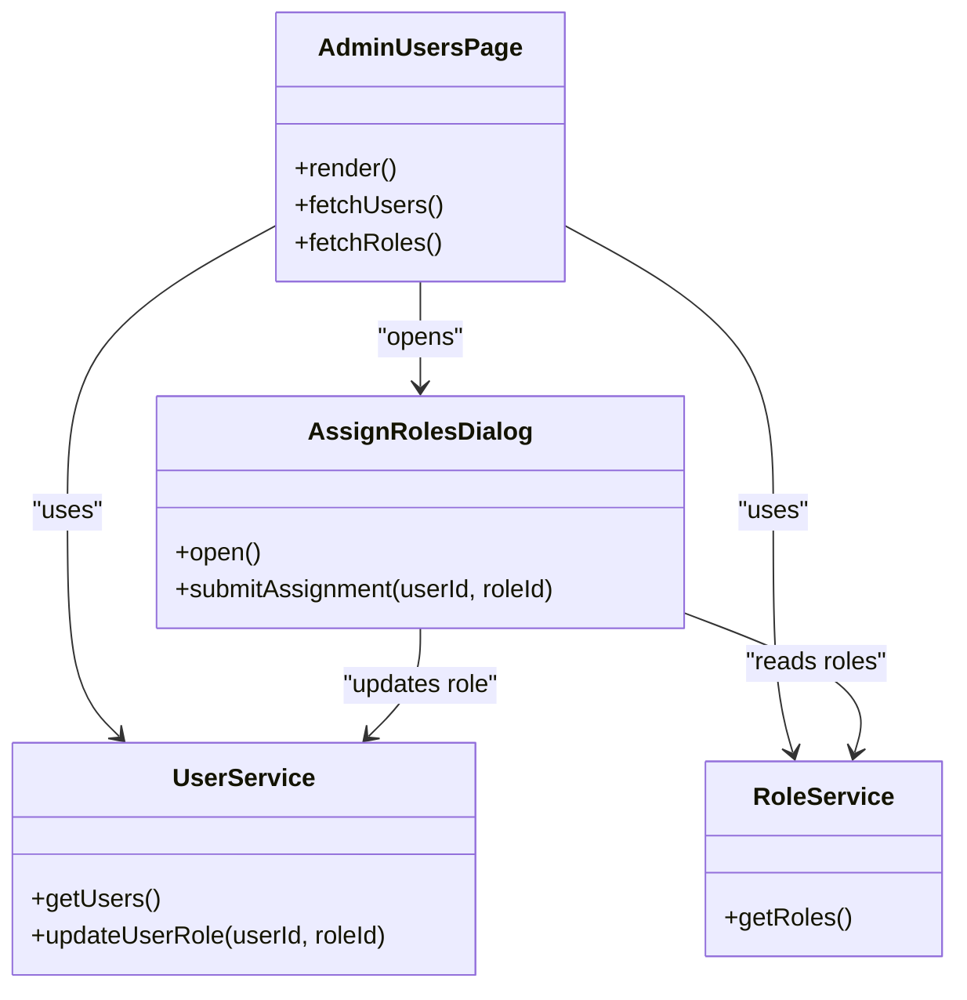
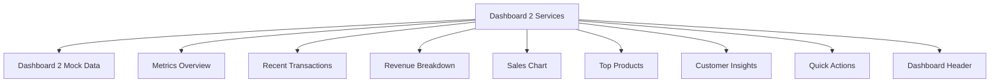
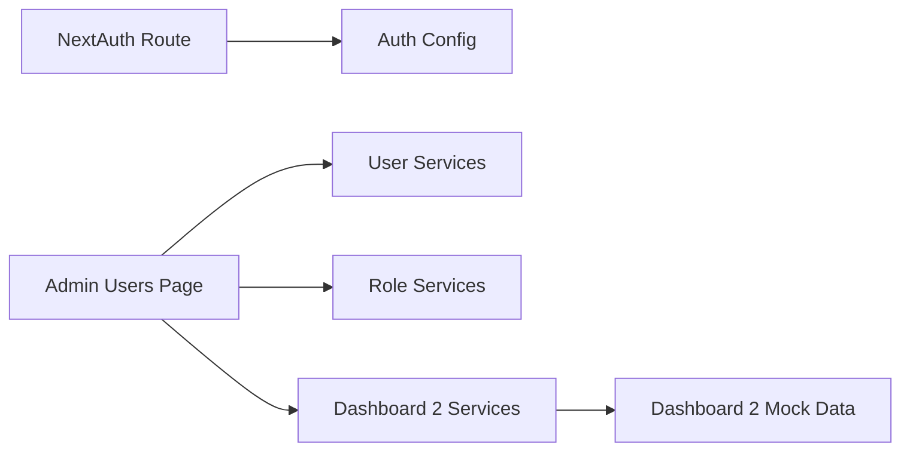

# User Activity Monitoring

<cite>
**Referenced Files in This Document**
- [auth.ts](file://src/auth.ts)
- [auth.config.ts](file://src/auth.config.ts)
- [route.ts](file://src/app/api/auth/[...nextauth]/route.ts)
- [page.tsx](file://src/app/(private)/admin/users/page.tsx)
- [user-services.ts](file://src/modules/users/services/user-services.ts)
- [user-mock-data.ts](file://src/modules/users/services/user-mock-data.ts)
- [user-types.ts](file://src/modules/users/services/types/user-types.ts)
- [user-columns.tsx](file://src/modules/users/components/user-columns.tsx)
- [user-data-table.tsx](file://src/modules/users/components/user-data-table.tsx)
- [assign-roles-dialog.tsx](file://src/modules/users/components/assign-roles-dialog.tsx)
- [role-services.ts](file://src/modules/users/services/role-services.ts)
- [role-mock-data.ts](file://src/modules/users/services/role-mock-data.ts)
- [role-columns.tsx](file://src/modules/users/components/role-columns.tsx)
- [stat-cards.tsx](file://src/modules/users/components/stat-cards.tsx)
- [dashboard-2-services.ts](file://src/modules/dashboard-2/services/dashboard-2-services.ts)
- [dashboard-2-mock-data.ts](file://src/modules/dashboard-2/services/dashboard-2-mock-data.ts)
- [metrics-overview.tsx](file://src/modules/dashboard-2/components/metrics-overview.tsx)
- [recent-transactions.tsx](file://src/modules/dashboard-2/components/recent-transactions.tsx)
- [revenue-breakdown.tsx](file://src/modules/dashboard-2/components/revenue-breakdown.tsx)
- [sales-chart.tsx](file://src/modules/dashboard-2/components/sales-chart.tsx)
- [top-products.tsx](file://src/modules/dashboard-2/components/top-products.tsx)
- [customer-insights.tsx](file://src/modules/dashboard-2/components/customer-insights.tsx)
- [quick-actions.tsx](file://src/modules/dashboard-2/components/quick-actions.tsx)
- [dashboard-header.tsx](file://src/modules/dashboard-2/components/dashboard-header.tsx)
- [page.tsx](file://src/app/(private)/dashboard-2/page.tsx)
- [firestore.rules](file://firestore.rules)
</cite>

## Table of Contents
1. [Introduction](#introduction)
2. [Project Structure](#project-structure)
3. [Core Components](#core-components)
4. [Architecture Overview](#architecture-overview)
5. [Detailed Component Analysis](#detailed-component-analysis)
6. [Dependency Analysis](#dependency-analysis)
7. [Performance Considerations](#performance-considerations)
8. [Troubleshooting Guide](#troubleshooting-guide)
9. [Conclusion](#conclusion)
10. [Appendices](#appendices)

## Introduction
This document explains how user activity monitoring and analytics are implemented and presented in the application. It covers how user actions are tracked, logged, and displayed in administrative dashboards, with examples for generating user reports, monitoring login activities, and tracking administrative actions. It also addresses privacy considerations, log retention policies, performance implications, and guidance for setting up alerts and notifications for suspicious activities.

The project uses NextAuth for authentication and provides admin-facing pages and data tables to manage users and roles. Dashboard modules present metrics and recent activity-like items that can be adapted for activity monitoring.

## Project Structure
Activity monitoring spans several areas:
- Authentication and session handling via NextAuth routes and configuration
- Admin user management pages and services
- Dashboard components that display metrics and recent activity-like data
- Security rules for Firestore (if used)

**Diagram sources**
- [route.ts](file://src/app/api/auth/[...nextauth]/route.ts)
- [auth.config.ts](file://src/auth.config.ts)
- [auth.ts](file://src/auth.ts)
- [page.tsx](file://src/app/(private)/admin/users/page.tsx)
- [user-services.ts](file://src/modules/users/services/user-services.ts)
- [user-mock-data.ts](file://src/modules/users/services/user-mock-data.ts)
- [user-types.ts](file://src/modules/users/services/types/user-types.ts)
- [user-columns.tsx](file://src/modules/users/components/user-columns.tsx)
- [user-data-table.tsx](file://src/modules/users/components/user-data-table.tsx)
- [assign-roles-dialog.tsx](file://src/modules/users/components/assign-roles-dialog.tsx)
- [role-services.ts](file://src/modules/users/services/role-services.ts)
- [role-mock-data.ts](file://src/modules/users/services/role-mock-data.ts)
- [role-columns.tsx](file://src/modules/users/components/role-columns.tsx)
- [dashboard-2-services.ts](file://src/modules/dashboard-2/services/dashboard-2-services.ts)
- [dashboard-2-mock-data.ts](file://src/modules/dashboard-2/services/dashboard-2-mock-data.ts)
- [metrics-overview.tsx](file://src/modules/dashboard-2/components/metrics-overview.tsx)
- [recent-transactions.tsx](file://src/modules/dashboard-2/components/recent-transactions.tsx)
- [revenue-breakdown.tsx](file://src/modules/dashboard-2/components/revenue-breakdown.tsx)
- [sales-chart.tsx](file://src/modules/dashboard-2/components/sales-chart.tsx)
- [top-products.tsx](file://src/modules/dashboard-2/components/top-products.tsx)
- [customer-insights.tsx](file://src/modules/dashboard-2/components/customer-insights.tsx)
- [quick-actions.tsx](file://src/modules/dashboard-2/components/quick-actions.tsx)
- [dashboard-header.tsx](file://src/modules/dashboard-2/components/dashboard-header.tsx)
- [page.tsx](file://src/app/(private)/dashboard-2/page.tsx)

**Section sources**
- [route.ts](file://src/app/api/auth/[...nextauth]/route.ts)
- [auth.config.ts](file://src/auth.config.ts)
- [auth.ts](file://src/auth.ts)
- [page.tsx](file://src/app/(private)/admin/users/page.tsx)
- [user-services.ts](file://src/modules/users/services/user-services.ts)
- [user-mock-data.ts](file://src/modules/users/services/user-mock-data.ts)
- [user-types.ts](file://src/modules/users/services/types/user-types.ts)
- [user-columns.tsx](file://src/modules/users/components/user-columns.tsx)
- [user-data-table.tsx](file://src/modules/users/components/user-data-table.tsx)
- [assign-roles-dialog.tsx](file://src/modules/users/components/assign-roles-dialog.tsx)
- [role-services.ts](file://src/modules/users/services/role-services.ts)
- [role-mock-data.ts](file://src/modules/users/services/role-mock-data.ts)
- [role-columns.tsx](file://src/modules/users/components/role-columns.tsx)
- [dashboard-2-services.ts](file://src/modules/dashboard-2/services/dashboard-2-services.ts)
- [dashboard-2-mock-data.ts](file://src/modules/dashboard-2/services/dashboard-2-mock-data.ts)
- [metrics-overview.tsx](file://src/modules/dashboard-2/components/metrics-overview.tsx)
- [recent-transactions.tsx](file://src/modules/dashboard-2/components/recent-transactions.tsx)
- [revenue-breakdown.tsx](file://src/modules/dashboard-2/components/revenue-breakdown.tsx)
- [sales-chart.tsx](file://src/modules/dashboard-2/components/sales-chart.tsx)
- [top-products.tsx](file://src/modules/dashboard-2/components/top-products.tsx)
- [customer-insights.tsx](file://src/modules/dashboard-2/components/customer-insights.tsx)
- [quick-actions.tsx](file://src/modules/dashboard-2/components/quick-actions.tsx)
- [dashboard-header.tsx](file://src/modules/dashboard-2/components/dashboard-header.tsx)
- [page.tsx](file://src/app/(private)/dashboard-2/page.tsx)

## Core Components
- Authentication and session control:
  - NextAuth route entry point for sign-in/sign-out flows
  - Auth configuration and provider setup
- Admin user management:
  - Admin page listing users and roles
  - Services and mock data for users and roles
  - UI columns and data table for browsing and filtering
  - Role assignment dialog for administrative actions
- Dashboard analytics:
  - Dashboard 2 services and mock data for metrics
  - Components for metrics overview, recent transactions, revenue breakdown, sales chart, top products, customer insights, quick actions, and header

These components collectively enable:
- Tracking login events through auth flows
- Displaying user-related metrics and recent activity-like entries
- Performing administrative actions such as role assignments

**Section sources**
- [route.ts](file://src/app/api/auth/[...nextauth]/route.ts)
- [auth.config.ts](file://src/auth.config.ts)
- [auth.ts](file://src/auth.ts)
- [page.tsx](file://src/app/(private)/admin/users/page.tsx)
- [user-services.ts](file://src/modules/users/services/user-services.ts)
- [user-mock-data.ts](file://src/modules/users/services/user-mock-data.ts)
- [user-types.ts](file://src/modules/users/services/types/user-types.ts)
- [user-columns.tsx](file://src/modules/users/components/user-columns.tsx)
- [user-data-table.tsx](file://src/modules/users/components/user-data-table.tsx)
- [assign-roles-dialog.tsx](file://src/modules/users/components/assign-roles-dialog.tsx)
- [role-services.ts](file://src/modules/users/services/role-services.ts)
- [role-mock-data.ts](file://src/modules/users/services/role-mock-data.ts)
- [role-columns.tsx](file://src/modules/users/components/role-columns.tsx)
- [dashboard-2-services.ts](file://src/modules/dashboard-2/services/dashboard-2-services.ts)
- [dashboard-2-mock-data.ts](file://src/modules/dashboard-2/services/dashboard-2-mock-data.ts)
- [metrics-overview.tsx](file://src/modules/dashboard-2/components/metrics-overview.tsx)
- [recent-transactions.tsx](file://src/modules/dashboard-2/components/recent-transactions.tsx)
- [revenue-breakdown.tsx](file://src/modules/dashboard-2/components/revenue-breakdown.tsx)
- [sales-chart.tsx](file://src/modules/dashboard-2/components/sales-chart.tsx)
- [top-products.tsx](file://src/modules/dashboard-2/components/top-products.tsx)
- [customer-insights.tsx](file://src/modules/dashboard-2/components/customer-insights.tsx)
- [quick-actions.tsx](file://src/modules/dashboard-2/components/quick-actions.tsx)
- [dashboard-header.tsx](file://src/modules/dashboard-2/components/dashboard-header.tsx)
- [page.tsx](file://src/app/(private)/dashboard-2/page.tsx)

## Architecture Overview
The monitoring architecture integrates authentication, admin operations, and dashboard visualization.

**Diagram sources**
- [route.ts](file://src/app/api/auth/[...nextauth]/route.ts)
- [auth.config.ts](file://src/auth.config.ts)
- [page.tsx](file://src/app/(private)/admin/users/page.tsx)
- [user-services.ts](file://src/modules/users/services/user-services.ts)
- [role-services.ts](file://src/modules/users/services/role-services.ts)
- [dashboard-2-services.ts](file://src/modules/dashboard-2/services/dashboard-2-services.ts)
- [metrics-overview.tsx](file://src/modules/dashboard-2/components/metrics-overview.tsx)
- [recent-transactions.tsx](file://src/modules/dashboard-2/components/recent-transactions.tsx)

## Detailed Component Analysis

### Authentication and Login Activity Tracking
- The NextAuth route handles authentication endpoints. Session creation and validation occur here, which is the primary place to record login attempts and outcomes.
- Auth configuration centralizes providers and callbacks, enabling consistent session behavior across the app.
- To monitor login activities:
  - Record successful and failed login events at the NextAuth route level
  - Enrich events with user identifiers, timestamps, IP addresses, and user agents where available
  - Persist events to a secure audit store or analytics backend

**Diagram sources**
- [route.ts](file://src/app/api/auth/[...nextauth]/route.ts)
- [auth.config.ts](file://src/auth.config.ts)

**Section sources**
- [route.ts](file://src/app/api/auth/[...nextauth]/route.ts)
- [auth.config.ts](file://src/auth.config.ts)

### Admin User Management and Administrative Actions
- The admin users page lists users and roles, providing a foundation for auditing who has access and what changes were made.
- User services and mock data supply the dataset for the admin interface.
- Role assignment dialog enables administrators to modify user roles, an action suitable for audit logging.

**Diagram sources**
- [page.tsx](file://src/app/(private)/admin/users/page.tsx)
- [user-services.ts](file://src/modules/users/services/user-services.ts)
- [role-services.ts](file://src/modules/users/services/role-services.ts)
- [assign-roles-dialog.tsx](file://src/modules/users/components/assign-roles-dialog.tsx)

**Section sources**
- [page.tsx](file://src/app/(private)/admin/users/page.tsx)
- [user-services.ts](file://src/modules/users/services/user-services.ts)
- [user-mock-data.ts](file://src/modules/users/services/user-mock-data.ts)
- [user-types.ts](file://src/modules/users/services/types/user-types.ts)
- [user-columns.tsx](file://src/modules/users/components/user-columns.tsx)
- [user-data-table.tsx](file://src/modules/users/components/user-data-table.tsx)
- [assign-roles-dialog.tsx](file://src/modules/users/components/assign-roles-dialog.tsx)
- [role-services.ts](file://src/modules/users/services/role-services.ts)
- [role-mock-data.ts](file://src/modules/users/services/role-mock-data.ts)
- [role-columns.tsx](file://src/modules/users/components/role-columns.tsx)

### Dashboard Analytics and Recent Activity Display
- Dashboard 2 services provide metrics and recent activity-like data consumed by multiple components.
- Metrics overview, recent transactions, revenue breakdown, sales chart, top products, customer insights, quick actions, and header compose the dashboard view.
- These components can be extended to include activity-specific metrics such as login counts, failed attempts, and admin actions.

**Diagram sources**
- [dashboard-2-services.ts](file://src/modules/dashboard-2/services/dashboard-2-services.ts)
- [dashboard-2-mock-data.ts](file://src/modules/dashboard-2/services/dashboard-2-mock-data.ts)
- [metrics-overview.tsx](file://src/modules/dashboard-2/components/metrics-overview.tsx)
- [recent-transactions.tsx](file://src/modules/dashboard-2/components/recent-transactions.tsx)
- [revenue-breakdown.tsx](file://src/modules/dashboard-2/components/revenue-breakdown.tsx)
- [sales-chart.tsx](file://src/modules/dashboard-2/components/sales-chart.tsx)
- [top-products.tsx](file://src/modules/dashboard-2/components/top-products.tsx)
- [customer-insights.tsx](file://src/modules/dashboard-2/components/customer-insights.tsx)
- [quick-actions.tsx](file://src/modules/dashboard-2/components/quick-actions.tsx)
- [dashboard-header.tsx](file://src/modules/dashboard-2/components/dashboard-header.tsx)

**Section sources**
- [dashboard-2-services.ts](file://src/modules/dashboard-2/services/dashboard-2-services.ts)
- [dashboard-2-mock-data.ts](file://src/modules/dashboard-2/services/dashboard-2-mock-data.ts)
- [metrics-overview.tsx](file://src/modules/dashboard-2/components/metrics-overview.tsx)
- [recent-transactions.tsx](file://src/modules/dashboard-2/components/recent-transactions.tsx)
- [revenue-breakdown.tsx](file://src/modules/dashboard-2/components/revenue-breakdown.tsx)
- [sales-chart.tsx](file://src/modules/dashboard-2/components/sales-chart.tsx)
- [top-products.tsx](file://src/modules/dashboard-2/components/top-products.tsx)
- [customer-insights.tsx](file://src/modules/dashboard-2/components/customer-insights.tsx)
- [quick-actions.tsx](file://src/modules/dashboard-2/components/quick-actions.tsx)
- [dashboard-header.tsx](file://src/modules/dashboard-2/components/dashboard-header.tsx)
- [page.tsx](file://src/app/(private)/dashboard-2/page.tsx)

## Dependency Analysis
- Authentication depends on NextAuth route and config; these should remain cohesive and isolated from business logic.
- Admin user management depends on user and role services; keep service interfaces stable to avoid cascading changes.
- Dashboard analytics depend on dashboard services and mock data; consider replacing mock data with real-time event streams for live monitoring.

**Diagram sources**
- [route.ts](file://src/app/api/auth/[...nextauth]/route.ts)
- [auth.config.ts](file://src/auth.config.ts)
- [page.tsx](file://src/app/(private)/admin/users/page.tsx)
- [user-services.ts](file://src/modules/users/services/user-services.ts)
- [role-services.ts](file://src/modules/users/services/role-services.ts)
- [dashboard-2-services.ts](file://src/modules/dashboard-2/services/dashboard-2-services.ts)
- [dashboard-2-mock-data.ts](file://src/modules/dashboard-2/services/dashboard-2-mock-data.ts)

**Section sources**
- [route.ts](file://src/app/api/auth/[...nextauth]/route.ts)
- [auth.config.ts](file://src/auth.config.ts)
- [page.tsx](file://src/app/(private)/admin/users/page.tsx)
- [user-services.ts](file://src/modules/users/services/user-services.ts)
- [role-services.ts](file://src/modules/users/services/role-services.ts)
- [dashboard-2-services.ts](file://src/modules/dashboard-2/services/dashboard-2-services.ts)
- [dashboard-2-mock-data.ts](file://src/modules/dashboard-2/services/dashboard-2-mock-data.ts)

## Performance Considerations
- Batch and paginate user and role queries to reduce payload sizes in admin views.
- Debounce search and filter inputs in data tables to limit re-renders and service calls.
- Use memoization for expensive computations in dashboard components.
- Prefer server-side aggregation for metrics when possible to minimize client processing.
- Avoid synchronous logging in hot paths; use asynchronous queues or background workers for audit persistence.

## Troubleshooting Guide
- Authentication issues:
  - Verify NextAuth route configuration and provider settings
  - Check session creation and redirect behavior after login
- Admin data loading:
  - Ensure user and role services return expected structures
  - Confirm data table columns match field names
- Dashboard metrics:
  - Validate dashboard services and mock data shapes
  - Inspect component props for missing fields causing rendering errors
- Firestore security (if applicable):
  - Review rules to ensure read/write permissions align with monitoring needs

**Section sources**
- [route.ts](file://src/app/api/auth/[...nextauth]/route.ts)
- [auth.config.ts](file://src/auth.config.ts)
- [user-services.ts](file://src/modules/users/services/user-services.ts)
- [role-services.ts](file://src/modules/users/services/role-services.ts)
- [dashboard-2-services.ts](file://src/modules/dashboard-2/services/dashboard-2-services.ts)
- [firestore.rules](file://firestore.rules)

## Conclusion
The application provides foundational building blocks for user activity monitoring:
- Authentication flows offer a natural hook for recording login events
- Admin user management surfaces administrative actions suitable for audit logging
- Dashboard components can be extended to visualize activity metrics and recent events

To mature the system, integrate persistent audit storage, implement alerting for suspicious patterns, enforce privacy controls and retention policies, and optimize performance for high-volume event ingestion.

## Appendices

### Examples: Generating User Reports
- Build a report endpoint that aggregates:
  - Total users, active sessions, and role distribution
  - Login success/failure rates over time
  - Administrative actions (e.g., role changes)
- Export formats: CSV or JSON for downstream analysis

### Examples: Monitoring Login Activities
- Track:
  - Timestamps, user IDs, IPs, user agents
  - Outcome (success/failure), failure reasons
- Visualize:
  - Daily login volume
  - Failure rate spikes
  - Geographic distribution if needed

### Examples: Tracking Administrative Actions
- Log:
  - Actor ID, target user ID, action type (e.g., role assignment), timestamp
  - Before/after state snapshots for critical changes
- Surface:
  - Audit trail in admin UI
  - Filtering by actor, target, date range

### Privacy Considerations
- Minimize collection of sensitive personal data
- Anonymize or pseudonymize logs where feasible
- Provide user consent mechanisms and clear privacy notices
- Restrict access to audit logs to authorized personnel only

### Log Retention Policies
- Define retention periods based on compliance requirements
- Implement automated archival and deletion workflows
- Maintain integrity and immutability of audit records

### Setting Up Alerts and Notifications for Suspicious Activities
- Define thresholds:
  - Excessive failed login attempts
  - Unusual geographic locations or device fingerprints
  - Rapid role escalation or bulk user modifications
- Alert channels:
  - Email, SMS, or messaging platforms
- Response workflow:
  - Auto-lock accounts temporarily
  - Notify security team
  - Trigger investigation tasks