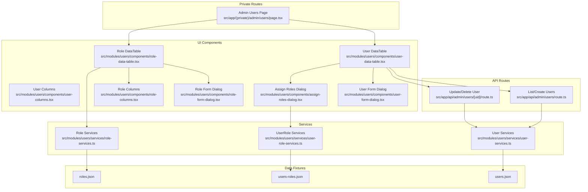
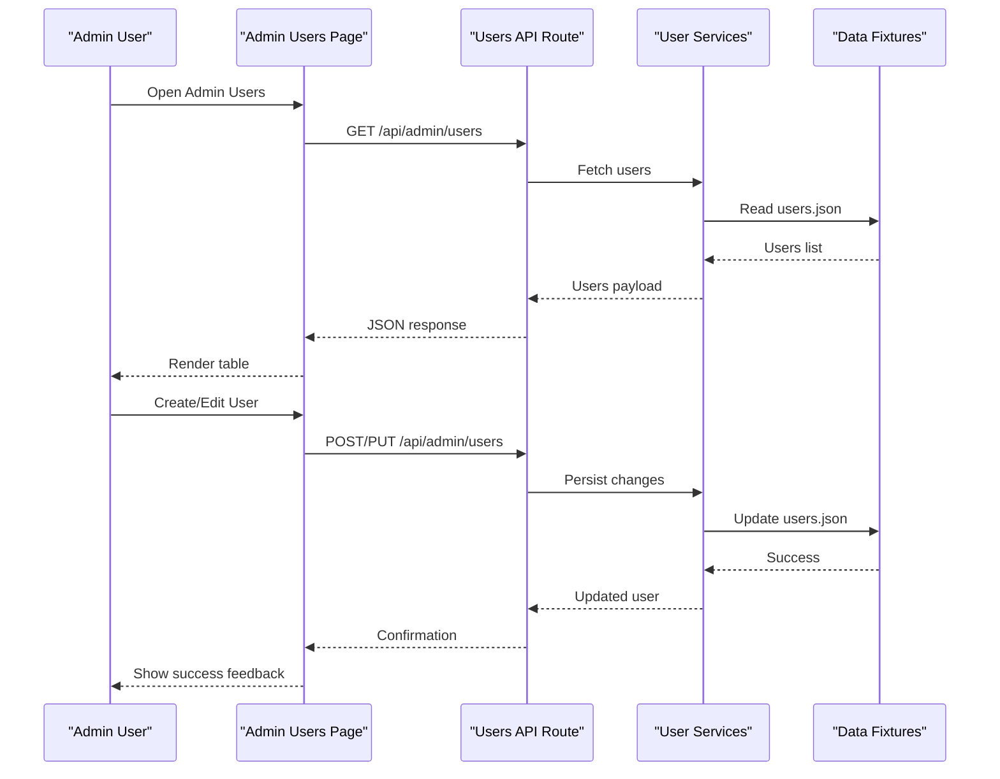
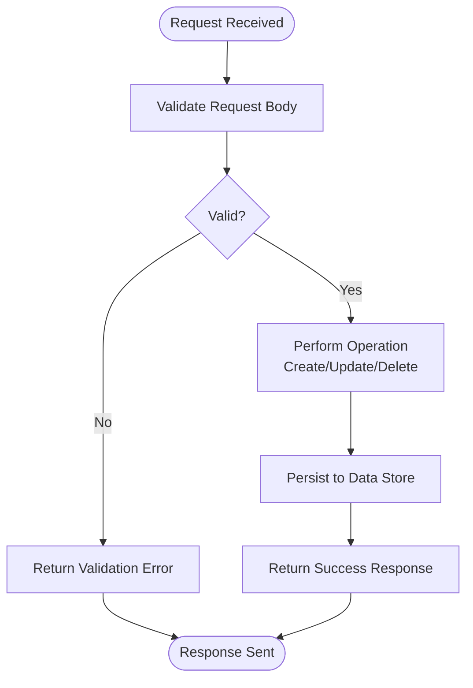
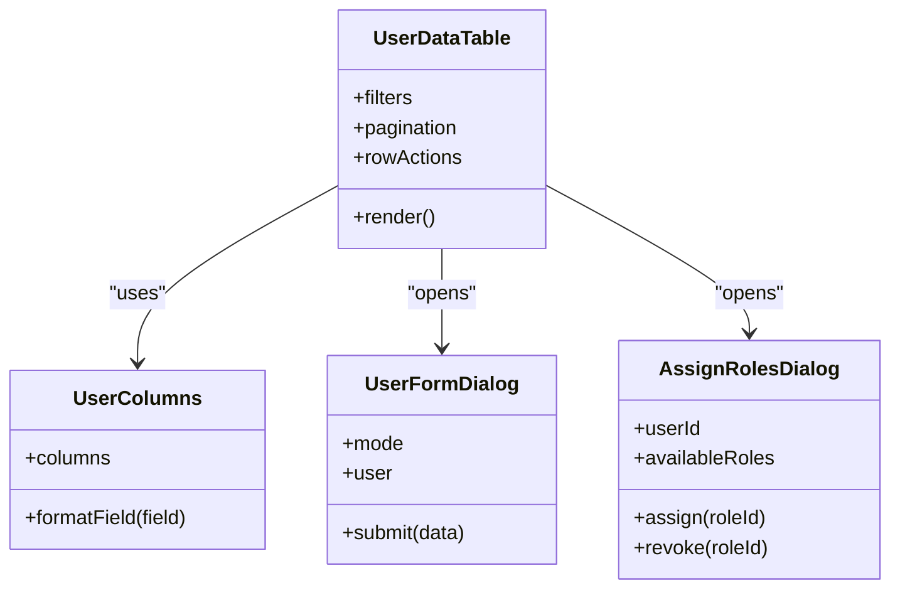
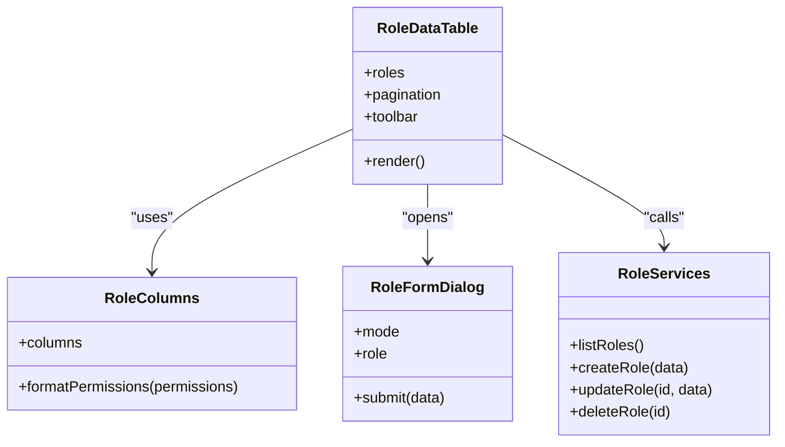
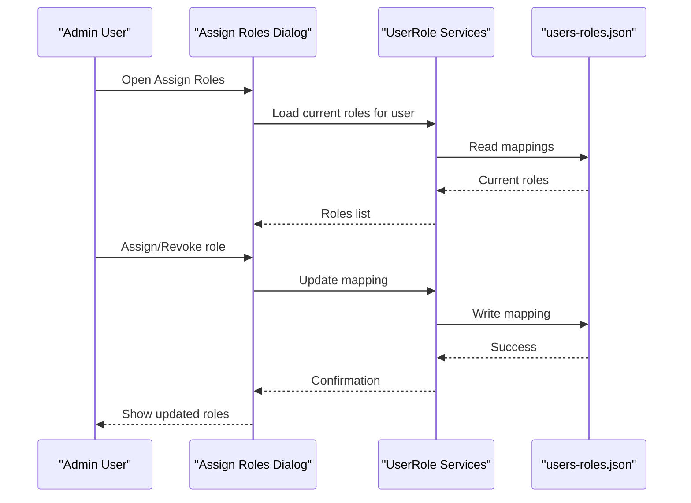
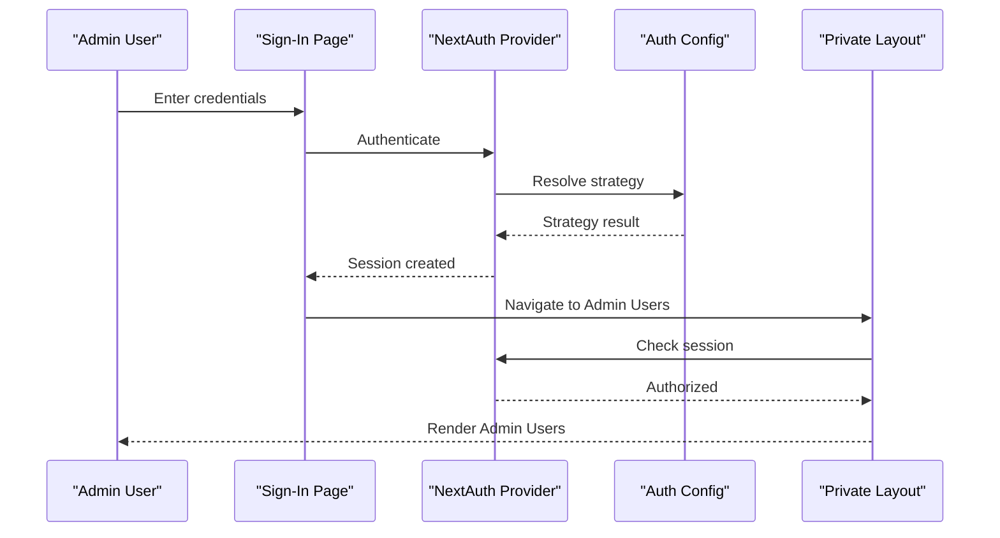
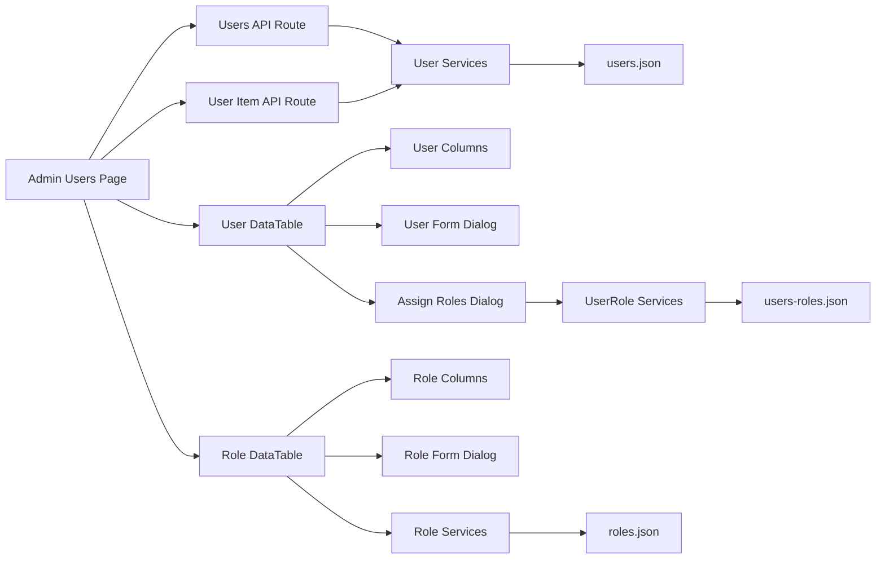

# User Administration

<cite>
**Referenced Files in This Document**
- [src/app/(private)/admin/users/page.tsx](file://src/app/(private)/admin/users/page.tsx)
- [src/app/api/admin/users/route.ts](file://src/app/api/admin/users/route.ts)
- [src/app/api/admin/users/[uid]/route.ts](file://src/app/api/admin/users/[uid]/route.ts)
- [src/modules/users/components/user-data-table.tsx](file://src/modules/users/components/user-data-table.tsx)
- [src/modules/users/components/user-columns.tsx](file://src/modules/users/components/user-columns.tsx)
- [src/modules/users/components/user-form-dialog.tsx](file://src/modules/users/components/user-form-dialog.tsx)
- [src/modules/users/components/user-data-table-toolbar.tsx](file://src/modules/users/components/user-data-table-toolbar.tsx)
- [src/modules/users/components/user-data-table-pagination.tsx](file://src/modules/users/components/user-data-table-pagination.tsx)
- [src/modules/users/components/assign-roles-dialog.tsx](file://src/modules/users/components/assign-roles-dialog.tsx)
- [src/modules/users/components/role-data-table.tsx](file://src/modules/users/components/role-data-table.tsx)
- [src/modules/users/components/role-columns.tsx](file://src/modules/users/components/role-columns.tsx)
- [src/modules/users/components/role-form-dialog.tsx](file://src/modules/users/components/role-form-dialog.tsx)
- [src/modules/users/components/role-data-table-toolbar.tsx](file://src/modules/users/components/role-data-table-toolbar.tsx)
- [src/modules/users/components/role-data-table-pagination.tsx](file://src/modules/users/components/role-data-table-pagination.tsx)
- [src/modules/users/services/user-services.ts](file://src/modules/users/services/user-services.ts)
- [src/modules/users/services/user-role-services.ts](file://src/modules/users/services/user-role-services.ts)
- [src/modules/users/services/role-services.ts](file://src/modules/users/services/role-services.ts)
- [src/modules/users/services/types/user-types.ts](file://src/modules/users/services/types/user-types.ts)
- [src/modules/users/services/data/users.json](file://src/modules/users/services/data/users.json)
- [src/modules/users/services/data/roles.json](file://src/modules/users/services/data/roles.json)
- [src/modules/users/services/data/users-roles.json](file://src/modules/users/services/data/users-roles.json)
- [src/auth.config.ts](file://src/auth.config.ts)
- [src/auth.ts](file://src/auth.ts)
- [src/app/(auth)/sign-in/page.tsx](file://src/app/(auth)/sign-in/page.tsx)
- [src/app/(auth)/sign-up/page.tsx](file://src/app/(auth)/sign-up/page.tsx)
- [src/app/(auth)/forgot-password/page.tsx](file://src/app/(auth)/forgot-password/page.tsx)
- [src/app/(auth)/layout.tsx](file://src/app/(auth)/layout.tsx)
- [src/app/(private)/layout.tsx](file://src/app/(private)/layout.tsx)
- [src/components/nav-user.tsx](file://src/components/nav-user.tsx)
- [src/components/auth-provider.tsx](file://src/components/auth-provider.tsx)
</cite>

## Table of Contents
1. [Introduction](#introduction)
2. [Project Structure](#project-structure)
3. [Core Components](#core-components)
4. [Architecture Overview](#architecture-overview)
5. [Detailed Component Analysis](#detailed-component-analysis)
6. [Dependency Analysis](#dependency-analysis)
7. [Performance Considerations](#performance-considerations)
8. [Troubleshooting Guide](#troubleshooting-guide)
9. [Conclusion](#conclusion)
10. [Appendices](#appendices)

## Introduction
This document explains the user administration features implemented in the project, focusing on:
- Role-based access control (RBAC) for users and roles
- Permission checks and protected routes
- Administrative interfaces for managing users and roles
- Bulk operations and data table interactions
- User lifecycle management including creation, updates, deactivation, and role assignment
- Security considerations for administrative functions

The system uses a Next.js App Router structure with server-side API routes for admin operations and client-side components for interactive UIs. Authentication is provided by NextAuth, with configuration files centralizing auth behavior.

## Project Structure
User administration spans several areas:
- Admin pages under the private route group
- API routes for CRUD operations on users and roles
- Reusable data tables and forms for users and roles
- Services layer that encapsulates data operations and types
- Data fixtures for mock datasets used during development

**Diagram sources**
- [src/app/(private)/admin/users/page.tsx](file://src/app/(private)/admin/users/page.tsx)
- [src/app/api/admin/users/route.ts](file://src/app/api/admin/users/route.ts)
- [src/app/api/admin/users/[uid]/route.ts](file://src/app/api/admin/users/[uid]/route.ts)
- [src/modules/users/components/user-data-table.tsx](file://src/modules/users/components/user-data-table.tsx)
- [src/modules/users/components/user-columns.tsx](file://src/modules/users/components/user-columns.tsx)
- [src/modules/users/components/user-form-dialog.tsx](file://src/modules/users/components/user-form-dialog.tsx)
- [src/modules/users/components/assign-roles-dialog.tsx](file://src/modules/users/components/assign-roles-dialog.tsx)
- [src/modules/users/components/role-data-table.tsx](file://src/modules/users/components/role-data-table.tsx)
- [src/modules/users/components/role-columns.tsx](file://src/modules/users/components/role-columns.tsx)
- [src/modules/users/components/role-form-dialog.tsx](file://src/modules/users/components/role-form-dialog.tsx)
- [src/modules/users/services/user-services.ts](file://src/modules/users/services/user-services.ts)
- [src/modules/users/services/user-role-services.ts](file://src/modules/users/services/user-role-services.ts)
- [src/modules/users/services/role-services.ts](file://src/modules/users/services/role-services.ts)
- [src/modules/users/services/data/users.json](file://src/modules/users/services/data/users.json)
- [src/modules/users/services/data/roles.json](file://src/modules/users/services/data/roles.json)
- [src/modules/users/services/data/users-roles.json](file://src/modules/users/services/data/users-roles.json)

**Section sources**
- [src/app/(private)/admin/users/page.tsx](file://src/app/(private)/admin/users/page.tsx)
- [src/app/api/admin/users/route.ts](file://src/app/api/admin/users/route.ts)
- [src/app/api/admin/users/[uid]/route.ts](file://src/app/api/admin/users/[uid]/route.ts)
- [src/modules/users/components/user-data-table.tsx](file://src/modules/users/components/user-data-table.tsx)
- [src/modules/users/components/user-columns.tsx](file://src/modules/users/components/user-columns.tsx)
- [src/modules/users/components/user-form-dialog.tsx](file://src/modules/users/components/user-form-dialog.tsx)
- [src/modules/users/components/assign-roles-dialog.tsx](file://src/modules/users/components/assign-roles-dialog.tsx)
- [src/modules/users/components/role-data-table.tsx](file://src/modules/users/components/role-data-table.tsx)
- [src/modules/users/components/role-columns.tsx](file://src/modules/users/components/role-columns.tsx)
- [src/modules/users/components/role-form-dialog.tsx](file://src/modules/users/components/role-form-dialog.tsx)
- [src/modules/users/services/user-services.ts](file://src/modules/users/services/user-services.ts)
- [src/modules/users/services/user-role-services.ts](file://src/modules/users/services/user-role-services.ts)
- [src/modules/users/services/role-services.ts](file://src/modules/users/services/role-services.ts)
- [src/modules/users/services/data/users.json](file://src/modules/users/services/data/users.json)
- [src/modules/users/services/data/roles.json](file://src/modules/users/services/data/roles.json)
- [src/modules/users/services/data/users-roles.json](file://src/modules/users/services/data/users-roles.json)

## Core Components
- Admin Users page orchestrates user and role management views and actions.
- API routes expose endpoints for listing, creating, updating, and deleting users.
- User data table provides filtering, sorting, pagination, and row-level actions.
- User form dialog supports creating and editing user profiles.
- Assign roles dialog enables assigning or revoking roles per user.
- Role data table and form support defining roles and their permissions.
- Services layer abstracts data operations and type definitions.

Key responsibilities:
- Enforce admin-only access to user management pages and APIs.
- Provide consistent UX for bulk operations via toolbar and pagination.
- Centralize validation and error handling in services and API routes.

**Section sources**
- [src/app/(private)/admin/users/page.tsx](file://src/app/(private)/admin/users/page.tsx)
- [src/app/api/admin/users/route.ts](file://src/app/api/admin/users/route.ts)
- [src/app/api/admin/users/[uid]/route.ts](file://src/app/api/admin/users/[uid]/route.ts)
- [src/modules/users/components/user-data-table.tsx](file://src/modules/users/components/user-data-table.tsx)
- [src/modules/users/components/user-form-dialog.tsx](file://src/modules/users/components/user-form-dialog.tsx)
- [src/modules/users/components/assign-roles-dialog.tsx](file://src/modules/users/components/assign-roles-dialog.tsx)
- [src/modules/users/components/role-data-table.tsx](file://src/modules/users/components/role-data-table.tsx)
- [src/modules/users/components/role-form-dialog.tsx](file://src/modules/users/components/role-form-dialog.tsx)
- [src/modules/users/services/user-services.ts](file://src/modules/users/services/user-services.ts)
- [src/modules/users/services/user-role-services.ts](file://src/modules/users/services/user-role-services.ts)
- [src/modules/users/services/role-services.ts](file://src/modules/users/services/role-services.ts)

## Architecture Overview
The user administration architecture separates concerns across routes, UI components, and services:
- Private routes protect admin pages.
- API routes handle server-side logic and data persistence.
- Client components manage state, user interactions, and data display.
- Services encapsulate business logic and data access.

**Diagram sources**
- [src/app/(private)/admin/users/page.tsx](file://src/app/(private)/admin/users/page.tsx)
- [src/app/api/admin/users/route.ts](file://src/app/api/admin/users/route.ts)
- [src/modules/users/services/user-services.ts](file://src/modules/users/services/user-services.ts)
- [src/modules/users/services/data/users.json](file://src/modules/users/services/data/users.json)

## Detailed Component Analysis

### Admin Users Page
- Entry point for user administration.
- Renders user and role management sections.
- Integrates with API routes for data operations.
- Applies layout and navigation context from private routes.

**Section sources**
- [src/app/(private)/admin/users/page.tsx](file://src/app/(private)/admin/users/page.tsx)
- [src/app/(private)/layout.tsx](file://src/app/(private)/layout.tsx)

### API Routes: Users
- List and create users via a collection endpoint.
- Update or delete individual users via an item endpoint.
- Validate inputs and return standardized responses.
- Integrate with services for data operations.

**Diagram sources**
- [src/app/api/admin/users/route.ts](file://src/app/api/admin/users/route.ts)
- [src/app/api/admin/users/[uid]/route.ts](file://src/app/api/admin/users/[uid]/route.ts)
- [src/modules/users/services/user-services.ts](file://src/modules/users/services/user-services.ts)

**Section sources**
- [src/app/api/admin/users/route.ts](file://src/app/api/admin/users/route.ts)
- [src/app/api/admin/users/[uid]/route.ts](file://src/app/api/admin/users/[uid]/route.ts)
- [src/modules/users/services/user-services.ts](file://src/modules/users/services/user-services.ts)

### User Data Table and Columns
- Displays paginated, filterable, sortable user lists.
- Provides row actions such as edit, assign roles, deactivate.
- Column definitions define visible fields and formatting.

**Diagram sources**
- [src/modules/users/components/user-data-table.tsx](file://src/modules/users/components/user-data-table.tsx)
- [src/modules/users/components/user-columns.tsx](file://src/modules/users/components/user-columns.tsx)
- [src/modules/users/components/user-form-dialog.tsx](file://src/modules/users/components/user-form-dialog.tsx)
- [src/modules/users/components/assign-roles-dialog.tsx](file://src/modules/users/components/assign-roles-dialog.tsx)

**Section sources**
- [src/modules/users/components/user-data-table.tsx](file://src/modules/users/components/user-data-table.tsx)
- [src/modules/users/components/user-columns.tsx](file://src/modules/users/components/user-columns.tsx)
- [src/modules/users/components/user-form-dialog.tsx](file://src/modules/users/components/user-form-dialog.tsx)
- [src/modules/users/components/assign-roles-dialog.tsx](file://src/modules/users/components/assign-roles-dialog.tsx)

### Role Management
- Role data table shows available roles and their permissions.
- Role form dialog supports creating and editing roles.
- Role services provide role data operations.

**Diagram sources**
- [src/modules/users/components/role-data-table.tsx](file://src/modules/users/components/role-data-table.tsx)
- [src/modules/users/components/role-columns.tsx](file://src/modules/users/components/role-columns.tsx)
- [src/modules/users/components/role-form-dialog.tsx](file://src/modules/users/components/role-form-dialog.tsx)
- [src/modules/users/services/role-services.ts](file://src/modules/users/services/role-services.ts)

**Section sources**
- [src/modules/users/components/role-data-table.tsx](file://src/modules/users/components/role-data-table.tsx)
- [src/modules/users/components/role-columns.tsx](file://src/modules/users/components/role-columns.tsx)
- [src/modules/users/components/role-form-dialog.tsx](file://src/modules/users/components/role-form-dialog.tsx)
- [src/modules/users/services/role-services.ts](file://src/modules/users/services/role-services.ts)

### User-Role Assignment
- Assign roles dialog manages per-user role assignments.
- UserRole services coordinate mapping between users and roles.
- Data fixture tracks relationships.

**Diagram sources**
- [src/modules/users/components/assign-roles-dialog.tsx](file://src/modules/users/components/assign-roles-dialog.tsx)
- [src/modules/users/services/user-role-services.ts](file://src/modules/users/services/user-role-services.ts)
- [src/modules/users/services/data/users-roles.json](file://src/modules/users/services/data/users-roles.json)

**Section sources**
- [src/modules/users/components/assign-roles-dialog.tsx](file://src/modules/users/components/assign-roles-dialog.tsx)
- [src/modules/users/services/user-role-services.ts](file://src/modules/users/services/user-role-services.ts)
- [src/modules/users/services/data/users-roles.json](file://src/modules/users/services/data/users-roles.json)

### Authentication and Protected Access
- NextAuth configuration centralizes authentication settings.
- Auth provider wraps application to expose session context.
- Sign-in, sign-up, and forgot-password pages integrate with auth flow.
- Private layout enforces authenticated access for admin routes.

**Diagram sources**
- [src/auth.config.ts](file://src/auth.config.ts)
- [src/auth.ts](file://src/auth.ts)
- [src/components/auth-provider.tsx](file://src/components/auth-provider.tsx)
- [src/app/(auth)/sign-in/page.tsx](file://src/app/(auth)/sign-in/page.tsx)
- [src/app/(auth)/layout.tsx](file://src/app/(auth)/layout.tsx)
- [src/app/(private)/layout.tsx](file://src/app/(private)/layout.tsx)

**Section sources**
- [src/auth.config.ts](file://src/auth.config.ts)
- [src/auth.ts](file://src/auth.ts)
- [src/components/auth-provider.tsx](file://src/components/auth-provider.tsx)
- [src/app/(auth)/sign-in/page.tsx](file://src/app/(auth)/sign-in/page.tsx)
- [src/app/(auth)/layout.tsx](file://src/app/(auth)/layout.tsx)
- [src/app/(private)/layout.tsx](file://src/app/(private)/layout.tsx)

## Dependency Analysis
The following diagram highlights key dependencies among user administration modules:

**Diagram sources**
- [src/app/(private)/admin/users/page.tsx](file://src/app/(private)/admin/users/page.tsx)
- [src/app/api/admin/users/route.ts](file://src/app/api/admin/users/route.ts)
- [src/app/api/admin/users/[uid]/route.ts](file://src/app/api/admin/users/[uid]/route.ts)
- [src/modules/users/components/user-data-table.tsx](file://src/modules/users/components/user-data-table.tsx)
- [src/modules/users/components/user-columns.tsx](file://src/modules/users/components/user-columns.tsx)
- [src/modules/users/components/user-form-dialog.tsx](file://src/modules/users/components/user-form-dialog.tsx)
- [src/modules/users/components/assign-roles-dialog.tsx](file://src/modules/users/components/assign-roles-dialog.tsx)
- [src/modules/users/components/role-data-table.tsx](file://src/modules/users/components/role-data-table.tsx)
- [src/modules/users/components/role-columns.tsx](file://src/modules/users/components/role-columns.tsx)
- [src/modules/users/components/role-form-dialog.tsx](file://src/modules/users/components/role-form-dialog.tsx)
- [src/modules/users/services/user-services.ts](file://src/modules/users/services/user-services.ts)
- [src/modules/users/services/user-role-services.ts](file://src/modules/users/services/user-role-services.ts)
- [src/modules/users/services/role-services.ts](file://src/modules/users/services/role-services.ts)
- [src/modules/users/services/data/users.json](file://src/modules/users/services/data/users.json)
- [src/modules/users/services/data/roles.json](file://src/modules/users/services/data/roles.json)
- [src/modules/users/services/data/users-roles.json](file://src/modules/users/services/data/users-roles.json)

**Section sources**
- [src/app/(private)/admin/users/page.tsx](file://src/app/(private)/admin/users/page.tsx)
- [src/app/api/admin/users/route.ts](file://src/app/api/admin/users/route.ts)
- [src/app/api/admin/users/[uid]/route.ts](file://src/app/api/admin/users/[uid]/route.ts)
- [src/modules/users/components/user-data-table.tsx](file://src/modules/users/components/user-data-table.tsx)
- [src/modules/users/components/user-columns.tsx](file://src/modules/users/components/user-columns.tsx)
- [src/modules/users/components/user-form-dialog.tsx](file://src/modules/users/components/user-form-dialog.tsx)
- [src/modules/users/components/assign-roles-dialog.tsx](file://src/modules/users/components/assign-roles-dialog.tsx)
- [src/modules/users/components/role-data-table.tsx](file://src/modules/users/components/role-data-table.tsx)
- [src/modules/users/components/role-columns.tsx](file://src/modules/users/components/role-columns.tsx)
- [src/modules/users/components/role-form-dialog.tsx](file://src/modules/users/components/role-form-dialog.tsx)
- [src/modules/users/services/user-services.ts](file://src/modules/users/services/user-services.ts)
- [src/modules/users/services/user-role-services.ts](file://src/modules/users/services/user-role-services.ts)
- [src/modules/users/services/role-services.ts](file://src/modules/users/services/role-services.ts)
- [src/modules/users/services/data/users.json](file://src/modules/users/services/data/users.json)
- [src/modules/users/services/data/roles.json](file://src/modules/users/services/data/roles.json)
- [src/modules/users/services/data/users-roles.json](file://src/modules/users/services/data/users-roles.json)

## Performance Considerations
- Use pagination and server-side filtering where possible to reduce payload sizes.
- Debounce search inputs in data tables to minimize unnecessary requests.
- Cache frequently accessed role definitions to avoid repeated reads.
- Batch updates when performing bulk operations to reduce round trips.
- Avoid heavy computations in render paths; move logic to services or hooks.

[No sources needed since this section provides general guidance]

## Troubleshooting Guide
Common issues and resolutions:
- Unauthorized access to admin pages: Ensure the user has an active session and required roles. Verify private layout guards and NextAuth configuration.
- API errors when creating/updating users: Check request body validation and service-layer error handling. Confirm data fixture integrity.
- Role assignment not persisting: Verify UserRole services write to the correct mapping file and that the UI reflects updates after confirmation.
- Missing user fields in table: Review column definitions and ensure services return expected shapes.

**Section sources**
- [src/app/(private)/layout.tsx](file://src/app/(private)/layout.tsx)
- [src/auth.config.ts](file://src/auth.config.ts)
- [src/auth.ts](file://src/auth.ts)
- [src/app/api/admin/users/route.ts](file://src/app/api/admin/users/route.ts)
- [src/app/api/admin/users/[uid]/route.ts](file://src/app/api/admin/users/[uid]/route.ts)
- [src/modules/users/services/user-services.ts](file://src/modules/users/services/user-services.ts)
- [src/modules/users/services/user-role-services.ts](file://src/modules/users/services/user-role-services.ts)
- [src/modules/users/services/data/users.json](file://src/modules/users/services/data/users.json)
- [src/modules/users/services/data/users-roles.json](file://src/modules/users/services/data/users-roles.json)

## Conclusion
The user administration module provides a comprehensive RBAC-enabled interface for managing users and roles. It leverages NextAuth for secure access, API routes for robust operations, and reusable data tables for efficient administration. The separation of concerns across UI, services, and data fixtures ensures maintainability and scalability.

[No sources needed since this section summarizes without analyzing specific files]

## Appendices

### Creating Custom Roles
- Define a new role using the role form dialog.
- Specify permissions associated with the role.
- Save the role and verify it appears in the role data table.

**Section sources**
- [src/modules/users/components/role-form-dialog.tsx](file://src/modules/users/components/role-form-dialog.tsx)
- [src/modules/users/components/role-data-table.tsx](file://src/modules/users/components/role-data-table.tsx)
- [src/modules/users/services/role-services.ts](file://src/modules/users/services/role-services.ts)
- [src/modules/users/services/data/roles.json](file://src/modules/users/services/data/roles.json)

### Implementing Permission Checks
- Use the assigned roles to determine allowed actions.
- Guard sensitive UI elements based on role permissions.
- Enforce server-side checks in API routes before processing admin operations.

**Section sources**
- [src/app/api/admin/users/route.ts](file://src/app/api/admin/users/route.ts)
- [src/app/api/admin/users/[uid]/route.ts](file://src/app/api/admin/users/[uid]/route.ts)
- [src/modules/users/services/user-role-services.ts](file://src/modules/users/services/user-role-services.ts)
- [src/modules/users/services/data/users-roles.json](file://src/modules/users/services/data/users-roles.json)

### Auditing User Actions
- Log critical admin operations (create, update, delete, role assignment).
- Record timestamps and actor identity for traceability.
- Provide an audit log view accessible to privileged administrators.

[No sources needed since this section provides general guidance]

### User Lifecycle Management
- Create users via the user form dialog and API.
- Update user details and roles through dedicated dialogs.
- Deactivate accounts by toggling status fields and reflecting changes in the table.

**Section sources**
- [src/modules/users/components/user-form-dialog.tsx](file://src/modules/users/components/user-form-dialog.tsx)
- [src/modules/users/components/user-data-table.tsx](file://src/modules/users/components/user-data-table.tsx)
- [src/app/api/admin/users/route.ts](file://src/app/api/admin/users/route.ts)
- [src/app/api/admin/users/[uid]/route.ts](file://src/app/api/admin/users/[uid]/route.ts)
- [src/modules/users/services/user-services.ts](file://src/modules/users/services/user-services.ts)
- [src/modules/users/services/data/users.json](file://src/modules/users/services/data/users.json)

### Security Considerations for Administrative Functions
- Restrict admin routes to authenticated users with appropriate roles.
- Validate all inputs on the server side.
- Minimize exposure of sensitive data in responses.
- Use HTTPS and secure cookies for sessions.

**Section sources**
- [src/auth.config.ts](file://src/auth.config.ts)
- [src/auth.ts](file://src/auth.ts)
- [src/app/(private)/layout.tsx](file://src/app/(private)/layout.tsx)
- [src/app/api/admin/users/route.ts](file://src/app/api/admin/users/route.ts)
- [src/app/api/admin/users/[uid]/route.ts](file://src/app/api/admin/users/[uid]/route.ts)