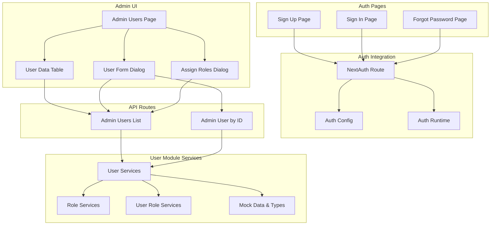
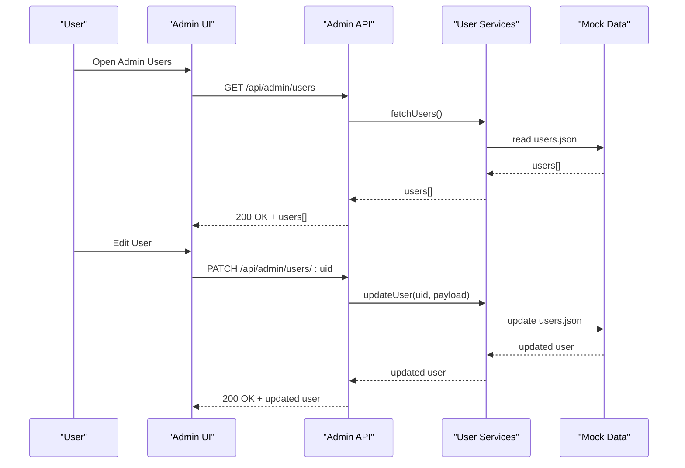
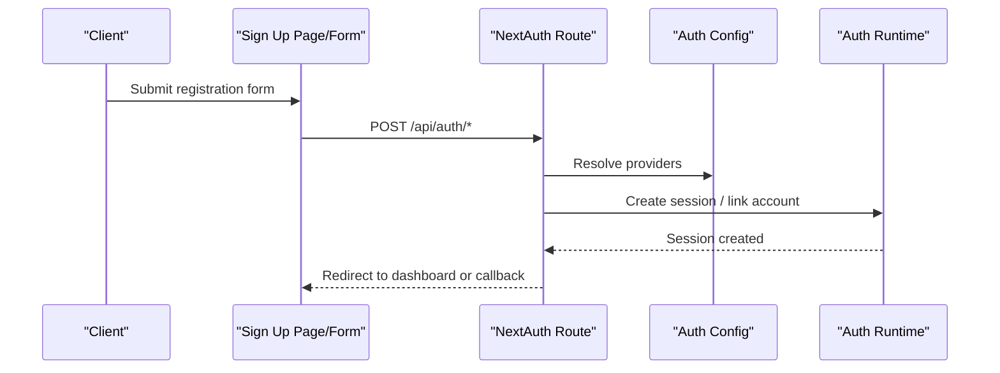
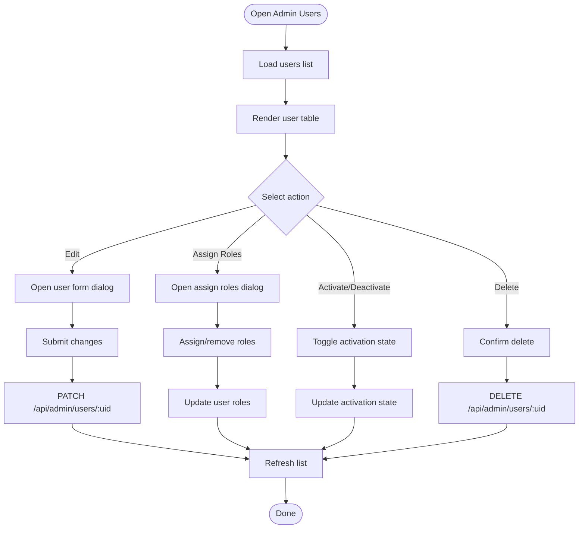
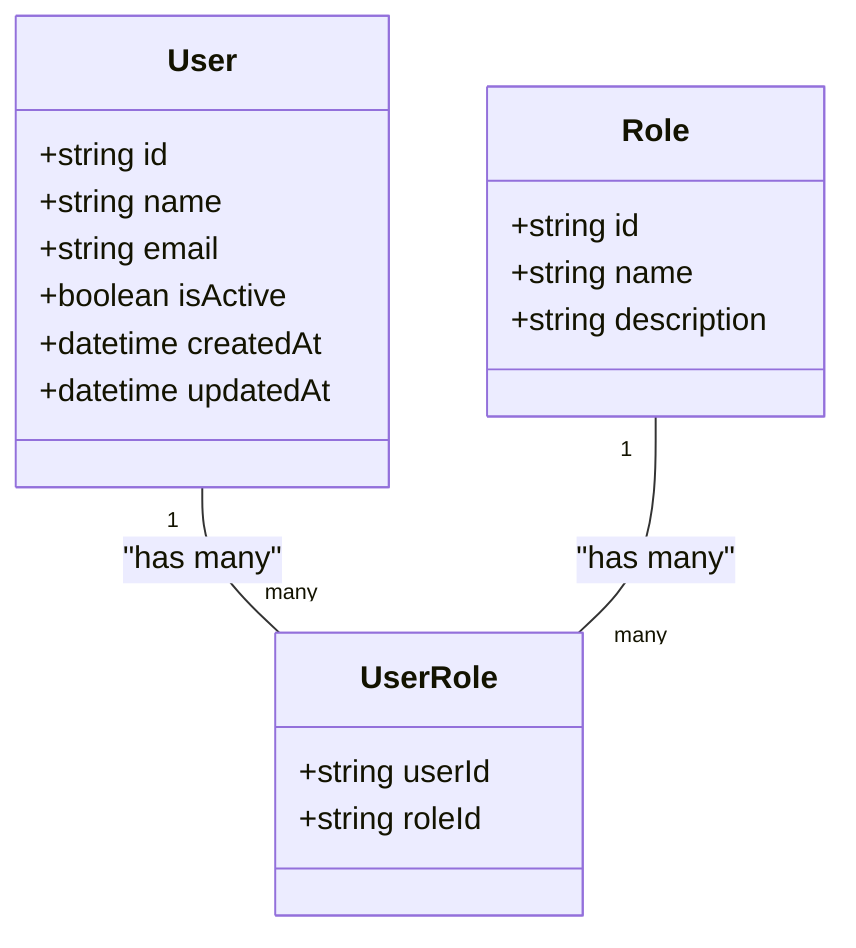
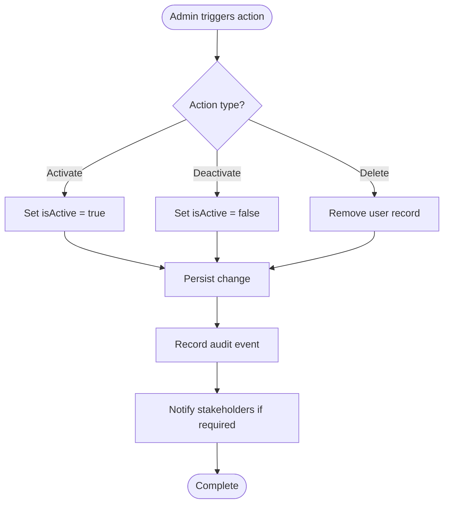
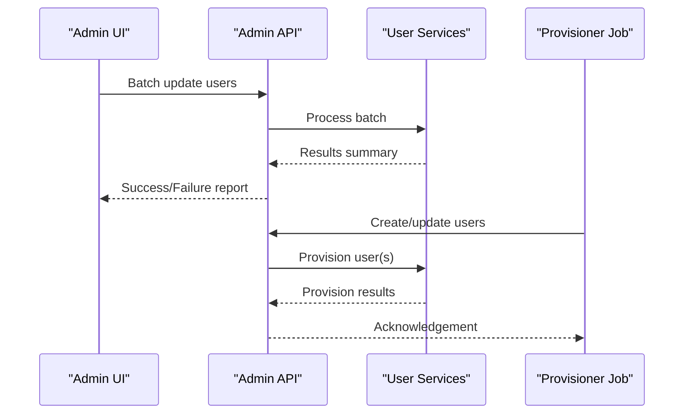
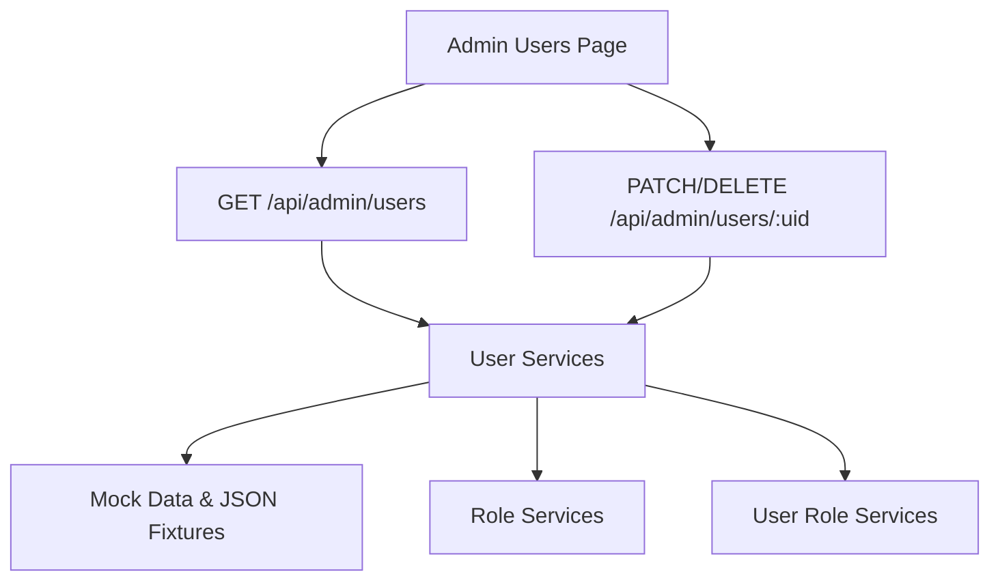

# User Lifecycle Management

<cite>
**Referenced Files in This Document**
- [src/app/(auth)/sign-up/page.tsx](file://src/app/(auth)/sign-up/page.tsx)
- [src/app/(auth)/sign-up/components/signup-form.tsx](file://src/app/(auth)/sign-up/components/signup-form.tsx)
- [src/app/(auth)/forgot-password/page.tsx](file://src/app/(auth)/forgot-password/page.tsx)
- [src/app/(auth)/forgot-password/components/forgot-password-form.tsx](file://src/app/(auth)/forgot-password/components/forgot-password-form.tsx)
- [src/app/(auth)/sign-in/page.tsx](file://src/app/(auth)/sign-in/page.tsx)
- [src/app/(auth)/sign-in/components/login-form.tsx](file://src/app/(auth)/sign-in/components/login-form.tsx)
- [src/app/api/auth/[...nextauth]/route.ts](file://src/app/api/auth/[...nextauth]/route.ts)
- [src/auth.config.ts](file://src/auth.config.ts)
- [src/auth.ts](file://src/auth.ts)
- [src/types/next-auth.d.ts](file://src/types/next-auth.d.ts)
- [src/app/(private)/admin/users/page.tsx](file://src/app/(private)/admin/users/page.tsx)
- [src/app/api/admin/users/route.ts](file://src/app/api/admin/users/route.ts)
- [src/app/api/admin/users/[uid]/route.ts](file://src/app/api/admin/users/[uid]/route.ts)
- [src/modules/users/services/user-services.ts](file://src/modules/users/services/user-services.ts)
- [src/modules/users/services/user-mock-data.ts](file://src/modules/users/services/user-mock-data.ts)
- [src/modules/users/services/types/user-types.ts](file://src/modules/users/services/types/user-types.ts)
- [src/modules/users/services/data/users.json](file://src/modules/users/services/data/users.json)
- [src/modules/users/services/user-role-services.ts](file://src/modules/users/services/user-role-services.ts)
- [src/modules/users/services/role-services.ts](file://src/modules/users/services/role-services.ts)
- [src/modules/users/services/data/roles.json](file://src/modules/users/services/data/roles.json)
- [src/modules/users/services/data/users-roles.json](file://src/modules/users/services/data/users-roles.json)
- [src/modules/users/components/user-columns.tsx](file://src/modules/users/components/user-columns.tsx)
- [src/modules/users/components/user-data-table-toolbar.tsx](file://src/modules/users/components/user-data-table-toolbar.tsx)
- [src/modules/users/components/user-data-table-pagination.tsx](file://src/modules/users/components/user-data-table-pagination.tsx)
- [src/modules/users/components/user-data-table.tsx](file://src/modules/users/components/user-data-table.tsx)
- [src/modules/users/components/user-form-dialog.tsx](file://src/modules/users/components/user-form-dialog.tsx)
- [src/modules/users/components/assign-roles-dialog.tsx](file://src/modules/users/components/assign-roles-dialog.tsx)
- [src/modules/users/components/stat-cards.tsx](file://src/modules/users/components/stat-cards.tsx)
</cite>

## Table of Contents
1. [Introduction](#introduction)
2. [Project Structure](#project-structure)
3. [Core Components](#core-components)
4. [Architecture Overview](#architecture-overview)
5. [Detailed Component Analysis](#detailed-component-analysis)
6. [Dependency Analysis](#dependency-analysis)
7. [Performance Considerations](#performance-considerations)
8. [Troubleshooting Guide](#troubleshooting-guide)
9. [Conclusion](#conclusion)
10. [Appendices](#appendices)

## Introduction
This document describes user lifecycle management across registration, authentication, profile updates, activation/deactivation, and deletion workflows. It covers the user data model, validation rules, business logic for state transitions, bulk operations, import/export, automated provisioning, audit trails, compliance requirements, and data retention policies. The analysis is grounded in the repository’s Next.js App Router API routes, authentication configuration, admin UI, and user module services.

## Project Structure
The user lifecycle spans several layers:
- Authentication pages and forms (sign-up, sign-in, forgot password)
- NextAuth integration route and configuration
- Admin user management UI and API endpoints
- User module services and mock data types

**Diagram sources**
- [src/app/(auth)/sign-up/page.tsx](file://src/app/(auth)/sign-up/page.tsx)
- [src/app/(auth)/sign-in/page.tsx](file://src/app/(auth)/sign-in/page.tsx)
- [src/app/(auth)/forgot-password/page.tsx](file://src/app/(auth)/forgot-password/page.tsx)
- [src/app/api/auth/[...nextauth]/route.ts](file://src/app/api/auth/[...nextauth]/route.ts)
- [src/auth.config.ts](file://src/auth.config.ts)
- [src/auth.ts](file://src/auth.ts)
- [src/app/(private)/admin/users/page.tsx](file://src/app/(private)/admin/users/page.tsx)
- [src/app/api/admin/users/route.ts](file://src/app/api/admin/users/route.ts)
- [src/app/api/admin/users/[uid]/route.ts](file://src/app/api/admin/users/[uid]/route.ts)
- [src/modules/users/services/user-services.ts](file://src/modules/users/services/user-services.ts)
- [src/modules/users/services/role-services.ts](file://src/modules/users/services/role-services.ts)
- [src/modules/users/services/user-role-services.ts](file://src/modules/users/services/user-role-services.ts)
- [src/modules/users/services/user-mock-data.ts](file://src/modules/users/services/user-mock-data.ts)
- [src/modules/users/services/types/user-types.ts](file://src/modules/users/services/types/user-types.ts)

**Section sources**
- [src/app/(auth)/sign-up/page.tsx](file://src/app/(auth)/sign-up/page.tsx)
- [src/app/(auth)/sign-in/page.tsx](file://src/app/(auth)/sign-in/page.tsx)
- [src/app/(auth)/forgot-password/page.tsx](file://src/app/(auth)/forgot-password/page.tsx)
- [src/app/api/auth/[...nextauth]/route.ts](file://src/app/api/auth/[...nextauth]/route.ts)
- [src/auth.config.ts](file://src/auth.config.ts)
- [src/auth.ts](file://src/auth.ts)
- [src/app/(private)/admin/users/page.tsx](file://src/app/(private)/admin/users/page.tsx)
- [src/app/api/admin/users/route.ts](file://src/app/api/admin/users/route.ts)
- [src/app/api/admin/users/[uid]/route.ts](file://src/app/api/admin/users/[uid]/route.ts)
- [src/modules/users/services/user-services.ts](file://src/modules/users/services/user-services.ts)
- [src/modules/users/services/role-services.ts](file://src/modules/users/services/role-services.ts)
- [src/modules/users/services/user-role-services.ts](file://src/modules/users/services/user-role-services.ts)
- [src/modules/users/services/user-mock-data.ts](file://src/modules/users/services/user-mock-data.ts)
- [src/modules/users/services/types/user-types.ts](file://src/modules/users/services/types/user-types.ts)

## Core Components
- Authentication pages and forms handle user-facing flows for registration, login, and password recovery.
- NextAuth route integrates provider-based authentication and session handling.
- Admin users page provides a centralized interface to manage users, including listing, editing, role assignment, and actions like activation/deactivation and deletion.
- Admin API routes expose list and single-user operations used by the admin UI.
- User module services encapsulate business logic for user CRUD, roles, and mock data access.

Key responsibilities:
- Registration and login are driven by auth pages and NextAuth.
- Profile updates and administrative actions are implemented via admin UI components calling admin API routes.
- User data model and validation rules are defined in user types and enforced in forms and services.

**Section sources**
- [src/app/(auth)/sign-up/components/signup-form.tsx](file://src/app/(auth)/sign-up/components/signup-form.tsx)
- [src/app/(auth)/sign-in/components/login-form.tsx](file://src/app/(auth)/sign-in/components/login-form.tsx)
- [src/app/(auth)/forgot-password/components/forgot-password-form.tsx](file://src/app/(auth)/forgot-password/components/forgot-password-form.tsx)
- [src/app/api/auth/[...nextauth]/route.ts](file://src/app/api/auth/[...nextauth]/route.ts)
- [src/auth.config.ts](file://src/auth.config.ts)
- [src/auth.ts](file://src/auth.ts)
- [src/app/(private)/admin/users/page.tsx](file://src/app/(private)/admin/users/page.tsx)
- [src/app/api/admin/users/route.ts](file://src/app/api/admin/users/route.ts)
- [src/app/api/admin/users/[uid]/route.ts](file://src/app/api/admin/users/[uid]/route.ts)
- [src/modules/users/services/user-services.ts](file://src/modules/users/services/user-services.ts)
- [src/modules/users/services/types/user-types.ts](file://src/modules/users/services/types/user-types.ts)

## Architecture Overview
The system uses NextAuth for authentication and an admin panel for user administration. The admin UI calls REST-like API routes that delegate to user services. User data is currently backed by mock data and JSON fixtures, with type definitions guiding validation and behavior.

**Diagram sources**
- [src/app/(private)/admin/users/page.tsx](file://src/app/(private)/admin/users/page.tsx)
- [src/app/api/admin/users/route.ts](file://src/app/api/admin/users/route.ts)
- [src/app/api/admin/users/[uid]/route.ts](file://src/app/api/admin/users/[uid]/route.ts)
- [src/modules/users/services/user-services.ts](file://src/modules/users/services/user-services.ts)
- [src/modules/users/services/user-mock-data.ts](file://src/modules/users/services/user-mock-data.ts)
- [src/modules/users/services/data/users.json](file://src/modules/users/services/data/users.json)

## Detailed Component Analysis

### Authentication Flows
- Sign Up: Collects user credentials and submits to NextAuth.
- Sign In: Authenticates existing users via NextAuth.
- Forgot Password: Initiates password reset flow through NextAuth.

**Diagram sources**
- [src/app/(auth)/sign-up/page.tsx](file://src/app/(auth)/sign-up/page.tsx)
- [src/app/(auth)/sign-up/components/signup-form.tsx](file://src/app/(auth)/sign-up/components/signup-form.tsx)
- [src/app/api/auth/[...nextauth]/route.ts](file://src/app/api/auth/[...nextauth]/route.ts)
- [src/auth.config.ts](file://src/auth.config.ts)
- [src/auth.ts](file://src/auth.ts)

**Section sources**
- [src/app/(auth)/sign-up/page.tsx](file://src/app/(auth)/sign-up/page.tsx)
- [src/app/(auth)/sign-up/components/signup-form.tsx](file://src/app/(auth)/sign-up/components/signup-form.tsx)
- [src/app/(auth)/sign-in/page.tsx](file://src/app/(auth)/sign-in/page.tsx)
- [src/app/(auth)/sign-in/components/login-form.tsx](file://src/app/(auth)/sign-in/components/login-form.tsx)
- [src/app/(auth)/forgot-password/page.tsx](file://src/app/(auth)/forgot-password/page.tsx)
- [src/app/(auth)/forgot-password/components/forgot-password-form.tsx](file://src/app/(auth)/forgot-password/components/forgot-password-form.tsx)
- [src/app/api/auth/[...nextauth]/route.ts](file://src/app/api/auth/[...nextauth]/route.ts)
- [src/auth.config.ts](file://src/auth.config.ts)
- [src/auth.ts](file://src/auth.ts)
- [src/types/next-auth.d.ts](file://src/types/next-auth.d.ts)

### Admin User Management
The admin users page orchestrates listing, editing, and role assignment. It consumes admin API routes which call user services.

**Diagram sources**
- [src/app/(private)/admin/users/page.tsx](file://src/app/(private)/admin/users/page.tsx)
- [src/app/api/admin/users/route.ts](file://src/app/api/admin/users/route.ts)
- [src/app/api/admin/users/[uid]/route.ts](file://src/app/api/admin/users/[uid]/route.ts)
- [src/modules/users/services/user-services.ts](file://src/modules/users/services/user-services.ts)
- [src/modules/users/components/user-data-table.tsx](file://src/modules/users/components/user-data-table.tsx)
- [src/modules/users/components/user-form-dialog.tsx](file://src/modules/users/components/user-form-dialog.tsx)
- [src/modules/users/components/assign-roles-dialog.tsx](file://src/modules/users/components/assign-roles-dialog.tsx)

**Section sources**
- [src/app/(private)/admin/users/page.tsx](file://src/app/(private)/admin/users/page.tsx)
- [src/app/api/admin/users/route.ts](file://src/app/api/admin/users/route.ts)
- [src/app/api/admin/users/[uid]/route.ts](file://src/app/api/admin/users/[uid]/route.ts)
- [src/modules/users/components/user-data-table.tsx](file://src/modules/users/components/user-data-table.tsx)
- [src/modules/users/components/user-data-table-toolbar.tsx](file://src/modules/users/components/user-data-table-toolbar.tsx)
- [src/modules/users/components/user-data-table-pagination.tsx](file://src/modules/users/components/user-data-table-pagination.tsx)
- [src/modules/users/components/user-form-dialog.tsx](file://src/modules/users/components/user-form-dialog.tsx)
- [src/modules/users/components/assign-roles-dialog.tsx](file://src/modules/users/components/assign-roles-dialog.tsx)

### User Data Model and Validation
The user data model and related types define fields such as identifiers, names, emails, roles, and status flags. Validation rules are enforced in forms and services before persistence.

**Diagram sources**
- [src/modules/users/services/types/user-types.ts](file://src/modules/users/services/types/user-types.ts)
- [src/modules/users/services/data/users.json](file://src/modules/users/services/data/users.json)
- [src/modules/users/services/data/roles.json](file://src/modules/users/services/data/roles.json)
- [src/modules/users/services/data/users-roles.json](file://src/modules/users/services/data/users-roles.json)

**Section sources**
- [src/modules/users/services/types/user-types.ts](file://src/modules/users/services/types/user-types.ts)
- [src/modules/users/services/user-mock-data.ts](file://src/modules/users/services/user-mock-data.ts)
- [src/modules/users/services/data/users.json](file://src/modules/users/services/data/users.json)
- [src/modules/users/services/data/roles.json](file://src/modules/users/services/data/roles.json)
- [src/modules/users/services/data/users-roles.json](file://src/modules/users/services/data/users-roles.json)

### Business Logic for State Transitions
Activation/deactivation toggles a user’s active state. Deletion removes a user record. These operations are initiated from the admin UI and executed via admin API routes delegating to user services.

[No diagram sources since this is a conceptual representation]

**Section sources**
- [src/app/api/admin/users/[uid]/route.ts](file://src/app/api/admin/users/[uid]/route.ts)
- [src/modules/users/services/user-services.ts](file://src/modules/users/services/user-services.ts)

### Bulk Operations, Import/Export, Automated Provisioning
Bulk operations can be implemented using the admin API endpoints to iterate over selected users and apply updates (e.g., activation, role assignment). Import/export can leverage JSON fixtures and CSV processing within service functions. Automated provisioning can be modeled as scheduled jobs invoking the same APIs to create or update users based on external sources.

[No diagram sources since this section outlines implementation patterns not tied to specific files]

**Section sources**
- [src/app/api/admin/users/route.ts](file://src/app/api/admin/users/route.ts)
- [src/app/api/admin/users/[uid]/route.ts](file://src/app/api/admin/users/[uid]/route.ts)
- [src/modules/users/services/user-services.ts](file://src/modules/users/services/user-services.ts)

### Audit Trails, Compliance, and Data Retention
Audit trails should log critical events such as creation, updates, activation/deactivation, and deletion. Compliance considerations include protecting personal data, enforcing least privilege, and retaining logs per policy. Data retention policies should define how long user records and audit logs are kept, including secure deletion procedures.

Implementation guidance:
- Record structured audit entries with timestamps, actor IDs, affected user IDs, and operation details.
- Enforce access controls on audit logs and restrict export capabilities.
- Implement retention schedules and automated purging for expired records and logs.

[No sources needed since this section provides general guidance]

## Dependency Analysis
The following diagram maps key dependencies among admin UI, API routes, and user services.

**Diagram sources**
- [src/app/(private)/admin/users/page.tsx](file://src/app/(private)/admin/users/page.tsx)
- [src/app/api/admin/users/route.ts](file://src/app/api/admin/users/route.ts)
- [src/app/api/admin/users/[uid]/route.ts](file://src/app/api/admin/users/[uid]/route.ts)
- [src/modules/users/services/user-services.ts](file://src/modules/users/services/user-services.ts)
- [src/modules/users/services/role-services.ts](file://src/modules/users/services/role-services.ts)
- [src/modules/users/services/user-role-services.ts](file://src/modules/users/services/user-role-services.ts)
- [src/modules/users/services/user-mock-data.ts](file://src/modules/users/services/user-mock-data.ts)
- [src/modules/users/services/data/users.json](file://src/modules/users/services/data/users.json)

**Section sources**
- [src/app/(private)/admin/users/page.tsx](file://src/app/(private)/admin/users/page.tsx)
- [src/app/api/admin/users/route.ts](file://src/app/api/admin/users/route.ts)
- [src/app/api/admin/users/[uid]/route.ts](file://src/app/api/admin/users/[uid]/route.ts)
- [src/modules/users/services/user-services.ts](file://src/modules/users/services/user-services.ts)
- [src/modules/users/services/role-services.ts](file://src/modules/users/services/role-services.ts)
- [src/modules/users/services/user-role-services.ts](file://src/modules/users/services/user-role-services.ts)
- [src/modules/users/services/user-mock-data.ts](file://src/modules/users/services/user-mock-data.ts)
- [src/modules/users/services/data/users.json](file://src/modules/users/services/data/users.json)

## Performance Considerations
- Use pagination and filtering in the admin user list to reduce payload sizes.
- Cache frequently accessed user lists where appropriate and invalidate caches on mutations.
- Batch updates to minimize round trips when performing bulk operations.
- Avoid unnecessary re-renders in the admin UI by memoizing columns and rows.

[No sources needed since this section provides general guidance]

## Troubleshooting Guide
Common issues and resolutions:
- Authentication failures: Verify NextAuth configuration and provider settings; check session handling.
- Admin API errors: Validate request payloads against user types; ensure required fields are present.
- Role assignment problems: Confirm role existence and user-role mappings; verify permissions.
- Data inconsistencies: Inspect mock data and JSON fixtures; ensure referential integrity between users and roles.

Operational checks:
- Review API route handlers for proper error responses and logging.
- Validate form inputs in admin dialogs to prevent invalid state transitions.
- Monitor audit logs for anomalies and unauthorized actions.

**Section sources**
- [src/app/api/auth/[...nextauth]/route.ts](file://src/app/api/auth/[...nextauth]/route.ts)
- [src/auth.config.ts](file://src/auth.config.ts)
- [src/auth.ts](file://src/auth.ts)
- [src/app/api/admin/users/route.ts](file://src/app/api/admin/users/route.ts)
- [src/app/api/admin/users/[uid]/route.ts](file://src/app/api/admin/users/[uid]/route.ts)
- [src/modules/users/services/user-services.ts](file://src/modules/users/services/user-services.ts)
- [src/modules/users/services/types/user-types.ts](file://src/modules/users/services/types/user-types.ts)

## Conclusion
The repository implements a functional foundation for user lifecycle management using NextAuth for authentication and an admin panel for user administration. The current data layer relies on mock data and JSON fixtures, with clear type definitions guiding validation and behavior. Extending this foundation involves adding robust audit trails, compliance safeguards, and data retention mechanisms, while enhancing performance through caching and efficient data handling.

## Appendices

### API Definitions
- GET /api/admin/users
  - Purpose: Retrieve paginated list of users
  - Response: Array of user objects
- PATCH /api/admin/users/:uid
  - Purpose: Update user profile or state
  - Request: Partial user object with validated fields
  - Response: Updated user object
- DELETE /api/admin/users/:uid
  - Purpose: Remove a user
  - Response: Confirmation or error details

**Section sources**
- [src/app/api/admin/users/route.ts](file://src/app/api/admin/users/route.ts)
- [src/app/api/admin/users/[uid]/route.ts](file://src/app/api/admin/users/[uid]/route.ts)

### User Types Summary
- User: Identifier, name, email, activation flag, timestamps
- Role: Identifier, name, description
- UserRole: Mapping between users and roles

**Section sources**
- [src/modules/users/services/types/user-types.ts](file://src/modules/users/services/types/user-types.ts)
- [src/modules/users/services/data/users.json](file://src/modules/users/services/data/users.json)
- [src/modules/users/services/data/roles.json](file://src/modules/users/services/data/roles.json)
- [src/modules/users/services/data/users-roles.json](file://src/modules/users/services/data/users-roles.json)